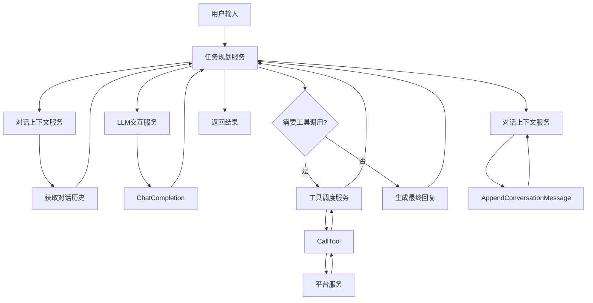
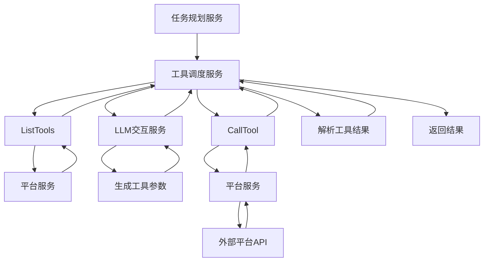
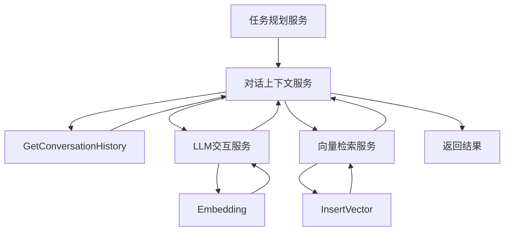

# Agent系统核心协议

## 一、Agent系统架构

Agent智能层是系统的核心，由以下四个主要服务组成：
1. LLM交互服务：系统与大模型的唯一交互入口
2. 任务规划与编排服务：Agent的「大脑中枢」，负责任务拆解与编排
3. 工具调度与参数校验服务：Agent的「手脚调度器」，负责工具调用与执行
4. 对话上下文管理服务：系统的「记忆中枢」，负责维护对话历史与用户偏好

## 二、核心协议定义

### 1. LLM交互协议

#### 1.1 ChatCompletion协议

**功能**：与大模型进行对话交互，支持流式输出和工具调用

**请求格式**：
```protobuf
message ChatCompletionRequest {
  string model = 1;           // 模型名称
  repeated Message messages = 2;  // 消息列表
  float temperature = 3;      // 温度参数
  bool stream = 4;            // 是否流式输出
  repeated Function functions = 5;  // 可用函数列表
}

message Message {
  string role = 1;            // 角色：user/assistant/system
  string content = 2;         // 内容
}

message Function {
  string name = 1;            // 函数名称
  string description = 2;     // 函数描述
  map<string, string> parameters = 3;  // 参数定义
}
```

**响应格式**：
```protobuf
message ChatCompletionResponse {
  string content = 1;         // 回复内容
  ToolCall tool_call = 2;     // 工具调用
  Usage usage = 3;            // Token使用情况
  string finish_reason = 4;   // 结束原因
}

message ToolCall {
  string name = 1;            // 工具名称
  map<string, string> arguments = 2;  // 工具参数
}

message Usage {
  int32 prompt_tokens = 1;    // 提示Token数
  int32 completion_tokens = 2; // 完成Token数
  int32 total_tokens = 3;     // 总Token数
}
```

#### 1.2 Embedding协议

**功能**：将文本转换为向量表示

**请求格式**：
```protobuf
message EmbeddingRequest {
  repeated string text_list = 1;  // 文本列表
  string model = 2;            // 模型名称
}
```

**响应格式**：
```protobuf
message EmbeddingResponse {
  repeated EmbeddingVector embeddings = 1;  // 嵌入向量列表
  Usage usage = 2;            // Token使用情况
}

message EmbeddingVector {
  repeated float values = 1;   // 向量值
}
```

### 2. 任务规划协议

#### 2.1 PlanAndExecuteTask协议

**功能**：规划并执行任务，将用户需求拆解为可执行的子任务

**请求格式**：
```protobuf
message TaskPlanRequest {
  string user_id = 1;          // 用户ID
  string conversation_id = 2;   // 对话ID
  string user_input = 3;        // 用户输入
  int32 max_step = 4;           // 最大步骤数
}
```

**响应格式**：
```protobuf
message TaskPlanResponse {
  string task_id = 1;           // 任务ID
  string status = 2;            // 任务状态：pending/running/success/failed
  string final_result = 3;      // 最终结果
  string error_msg = 4;         // 错误信息
}
```

#### 2.2 GetTaskStatus协议

**功能**：获取任务执行状态

**请求格式**：
```protobuf
message TaskStatusRequest {
  string task_id = 1;           // 任务ID
}
```

**响应格式**：
```protobuf
message TaskStatusResponse {
  string task_id = 1;           // 任务ID
  int32 current_step = 2;       // 当前步骤
  float progress = 3;           // 进度（0-1）
  string status = 4;            // 任务状态
}
```

### 3. 工具调度协议

#### 3.1 CallTool协议

**功能**：调用工具执行操作

**请求格式**：
```protobuf
message ToolCallRequest {
  string user_id = 1;          // 用户ID
  string tool_name = 2;        // 工具名称
  map<string, string> arguments = 3;  // 工具参数
}
```

**响应格式**：
```protobuf
message ToolCallResponse {
  bool success = 1;            // 操作是否成功
  string result = 2;            // 工具执行结果
  string error_msg = 3;         // 错误信息
  int64 latency_ms = 4;         // 执行延迟（毫秒）
}
```

#### 3.2 ListTools协议

**功能**：列出可用工具

**请求格式**：
```protobuf
message ListToolsRequest {
  string platform = 1;          // 平台名称
  string keyword = 2;           // 关键词
}
```

**响应格式**：
```protobuf
message ListToolsResponse {
  repeated ToolDefinition tools = 1;  // 工具定义列表
}

message ToolDefinition {
  string name = 1;            // 工具名称
  string description = 2;     // 工具描述
  map<string, string> parameters = 3;  // 参数定义
  string platform = 4;        // 平台名称
}
```

### 4. 对话上下文管理协议

#### 4.1 GetConversationHistory协议

**功能**：获取对话历史

**请求格式**：
```protobuf
message ConversationRequest {
  string user_id = 1;          // 用户ID
  string conversation_id = 2;   // 对话ID
  int32 max_round = 3;          // 最大轮数
}
```

**响应格式**：
```protobuf
message ConversationResponse {
  repeated Message messages = 1;  // 消息列表
}
```

#### 4.2 AppendConversationMessage协议

**功能**：追加对话消息

**请求格式**：
```protobuf
message AppendMessageRequest {
  string user_id = 1;          // 用户ID
  string conversation_id = 2;   // 对话ID
  string role = 3;             // 角色
  string content = 4;          // 内容
}
```

**响应格式**：
```protobuf
message AppendMessageResponse {
  bool success = 1;            // 操作是否成功
  string error_msg = 2;         // 错误信息
}
```

#### 4.3 GetUserPreference协议

**功能**：获取用户偏好

**请求格式**：
```protobuf
message UserPreferenceRequest {
  string user_id = 1;          // 用户ID
}
```

**响应格式**：
```protobuf
message UserPreferenceResponse {
  map<string, string> preference = 1;  // 用户偏好
}
```

## 三、Agent内部交互流程

### 1. 对话处理流程



### 2. 工具调用流程



### 3. 上下文管理流程



## 四、Agent与外部模块交互协议

### 1. 与平台服务交互

**调用方式**：gRPC同步调用
**接口**：`PlatformService.CallTool`、`PlatformService.GetToolDefinitions`
**数据格式**：Protobuf

### 2. 与用户服务交互

**调用方式**：gRPC同步调用
**接口**：`UserService.GetUserCredential`
**数据格式**：Protobuf

### 3. 与向量检索服务交互

**调用方式**：gRPC同步调用
**接口**：`VectorService.SearchVector`、`VectorService.InsertVector`
**数据格式**：Protobuf

### 4. 与Redpanda交互

**调用方式**：异步消息发布
**Topic**：`audit-log-events`、`realtime-events`
**数据格式**：JSON

## 五、Agent系统的核心设计原则

### 1. 模块化设计

- 每个服务只负责一项核心功能
- 服务之间通过明确的接口通信
- 避免服务间的直接依赖

### 2. 可扩展性

- 支持新增大模型接口
- 支持新增工具定义
- 支持新增平台适配器

### 3. 容错性

- 大模型调用失败时的重试机制
- 工具调用失败时的降级策略
- 服务不可用时的熔断保护

### 4. 可观测性

- 全链路Trace追踪
- 详细的日志记录
- 核心指标监控

### 5. 安全性

- 敏感操作的权限校验
- 工具调用的审计记录
- 数据传输的加密保护

## 六、Agent系统的性能优化策略

### 1. 缓存策略

- 对话历史缓存
- 工具定义缓存
- LLM响应缓存

### 2. 异步处理

- 非关键操作的异步执行
- 批量处理优化
- 后台任务队列

### 3. 资源管理

- 大模型Token使用优化
- 并发请求控制
- 内存使用限制

### 4. 负载均衡

- 多实例部署
- 请求分发策略
- 健康检查机制

## 七、Agent系统的版本控制

### 1. 接口版本ing

- 语义化版本号
- 向后兼容保证
- 版本升级策略

### 2. 模型版本管理

- 模型切换机制
- 模型性能评估
- 模型配置管理

### 3. 工具版本管理

- 工具定义版本控制
- 工具调用历史记录
- 工具性能监控

## 八、Agent系统的测试策略

### 1. 单元测试

- 服务接口测试
- 核心逻辑测试
- 异常处理测试

### 2. 集成测试

- 服务间交互测试
- 端到端流程测试
- 性能回归测试

### 3. 模拟测试

- 大模型模拟
- 工具调用模拟
- 外部平台模拟

## 九、Agent系统的部署策略

### 1. 容器化部署

- Docker镜像构建
- Kubernetes部署
- 资源配置优化

### 2. 环境隔离

- 开发环境
- 测试环境
- 生产环境

### 3. 持续集成/持续部署

- CI/CD流水线
- 自动化测试
- 灰度发布

## 十、Agent系统的监控与告警

### 1. 关键指标监控

- LLM调用成功率
- 工具调用成功率
- 任务执行成功率
- 响应时间
- Token消耗

### 2. 告警策略

- 服务异常告警
- 性能劣化告警
- 资源使用告警
- 安全事件告警

### 3. 故障排查

- 全链路Trace分析
- 日志聚合分析
- 异常模式识别
