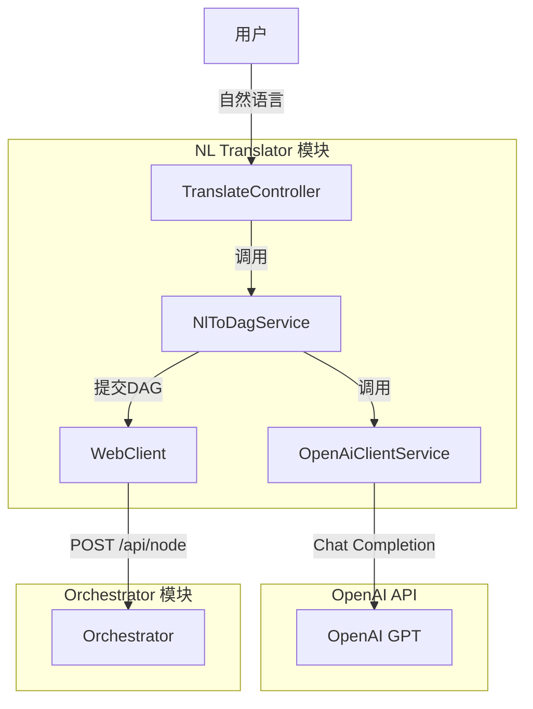
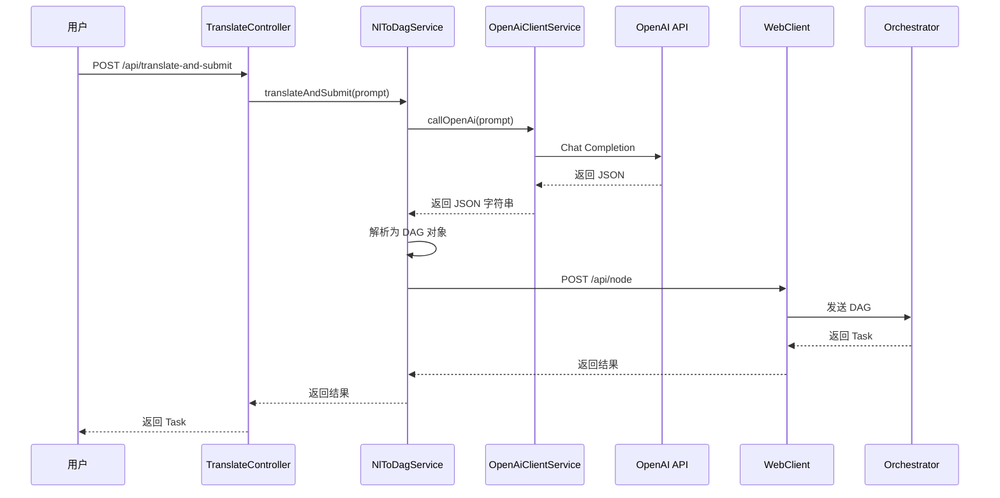

# 灵犀AI OS NL Translator 模块完整指南

> 本文档适用于零基础开发者，帮助你快速理解和使用 NL Translator 模块。

---

## 目录

1. [什么是 NL Translator？](#什么是-nl-translator)
2. [核心功能](#核心功能)
3. [技术栈](#技术栈)
4. [项目结构](#项目结构)
5. [类定义详解](#类定义详解)
6. [工作流程](#工作流程)
7. [快速开始](#快速开始)

## 什么是 NL Translator？

**NL Translator（自然语言翻译器）** 是灵犀AI OS的自然语言处理模块，负责：

- 接收用户的自然语言任务描述
- 通过 OpenAI API 将自然语言转换为结构化的 Node/DAG
- 可选地直接将生成的 DAG 提交给 Orchestrator 执行

简单来说，NL Translator 就是连接用户自然语言和系统执行引擎的桥梁。

### 整体架构图



---

## 核心功能

### 1. 自然语言到 DAG 转换
- 使用结构化 Prompt 引导 LLM 输出符合要求的 JSON
- 自动解析 LLM 响应为 DAG 对象
- 初始化节点状态为 PENDING

### 2. OpenAI API 集成
- 支持配置 API Key、Model、Temperature 等参数
- 使用环境变量或配置文件管理敏感信息
- 超时控制和错误处理

### 3. 可选自动提交
- 提供两个接口：仅翻译 / 翻译并提交
- 通过 WebClient 调用 Orchestrator API
- 完整的错误处理和日志记录

---

## 技术栈

| 技术 | 版本 | 用途 |
|------|------|------|
| Java | 17+ | 开发语言 |
| Spring Boot | 3.2.5 | 应用框架 |
| Spring WebFlux | 3.2.5 | WebClient（异步 HTTP 客户端） |
| OpenAI Java SDK | 0.18.2 | OpenAI API 客户端 |
| Maven | 3.9.x | 构建工具 |
| Lombok | 1.18.32 | 简化代码 |
| Jackson | 最新 | JSON 序列化 |

---

## 项目结构

```
nl-translator/
├── pom.xml                                    # Maven 配置文件
├── src/main/java/com/lingxi/ai/translator/
│   ├── NlTranslatorApplication.java          # 应用启动入口
│   ├── controller/                            # 控制器层（API接口）
│   │   └── TranslateController.java          # 翻译 API 控制器
│   ├── service/                               # 服务层（业务逻辑）
│   │   ├── OpenAiClientService.java          # OpenAI API 客户端服务
│   │   └── NlToDagService.java              # 自然语言转 DAG 服务
│   ├── model/                                 # 模型层（数据结构）
│   │   ├── Task.java                          # 任务模型
│   │   ├── Node.java                          # 节点模型
│   │   ├── DAG.java                           # DAG（有向无环图）模型
│   │   ├── TaskStatus.java                    # 任务状态枚举
│   │   └── NodeStatus.java                    # 节点状态枚举
│   └── config/                                # 配置层
│       ├── OpenAiConfig.java                  # OpenAI 配置类
│       └── WebClientConfig.java               # WebClient 配置类
└── src/main/resources/
    └── application.yml                        # 应用配置文件
```

---

## 类定义详解

### 配置类

#### OpenAiConfig（OpenAI 配置）
**文件位置**: `config/OpenAiConfig.java`

配置 OpenAI API 的参数：

| 字段 | 类型 | 说明 |
|------|------|------|
| apiKey | String | OpenAI API Key |
| model | String | 模型名称（如 gpt-4-turbo-preview） |
| temperature | Double | 温度参数（0-2，默认 0.7） |
| maxTokens | Integer | 最大 Token 数 |
| timeout | Integer | 超时时间（毫秒） |

#### WebClientConfig（WebClient 配置）
**文件位置**: `config/WebClientConfig.java`

配置用于调用 Orchestrator API 的 WebClient。

---

### 模型类

复用 ai-orchestrator 模块的模型定义，包括：
- **Task**: 任务模型
- **Node**: 节点模型
- **DAG**: 有向无环图模型
- **TaskStatus**: 任务状态枚举
- **NodeStatus**: 节点状态枚举

---

### 服务类

#### OpenAiClientService（OpenAI API 客户端）
**文件位置**: `service/OpenAiClientService.java`

负责调用 OpenAI API：

| 方法 | 说明 |
|------|------|
| `callOpenAi(userPrompt)` | 调用 OpenAI Chat Completion API |

**System Prompt 设计要点**：
- 明确指示 LLM 的角色（任务分解专家）
- 详细定义 Node 的 JSON 格式
- 提供示例输出
- 要求返回纯 JSON，无额外文字

#### NlToDagService（自然语言转 DAG 服务）
**文件位置**: `service/NlToDagService.java`

核心服务类：

| 方法 | 说明 |
|------|------|
| `translateToDag(prompt)` | 将自然语言翻译为 DAG 对象 |
| `translateAndSubmit(prompt, url)` | 翻译并提交给 Orchestrator |

---

### 控制器类

#### TranslateController（翻译 API 控制器）
**文件位置**: `controller/TranslateController.java`

提供 REST API 接口：

| 方法 | 路径 | 说明 |
|------|------|------|
| POST | `/api/translate` | 仅翻译，返回 DAG |
| POST | `/api/translate-and-submit` | 翻译并提交给 Orchestrator |

---

## 工作流程

### 执行时序图



---

## 快速开始

### 前置要求

- Java 17+
- Maven 3.9.x
- OpenAI API Key

### 步骤 1：配置 OpenAI API Key

```bash
# 设置环境变量（推荐）
export OPENAI_API_KEY=sk-your-api-key-here

# 或者修改 application.yml 中的默认值
```

### 步骤 2：编译项目

```bash
cd nl-translator
mvn clean compile
```

### 步骤 3：启动应用

```bash
mvn spring-boot:run
```

应用会在 `http://localhost:8081` 启动。

### 步骤 4：测试 API

**仅翻译**：

```bash
curl -s -X POST http://localhost:8081/api/translate \
  -H "Content-Type: application/json" \
  -d '{"prompt":"写文章并生成摘要"}' | jq .
```

**翻译并提交**：

```bash
# 确保 Orchestrator 已启动
curl -s -X POST http://localhost:8081/api/translate-and-submit \
  -H "Content-Type: application/json" \
  -d '{"prompt":"写一篇关于AI的文章并生成摘要"}' | jq .
```

### 配置说明

**application.yml**:

```yaml
openai:
  api-key: ${OPENAI_API_KEY:your-api-key-here}
  model: gpt-4-turbo-preview
  temperature: 0.7
  max-tokens: 2000
  timeout: 30000

orchestrator:
  url: ${ORCHESTRATOR_URL:http://localhost:8080}
```

---

## 下一步

- 探索如何自定义 System Prompt
- 学习如何添加更多 LLM 提供商支持
- 了解如何添加 DAG 验证逻辑

---

## 总结

恭喜你！现在你已经了解了 NL Translator 模块的：
- ✅ 核心功能和用途
- ✅ 完整的技术栈
- ✅ 项目结构
- ✅ 所有类的定义和作用
- ✅ 完整的工作流程
- ✅ 如何快速启动和测试
