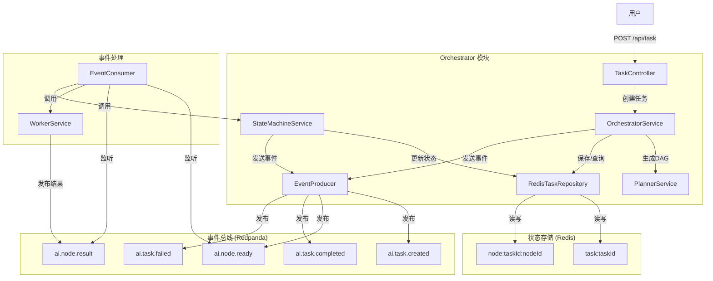
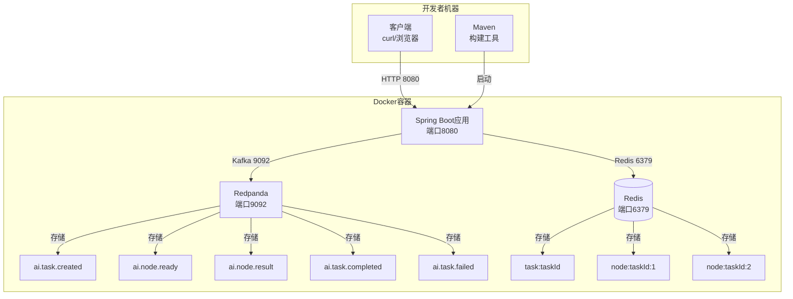
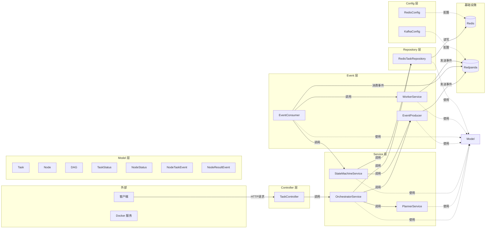
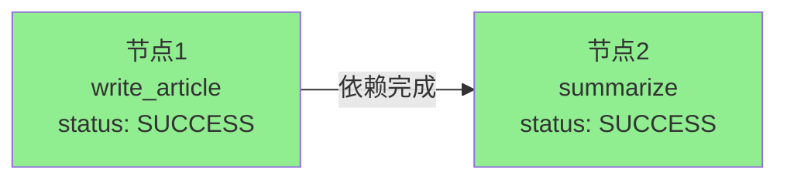
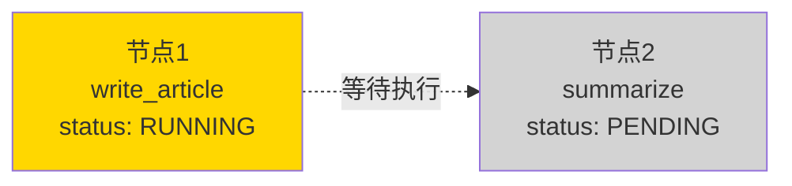
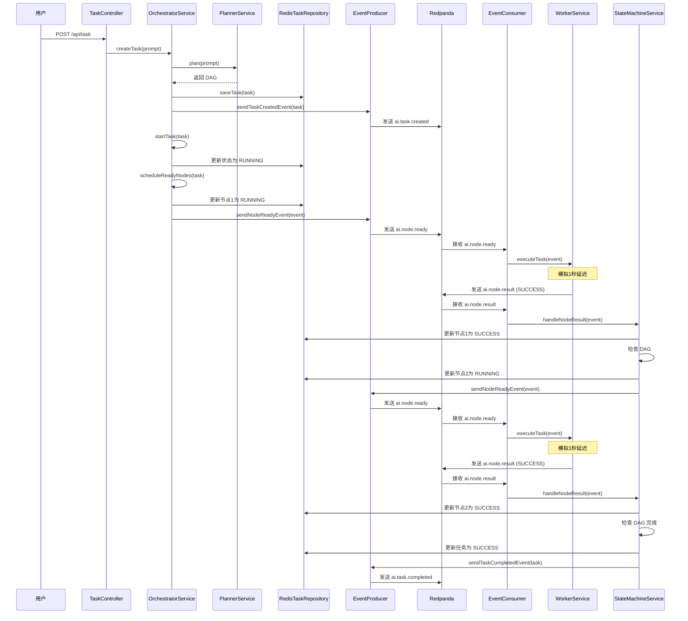

# 灵犀AI OS Orchestrator 模块完整指南

> 本文档适用于零基础开发者，帮助你快速理解和使用 Orchestrator 模块。

---

## 目录

1. [什么是 Orchestrator？](#什么是-orchestrator)
2. [核心功能](#核心功能)
3. [技术栈](#技术栈)
4. [项目结构](#项目结构)
5. [类定义详解](#类定义详解)
6. [工作流程](#工作流程)
7. [快速开始](#快速开始)

## 架构图索引

本文档包含以下 mermaid 架构图：

- 📊 [整体架构图](#整体架构图) - 展示 Orchestrator 各组件的交互关系
- 🏗️ [分层架构图](#分层架构图) - 展示代码的层次结构
- 🔄 [DAG 流程图](#示例-dag-结构) - 展示任务节点的依赖关系
- ⏱️ [执行时序图](#执行时序图) - 展示完整的执行时序
- 🖥️ [系统部署图](#系统部署图) - 展示系统的部署结构

---

## 什么是 Orchestrator？

**Orchestrator（编排器）** 是灵犀AI OS的核心调度模块，就像操作系统的内核一样，负责：

- 接收用户的任务请求
- 将任务拆解成多个步骤（DAG有向无环图）
- 按顺序调度执行这些步骤
- 监控任务执行状态
- 通过事件驱动的方式与其他模块通信

简单来说，Orchestrator 就是一个"任务大管家"，帮你把复杂的AI任务有条不紊地执行完成。

### 整体架构图



---

## 核心功能

### 1. DAG 任务编排
- 将复杂任务拆解成多个节点（Node）
- 节点之间可以有依赖关系（比如：节点2必须等节点1完成后才能执行）
- 自动调度就绪的节点执行

### 2. 事件驱动架构
- 使用 Redpanda（Kafka兼容）作为事件总线
- 所有模块通过事件通信，松耦合设计
- 支持异步处理，高性能

### 3. 状态管理
- 使用 Redis 存储任务和节点状态
- 支持任务状态查询
- 无状态设计，支持水平扩展

### 4. 内置 Mock Worker
- 自带模拟的 Worker 服务
- 可以模拟节点执行过程
- 方便开发和测试

---

## 技术栈

| 技术 | 版本 | 用途 |
|------|------|------|
| Java | 17+ | 开发语言 |
| Spring Boot | 3.2.5 | 应用框架 |
| Spring Kafka | 3.1.x | Redpanda 客户端 |
| Redpanda | v23.3.11+ | 事件总线（Kafka 兼容） |
| Redis | 7.x | 状态存储 |
| Maven | 3.9.x | 构建工具 |
| Lombok | 1.18.32 | 简化代码 |
| Jackson | 最新 | JSON 序列化 |

### 系统部署图



---

## 项目结构

```
ai-orchestrator/
├── pom.xml                                    # Maven 配置文件
├── docker-compose.yml                         # Docker 依赖配置
├── src/main/java/com/lingxi/ai/orchestrator/
│   ├── OrchestratorApplication.java           # 应用启动入口
│   ├── controller/                            # 控制器层（API接口）
│   │   └── TaskController.java               # 任务API控制器
│   ├── service/                               # 服务层（业务逻辑）
│   │   ├── OrchestratorService.java          # 核心编排服务
│   │   ├── PlannerService.java               # 规划服务（生成DAG）
│   │   └── StateMachineService.java          # 状态机服务
│   ├── model/                                 # 模型层（数据结构）
│   │   ├── Task.java                          # 任务模型
│   │   ├── Node.java                          # 节点模型
│   │   ├── DAG.java                           # DAG（有向无环图）模型
│   │   ├── TaskStatus.java                    # 任务状态枚举
│   │   ├── NodeStatus.java                    # 节点状态枚举
│   │   ├── NodeTaskEvent.java                 # 节点任务事件
│   │   └── NodeResultEvent.java               # 节点结果事件
│   ├── event/                                 # 事件层
│   │   ├── EventProducer.java                 # 事件发送者
│   │   ├── EventConsumer.java                 # 事件消费者
│   │   └── WorkerService.java                 # 内置Mock Worker
│   ├── repository/                            # 仓储层（数据访问）
│   │   └── RedisTaskRepository.java           # Redis 数据访问
│   └── config/                                # 配置层
│       ├── KafkaConfig.java                   # Kafka/Redpanda 配置
│       └── RedisConfig.java                   # Redis 配置
└── src/main/resources/
    └── application.yml                        # 应用配置文件
```

### 分层架构图



---

## 类定义详解

### 枚举类

#### TaskStatus（任务状态枚举）
**文件位置**: `model/TaskStatus.java`

定义了任务的四种状态：

```java
public enum TaskStatus {
    CREATED,   // 已创建：任务刚被创建，还没开始执行
    RUNNING,   // 运行中：任务正在执行
    SUCCESS,   // 成功：任务执行成功
    FAILED     // 失败：任务执行失败
}
```

#### NodeStatus（节点状态枚举）
**文件位置**: `model/NodeStatus.java`

定义了节点的四种状态：

```java
public enum NodeStatus {
    PENDING,   // 待执行：节点还在等待依赖完成
    RUNNING,   // 运行中：节点正在执行
    SUCCESS,   // 成功：节点执行成功
    FAILED     // 失败：节点执行失败
}
```

---

### 模型类

#### Task（任务模型）
**文件位置**: `model/Task.java`

代表一个完整的任务，包含以下字段：

| 字段 | 类型 | 说明 |
|------|------|------|
| taskId | String | 任务唯一标识符（UUID） |
| prompt | String | 用户输入的提示词 |
| status | TaskStatus | 任务当前状态 |
| dag | DAG | 任务的有向无环图（包含所有节点） |
| traceId | String | 分布式追踪ID（用于日志追踪） |
| createTime | long | 任务创建时间戳 |
| startTime | long | 任务开始执行时间戳 |
| endTime | long | 任务结束时间戳 |

#### Node（节点模型）
**文件位置**: `model/Node.java`

代表 DAG 中的一个执行节点，包含以下字段：

| 字段 | 类型 | 说明 |
|------|------|------|
| nodeId | String | 节点唯一标识符 |
| type | String | 节点类型（如 "LLM"、"TOOL"） |
| task | String | 节点要执行的任务（如 "write_article"） |
| deps | List\<String\> | 依赖的节点ID列表 |
| status | NodeStatus | 节点当前状态 |
| input | Map\<String, Object\> | 节点输入数据 |
| output | Map\<String, Object\> | 节点输出数据 |
| errorMessage | String | 错误信息（失败时填充） |

#### DAG（有向无环图模型）
**文件位置**: `model/DAG.java`

代表任务的执行流程图，包含以下核心方法：

| 方法 | 说明 |
|------|------|
| `static sample()` | 生成示例 DAG（2个节点，1→2） |
| `getReadyNodes()` | 获取所有可执行节点（依赖全部完成） |
| `isCompleted()` | 检查 DAG 是否全部完成 |
| `isFailed()` | 检查 DAG 是否有节点失败 |

**示例 DAG 结构**：





DAG 执行状态流转：
- 初始状态：节点1 `PENDING` → 节点2 `PENDING`
- 执行中：节点1 `RUNNING` → 节点2 `PENDING`
- 完成后：节点1 `SUCCESS` → 节点2 `SUCCESS`

#### NodeTaskEvent（节点任务事件）
**文件位置**: `model/NodeTaskEvent.java`

发送给 Worker 的事件，包含以下字段：

| 字段 | 类型 | 说明 |
|------|------|------|
| taskId | String | 任务ID |
| nodeId | String | 节点ID |
| type | String | 节点类型 |
| payload | Map\<String, Object\> | 任务负载数据 |
| traceId | String | 追踪ID |

#### NodeResultEvent（节点结果事件）
**文件位置**: `model/NodeResultEvent.java`

Worker 返回的执行结果事件，包含以下字段：

| 字段 | 类型 | 说明 |
|------|------|------|
| taskId | String | 任务ID |
| nodeId | String | 节点ID |
| status | NodeStatus | 节点执行状态 |
| output | Map\<String, Object\> | 节点输出数据 |
| traceId | String | 追踪ID |
| errorMessage | String | 错误信息（失败时填充） |

---

### 控制器类

#### TaskController（任务API控制器）
**文件位置**: `controller/TaskController.java`

提供 REST API 接口，包含两个端点：

| 方法 | 路径 | 说明 |
|------|------|------|
| POST | `/api/task` | 创建新任务 |
| GET | `/api/task/{taskId}` | 查询任务状态 |

---

### 服务类

#### OrchestratorService（核心编排服务）
**文件位置**: `service/OrchestratorService.java`

整个 Orchestrator 的核心，负责：

| 方法 | 说明 |
|------|------|
| `createTask(prompt)` | 创建任务，生成 DAG，保存到 Redis，发布事件 |
| `startTask(task)` | 启动任务，更新状态为 RUNNING |
| `scheduleReadyNodes(task)` | 调度所有就绪节点执行 |
| `getTask(taskId)` | 从 Redis 查询任务 |

#### PlannerService（规划服务）
**文件位置**: `service/PlannerService.java`

负责根据用户输入生成 DAG：

| 方法 | 说明 |
|------|------|
| `plan(prompt)` | 根据提示词生成 DAG（当前是 Mock 实现，返回固定2节点 DAG） |

#### StateMachineService（状态机服务）
**文件位置**: `service/StateMachineService.java`

管理任务和节点的状态流转：

| 方法 | 说明 |
|------|------|
| `handleNodeResult(event)` | 处理节点执行结果，更新状态，调度下一批节点 |
| `scheduleReadyNodes(task)` | 调度就绪节点 |

---

### 事件类

#### EventProducer（事件发送者）
**文件位置**: `event/EventProducer.java`

负责向 Redpanda 发送事件：

| 方法 | 说明 | Topic |
|------|------|-------|
| `sendTaskCreatedEvent(task)` | 发送任务创建事件 | `ai.task.created` |
| `sendNodeReadyEvent(event)` | 发送节点就绪事件 | `ai.node.ready` |
| `sendTaskCompletedEvent(task)` | 发送任务完成事件 | `ai.task.completed` |
| `sendTaskFailedEvent(task)` | 发送任务失败事件 | `ai.task.failed` |

#### EventConsumer（事件消费者）
**文件位置**: `event/EventConsumer.java`

监听并处理 Redpanda 中的事件：

| 方法 | 说明 | 监听 Topic |
|------|------|-----------|
| `handleNodeReady(event)` | 处理节点就绪事件，调用 Worker 执行 | `ai.node.ready` |
| `handleNodeResult(event)` | 处理节点结果事件，更新状态 | `ai.node.result` |

#### WorkerService（内置 Mock Worker）
**文件位置**: `event/WorkerService.java`

模拟 Worker 执行节点任务：

| 方法 | 说明 |
|------|------|
| `executeTask(event)` | 执行节点任务（模拟1秒延迟，返回 Mock 结果） |

**Mock 逻辑**：
- 节点1（write_article）：返回 `{"content": "这是一篇AI生成的文章..."}`
- 节点2（summarize）：返回 `{"summary": "这是文章的摘要..."}`

---

### 仓储类

#### RedisTaskRepository（Redis 数据访问）
**文件位置**: `repository/RedisTaskRepository.java`

负责与 Redis 交互，存取数据：

| 方法 | 说明 | Redis Key 格式 |
|------|------|----------------|
| `saveTask(task)` | 保存任务 | `task:{taskId}` |
| `getTask(taskId)` | 获取任务 | `task:{taskId}` |
| `saveNode(taskId, node)` | 保存节点 | `node:{taskId}:{nodeId}` |

---

### 配置类

#### KafkaConfig（Kafka/Redpanda 配置）
**文件位置**: `config/KafkaConfig.java`

配置 Kafka 生产者和消费者：

- 配置生产者：连接 Redpanda，JSON 序列化
- 配置消费者：连接 Redpanda，JSON 反序列化
- 配置 Kafka 监听器容器

#### RedisConfig（Redis 配置）
**文件位置**: `config/RedisConfig.java`

配置 Redis 连接：

- 配置 Redis 连接工厂（Lettuce 客户端）
- 配置 RedisTemplate：String 类型 Key，JSON 类型 Value

---

### 启动类

#### OrchestratorApplication（应用启动入口）
**文件位置**: `OrchestratorApplication.java`

Spring Boot 应用主类：

- `@SpringBootApplication`：标记为 Spring Boot 应用
- `@EnableKafka`：启用 Kafka 监听器
- `main()` 方法：启动应用

---

## 工作流程

### 执行时序图



### 完整执行链路

```
1. 用户 POST /api/task {"prompt":"写文章并生成摘要"}
   ↓
2. OrchestratorService 生成 taskId 和 traceId
   ↓
3. PlannerService 生成 2节点 DAG（write_article → summarize）
   ↓
4. 任务保存到 Redis，状态为 CREATED
   ↓
5. EventProducer 发布 ai.task.created 事件
   ↓
6. 任务状态更新为 RUNNING，调度就绪节点（node1）
   ↓
7. EventProducer 发布 ai.node.ready 事件
   ↓
8. EventConsumer 消费事件，WorkerService 执行 node1（模拟1秒延迟）
   ↓
9. WorkerService 发布 ai.node.result 事件（SUCCESS）
   ↓
10. StateMachineService 更新 node1 状态为 SUCCESS
    ↓
11. 检查 DAG，发现 node2 依赖已完成，调度 node2
    ↓
12. EventProducer 发布 ai.node.ready 事件
    ↓
13. EventConsumer 消费事件，WorkerService 执行 node2（模拟1秒延迟）
    ↓
14. WorkerService 发布 ai.node.result 事件（SUCCESS）
    ↓
15. StateMachineService 更新 node2 状态为 SUCCESS
    ↓
16. 检查 DAG 已全部完成，更新任务状态为 SUCCESS
    ↓
17. EventProducer 发布 ai.task.completed 事件
```

### Redpanda Topic 设计

| Topic 名称 | 说明 |
|-----------|------|
| `ai.task.created` | 任务创建事件 |
| `ai.node.ready` | 节点就绪事件（发给 Worker） |
| `ai.node.result` | 节点执行结果事件（Worker 返回） |
| `ai.task.completed` | 任务完成事件 |
| `ai.task.failed` | 任务失败事件 |

---

## 快速开始

### 前置要求

- Java 17+
- Maven 3.9.x
- Docker 和 Docker Compose

### 步骤 1：启动依赖服务

在 `ai-orchestrator/` 目录下运行：

```bash
cd ai-orchestrator
docker-compose up -d redis redpanda
```

这会启动：
- Redis（端口 6379）：状态存储
- Redpanda（端口 9092）：事件总线

### 步骤 2：编译项目

```bash
mvn clean compile
```

### 步骤 3：启动应用

```bash
mvn spring-boot:run
```

应用会在 `http://localhost:8080` 启动。

### 步骤 4：测试 API

**创建任务**：

```bash
curl -s -X POST http://localhost:8080/api/task \
  -H "Content-Type: application/json" \
  -d '{"prompt":"写文章并生成摘要"}'
```

你会得到类似这样的响应：

```json
{
  "taskId": "afbbc0d1-ed57-46b2-a760-9672e14d3008",
  "prompt": "写文章并生成摘要",
  "status": "RUNNING",
  "dag": {
    "nodes": [
      {
        "nodeId": "1",
        "type": "LLM",
        "task": "write_article",
        "deps": [],
        "status": "RUNNING"
      },
      {
        "nodeId": "2",
        "type": "LLM",
        "task": "summarize",
        "deps": ["1"],
        "status": "PENDING"
      }
    ]
  }
}
```

**查询任务状态**：

```bash
# 等待 5-8 秒让任务执行完成
sleep 8

# 查询任务状态（把上面的 taskId 替换成你得到的）
curl -s http://localhost:8080/api/task/afbbc0d1-ed57-46b2-a760-9672e14d3008
```

你会看到任务状态已变成 `SUCCESS`，两个节点都执行成功，并有输出数据：

```json
{
  "taskId": "afbbc0d1-ed57-46b2-a760-9672e14d3008",
  "status": "SUCCESS",
  "dag": {
    "nodes": [
      {
        "nodeId": "1",
        "status": "SUCCESS",
        "output": {"content": "这是一篇AI生成的文章..."}
      },
      {
        "nodeId": "2",
        "status": "SUCCESS",
        "output": {"summary": "这是文章的摘要..."}
      }
    ]
  }
}
```

### 步骤 5：停止服务

```bash
# 停止应用（Ctrl+C）

# 停止 Docker 服务
docker-compose down
```

---

## 常见问题

### Q: 应用启动失败，提示连接不上 Redis？
A: 确保 Redis 容器已启动：`docker ps | grep lingxi-redis`

### Q: 任务一直卡在 RUNNING 状态？
A: 检查 Redpanda 是否正常运行，以及 Kafka 监听器是否正常初始化。

### Q: 如何查看应用日志？
A: 应用启动时日志会输出到控制台，或者查看 `app.log` 文件。

---

## 下一步

- 了解如何自定义 PlannerService 生成真实的 DAG
- 学习如何实现真实的 Worker 服务
- 探索如何添加更多节点类型
- 了解如何部署多个 Orchestrator 实例实现水平扩展

---

## 总结

恭喜你！现在你已经了解了 Orchestrator 模块的：
- ✅ 核心功能和用途
- ✅ 完整的技术栈
- ✅ 项目结构
- ✅ 所有类的定义和作用
- ✅ 完整的工作流程
- ✅ 如何快速启动和测试

继续探索吧！
