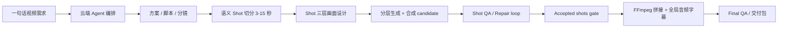

<p align="center">
  
</p>

<h1 align="center">躺营 AI 视频创作助手</h1>

<p align="center">
  从一个想法开始，把选题、脚本、分镜、素材生成、审核、渲染和交付串成一条可追踪的视频创作流水线。
</p>

<p align="center">
  <a href="https://github.com/SUSTechWLA/tangying-ai-operation-system/wiki">项目 Wiki</a>
  ·
  <a href="https://github.com/SUSTechWLA/tangying-ai-operation-system/wiki/English">English Wiki</a>
  ·
  <a href="https://github.com/SUSTechWLA/tangying-ai-operation-system/releases/latest">Download Latest Release</a>
  ·
  <a href="docs/RELEASE_STATUS.md">Release Status</a>
  ·
  <a href="CHANGELOG.md">Changelog</a>
  ·
  <a href="#快速开始">快速开始</a>
  ·
  <a href="#适合谁">适合谁</a>
</p>

<p align="center">
  
  
  
  
</p>

---

## 当前版本

**v0.2.1 - One-click desktop + canonical three-layer Shot production**

- 新增源码仓一键部署：自动安装锁定依赖、启动 Docker 后端与 HyperFrames、等待健康检查、打包 macOS 客户端，并可直接打开安装态应用。
- 每个 Shot 统一使用 `shot_visual_layers_v1`：IP A-roll 负责正式 3D 角色口播，HyperFrames / HyperKeyframes 负责精确文字和可控特效，AIGC 负责无文字背景、B-roll 或局部动态素材；三层设计与合成计划始终存在。
- 制作路线与 AIGC 执行策略已解耦：口播默认按 Shot 自动使用 AIGC 丰富层，也可选择纯本地执行；`aigcEnabled=false` 只禁止本次 AIGC 调用，不会删除该层的提示词、安全区和未来重启执行所需设计。
- 已安装 App 内置正式 IP 资产与 MCP provider，并显式发现 Homebrew FFmpeg/FFprobe；macOS `say` 只允许用于本地节奏预览，不能作为生产配音或正式成片的降级路径。
- 动态审核 UI 可随真实 Agent review gate 推进；MCP 必需素材失败时会 fail closed，不再把失败渲染伪装成成功。
- Closed beta runbook、beta smoke、fallback fixture、diagnostics、artifact provenance 和 readiness gate 已就绪。
- 视频流水线已对齐 shot 级生产闭环：语义/画面变化切分、3-15 秒时长校验、candidate 级 QA、保守 repair loop、accepted shot gate、FFmpeg final assembly 和 final QA。
- Shot 素材包已拆成可读的三层画面设计与一份合成计划：`ipArollPlan`、`hyperframesPlan`、`aigcPlan` 和 `ffmpegFusionPlan`，并统一收敛到 `visualLayers` 契约。
- 桌面端已修复 local runner 登录态注入时的重启问题；已安装客户端可以先启动本地 agent，再平滑切换为带用户会话的 runner。
- 即梦 CLI / MCP 登录配置已归入设置页，和文生图片、文生视频 Provider 一起管理；项目页只保留说明和跳转按钮。
- Shot 产物页已升级为面向创作者的线性 1-6 步工作台：LLM 先区分口播 / 知识类和影视 / AIGC shot 视频，进入 shot 后自动切到对应流程。
- 口播类 shot 聚焦口播稿、HyperFrames 时间线、AIGC 插入素材和最终合成；影视类 shot 聚焦剧本、角色 / 场景 / 道具参考、故事板、AIGC 主画面提示词、跨 shot 一致性和完整 shot 预览。
- 新增本地 IP 数字人口播渲染工具：当前主树懒 IP 使用可复用 Blender 母版、三段三指骨骼、口型与表情动作库、暖色工作室、GPT-SoVITS 固定声音和 FFmpeg 本地合成。
- 图片和视频产物现在直接可预览，图片支持点击放大和对话式重新生成提示，视频支持大弹窗播放；页面隐藏 `local://...`、`已登记`、`预览已就绪` 等非创作信息。
- JiMeng/Dreamina 视频调用会优先投放 AIGC 层提示词，而不是 HyperFrames 字幕/文字层或完整工程说明，避免把错误层级发给视频模型。
- 项目页启动体检会自动运行，只展示未就绪或需留意的问题；具体本地工具命令和排障细节保留在设置页、追踪页和诊断包中。
- 无真实 AIGC provider 时可以跑通 fallback preview、shot QA report、machine-readable repairPlan、accepted shot provenance 和 final assembly diagnostics。
- 当前 release 分支可作为初版受控内测上线基线，用于技术型用户安装、诊断、反馈和小范围创作者试用。
- GitHub Release 提供按版本和 CPU 架构命名的 macOS 客户端安装包；安装包由对应 release tag 自动构建，避免 tag、源码和用户端版本漂移。
- 邀请真实创作者前，必须在完整本地环境中运行 `BETA_READINESS_REQUIRE_AIGC=1 bash scripts/beta-readiness-check.sh` 并得到 `GO`。

### release 分支待发布更新

- 头像菜单内置统一设置页：分开管理文本、图片和视频生成接口，密钥仅在本地 Agent 持久化，并支持跟随系统、浅色和深色外观。
- 执行生成任务时，所需密钥会随当次认证请求传输给云端编排，不写入项目配置或云端数据库；设置页可显式清除本地密钥。
- 这些改动在下一个语义化 tag 之前均属于 `Unreleased`；当前可下载安装包仍为 `v0.2.1`。

详细版本历史见 [CHANGELOG.md](CHANGELOG.md)。当前可用性和内测门槛见 [docs/RELEASE_STATUS.md](docs/RELEASE_STATUS.md)。

## 默认 IP / A-roll 资产

默认树懒 IP 与演播室使用单一、版本化的正式资产对：

```text
ip-assets/main-ip/models/main-ip-aroll-master-20260720.blend
ip-assets/main-ip/scenes/warm-sloth-studio-20260720.blend
ip-assets/main-ip/character-profile.json
ip-assets/main-ip/manifests/default-aroll-assets.json
```

演播室不再依赖外部或打包 PNG 贴图，也不保存 demo 音轨。角色的 4 张 PBR 图已打包在角色母版内；`main-ip-rigged.glb` 仅作为兼容运行时导出，正式角色来源仍是唯一的 Blender 母版。预览、烟测图片、turnaround 和渲染输出只能写入 `tmp/` 或 `outputs/`，不得作为发布资产提交。所有跟踪路径必须使用英文 ASCII 名称。

资产结构、完整性校验和升级规则见 [Default IP A-roll Assets](docs/default-ip-aroll-assets.md) 与 [本地 IP 数字人口播渲染](docs/local-ip-talking-avatar-render.md)。

### 生产配音模式

IP A-roll 使用三种互斥的正式声音来源：

1. **默认 IP 音色**：使用资产清单固定的 GPT-SoVITS 参考音频、逐字稿、模型权重和哈希；任一校验不通过即停止。
2. **授权参考音色**：用户在当前项目上传参考录音，填写与录音完全一致的逐字稿，并确认使用权后，才允许通过标准 MCP 工具 `ip_avatar_3d.synthesize_reference_voice` 合成。
3. **用户实录旁白**：用户上传已经录好的完整口播，不做声音克隆和 TTS，只在本地执行格式、响度和真峰值母带化。

三种模式最终都在本地生成 48 kHz、单声道 PCM16 的 `narration_master.wav` 和同目录 provenance sidecar。渲染器会校验来源模式、provider、授权状态、逐字稿确认、内容哈希、格式和响度后再消费；ChatTTS 与 macOS `say` 都不是生产 provider。云端只接收项目内 artifact ID、`local://` 引用、内容哈希、MIME、逐字稿和授权标记，不上传音频字节，也不保存本机绝对路径。

## 一句话理解

## 创作者工作台

登录后的默认入口是 `#/create`。持久导航只有“开始创作”和“我的视频”；开发诊断保留在开发环境开关下的 `#/developer/*`，不会出现在生产创作者导航中。

头像菜单中的“设置”统一管理文本生成、图片生成和视频生成接口，API 密钥仅在本地 Agent 持久化；外观可选择跟随系统、浅色或深色并自动记住。开始创作页只展示创作者需要做的选择，不暴露 Shot 内部三层编排术语，后端仍按 `shot_visual_layers_v1` 自动生成并执行完整的 IP A-roll、HyperFrames 与 AIGC 画面计划。

项目按需求、创意方案、脚本、分镜与素材、成片预览、交付六步推进。单个 Shot 必须大于 0 且小于 15 秒；重生成和候选确认只影响该 Shot 与成片待更新状态，历史版本可恢复为新的当前版本。重新拼接会重试真实的预览审核节点，不会重生成任何 Shot。最终视频与下载入口只在当前交付产物明确记录成片检查通过后出现。

常用验证：`cd cloud-backend && go test ./... && go vet ./... && make api-types-check`，`cd frontend && npm run test:creator && npm run test:settings && npm run test:developer-build && npm run lint && npm run build`，以及 `bash scripts/beta-smoke-check.sh`。

躺营不是一个单点的“文生视频按钮”，而是一个把真实创作过程拆成可审核阶段的 AI 视频制片台。它让云端负责编排，让用户电脑负责本地工具执行和文件生产，让创作者在关键节点确认方向，避免黑盒式生成。

<table>
  <tr>
    <td width="33%">
      <h3>给内容创作者</h3>
      <p>输入主题后，系统按视频类型拆出方案、脚本、分镜、素材需求、预览和成片，减少从零组织流程的成本。</p>
    </td>
    <td width="33%">
      <h3>给团队负责人</h3>
      <p>每个阶段都有产物、状态和审核记录，方便知道项目卡在哪里、谁需要确认、哪些素材还缺。</p>
    </td>
    <td width="33%">
      <h3>给技术团队</h3>
      <p>云端编排、本地 runner、工具 manifest、MCP 扩展和桌面端解耦，方便继续接入新模型和新工具。</p>
    </td>
  </tr>
</table>

## 当前能做什么

| 能力 | 体验结果 |
|---|---|
| 影视化 / AIGC shot 视频 | 从故事大纲、详细剧本、角色/场景/道具档案、多视角参考图到语义 shot 切分、candidate 生成、shot 级 QA 和返修 |
| 口播 / 知识类视频 | 先生成口播稿，再为每个 Shot 共同设计 3D IP A-roll、HyperFrames 文字特效、可选 AIGC 图片/视频素材和最终合成 |
| 3D IP 口播层 MCP | 输入口播和本地角色资产，通过 MCP 生成高保真 IP A-roll 视频层，支持口型、眨眼、点头、四肢动作、分段声音 prosody 计划和 HyperGen 控制 schema，系统负责接收、预览和合成 |
| 分阶段审核 | 方案、脚本、分镜、预览、渲染等节点可确认、拒绝、编辑或重新生成 |
| 本地执行器 | 用户电脑负责本地文件、HyperFrames 项目、渲染和工具执行 |
| 即梦 JiMeng MCP 扩展 | 用户显式安装并登录 Dreamina CLI 后，可通过本地 MCP 自动生成 AIGC 素材 |
| Shot 级抽帧 QA | 每个 shot candidate 独立 QA，失败后生成保守 repairPlan，只有通过或人工批准的 candidate 才能进入 final assembly |
| 手动外部生成兜底 | 没有可用模型或未启用即梦时，系统仍会展示可复制提示词和参考图信息 |
| Shot 产物工作台 | 按 1-6 步线性展示剧本/口播、参考图、IP A-roll、AIGC 丰富层、HyperFrames/HyperKeyframes 文字特效层、字幕时间轴、上传回填和完整 Shot 预览 |

## 创作流程



Shot split policy 固定为 `minShotDurationSec=3`、`maxShotDurationSec=15`、`preferredShotDurationSec=6-8`、`splitByScriptSemantics=true`、`splitByVisualChange=true`。切分优先参考剧情节点、场景、主体、动作、景别、视角、焦段、情绪节奏和旁白/对白语义段落；超过 15 秒必须继续拆分，短于 3 秒只在连续且合并后不超过 15 秒时合并。

每个 Shot 都会输出 `visualLayers`，并明确拆分为 `ipArollPlan`、`hyperframesPlan`、`aigcPlan` 与 `ffmpegFusionPlan`。IP A-roll 提示词描述正式 3D 角色的口播、口型、表情和动作；AIGC 提示词只生成无文字背景、B-roll 或局部动态并预留主体/文字安全区；中文文字、标题、字幕、流程标签和 UI 文案由 HyperFrames / HyperKeyframes 精确渲染。最终合成器按同一个 Shot 时间窗融合三层。即使本次选择纯本地，`aigcPlan.designed=true` 仍保留，`executionPolicy=disabled` 且不会创建外部生成请求。

生成后的 `hyperframes/assets/data.json` 会在顶层和每个 Shot 同时保存 `designedLayers`、`layerExecutionPolicy`、`requiredLayers`、`visualLayers` 与可读的三层设计摘要。纯本地降级渲染使用 `storyboard_ip_composite`：IP A-roll 保持为连续画面和音频底层，HyperFrames 透明文字层按同一时间窗叠加，AIGC 设计保留但不伪造已执行状态。

产物页按创作流程展示 shot，而不是按底层文件路径展示。口播视频进入后优先看口播稿、HyperFrames 时间线和 AIGC 插入素材；影视/AIGC shot 视频进入后优先看剧本片段、跨 shot 一致性、角色/场景/道具参考图、故事板、AIGC 主画面提示词和完整 shot。图片可点击放大并基于选中内容生成返工提示词；视频可在弹窗中大尺寸播放；字幕文件会解析成时间轴，方便用户直接校对。

成片阶段只消费 accepted shot candidate。最终 voiceover、BGM、ducking、字幕时间轴、响度、转码和 final QA 在 final assembly 阶段统一处理，不在每个 shot 内烧录最终字幕或混最终 BGM。

## 产品架构

<table>
  <tr>
    <td width="25%"><strong>桌面客户端</strong><br/>React + Electron，给真实用户操作项目、审核、追踪和导出。</td>
    <td width="25%"><strong>本地 Agent</strong><br/>管理本机目录、模型配置、本地 artifacts、MCP provider 和 runner。</td>
    <td width="25%"><strong>云端 Backend</strong><br/>负责任务编排、DAG、审核门、工具 manifest、持久化和 API。</td>
    <td width="25%"><strong>工具扩展</strong><br/>HyperFrames、FFmpeg、JiMeng MCP 等工具通过明确命令边界接入。</td>
  </tr>
</table>

## 适合谁

- 想把短视频生产流程标准化的个人创作者和小团队
- 需要“AI 生成 + 人工确认 + 本地交付”的视频工作流
- 希望保留本地文件控制权，不把所有素材、密钥持久化和中间产物存储交给云端的团队
- 正在验证 AIGC 影视化、口播视频、自动分镜和多 Agent 编排的产品原型

## 快速开始

macOS 14+ Apple Silicon、Docker、Node.js 24、Go 1.25、Python 3.11+、Blender 和 FFmpeg 就绪后：

```bash
git clone https://github.com/SUSTechWLA/tangying-ai-operation-system.git
cd tangying-ai-operation-system
git checkout release
bash scripts/one-click-deploy.sh up --open
```

状态检查与停止：

```bash
bash scripts/one-click-deploy.sh status
bash scripts/one-click-deploy.sh down
```

命令会保留数据库和项目数据卷，输出 `.app` 与 `.dmg` 的绝对路径。打开客户端后选择“三层口播（IP + 文字特效 + AIGC）”可让系统按 Shot 自动丰富画面；若暂时不配置 AIGC provider，在“AIGC 丰富层”选择“纯本地（保留 AIGC 层设计但不执行）”即可使用默认树懒 IP、演播室和本地文字层完成视频。

首次启动后，从右上角用户头像进入“设置”，分别配置文本生成、图片生成和视频生成 provider，并选择外观模式。“开始创作”页只展示创作者需要的选项；Shot 的 IP A-roll、HyperFrames 文字特效和 AIGC 丰富层仍由后端自动设计与编排。

Closed beta 安装、诊断和 smoke 验证见 [Closed Beta Runbook](docs/BETA_RUNBOOK.md)。快速自检可运行：

```bash
bash scripts/beta-smoke-check.sh
```

邀请真实创作者前，先启动 cloud/local/frontend/HyperFrames 和 AIGC MCP provider，再运行：

```bash
BETA_READINESS_REQUIRE_AIGC=1 bash scripts/beta-readiness-check.sh
```

只有 readiness 返回 `GO` 时，才把当前环境描述为“一句话生成高质量真实 AIGC 视频”的内测版本；`CONDITIONAL` 只代表 fallback 预览和工程链路可验证。

## MCP 扩展

本地 Agent 支持标准 MCP provider 注册。provider 可以用 Python、Node、Go 或其他语言实现，只要暴露标准 `tools/list` 与 `tools/call` 能力即可；系统只保存 provider 配置，不绑定具体实现语言。

### Agent/Tool/MCP 标准契约

Agent 运行时按 Context、Tools、Constrain、Verify、Correct 五层分离感知、行动、安全边界、结果验证和失败修复。当前 planner 通过 Chat Completions 生成一次性 JSON `AgentPlan`，再经 Guard、DAG、工具执行、结果验证和 repair loop 推进；`LLMToolDefinition` 的 OpenAI Responses / Chat Completions、Anthropic、Gemini 四种 adapter 是标准 provider-boundary library，当前不代表已启用 provider-native `tool_calls` 回灌。canonical JSON Schema 会在注册、参数解析后和结果发布前执行验证；本地扩展按标准 MCP 生命周期动态发现，不为每个 provider 增加专用 runner 分支。完整规则见 [Agent、Tool 与 MCP 标准契约](docs/agent-tool-mcp-contract.md)。

Runner 通过心跳上报经过大小、schema 和 revision 校验的安全 `tools/list` 摘要。云端在每次 Agent run 开始时只按已认证的 `userId`、`deviceId` 和可选 `targetRunnerId` 读取在线 catalog，并建立一次运行内不可变的工具快照；这些虚拟 manifest 不写入全局 registry、数据库或 Redis。跨设备出现同名工具时必须选定设备/runner，否则返回 `MCP_TOOL_AMBIGUOUS`。编译后的隐藏 gateway 固化 `targetRunnerId`、`catalogRevision`、`providerId`、`remoteToolName` 和 `logicalToolName`，派发时 revision 变化会返回 `MCP_CATALOG_STALE`，要求重新规划；cloud-owned job 同时固化非 secret schema 快照，完成时据此校验 `structuredContent`，`isError=true` 不会被当成成功。内置 IP Avatar 也必须由真实 runner catalog 提供，不再通过云端伪造全局 manifest。

以下配置可直接作为 `PUT /api/local/mcp-providers` 的请求体。PUT 只校验并持久化配置，不会立即连接 provider；只有 `enabled: true` 的 provider 才会在状态检查、工具发现或实际调用时执行 `initialize` 和 `tools/list`。把绝对路径和占位符替换为本机值；`<MCP_AUTH_TOKEN>` 不是有效密钥，也不会被仓库保存为真实凭据。下方 HTTP provider 是 `enabled: false` 的可选配置示例，因此保存时和后续发现时都不会自动连接：

```json
{
  "providers": [
    {
      "id": "custom_stdio",
      "label": "Custom stdio MCP",
      "transport": "stdio",
      "command": "python3",
      "args": ["/absolute/path/to/server.py"],
      "workingDir": "/absolute/path/to/provider",
      "toolPrefix": "custom.",
      "approvalMode": "before_execute",
      "enabled": true
    },
    {
      "id": "custom_http",
      "label": "Custom Streamable HTTP MCP",
      "transport": "http",
      "endpoint": "https://mcp.example.invalid/mcp",
      "headers": {
        "Authorization": "Bearer <MCP_AUTH_TOKEN>"
      },
      "toolPrefix": "remote.",
      "approvalMode": "before_execute",
      "enabled": false
    }
  ]
}
```

环境变量和 Header secret 只写不回显：配置写入后，GET、状态和诊断接口只返回 `hasEnv` / `envKeys` 与 `hasHeaders` / `headerKeys` 元数据，不返回 value。更新时省略 `env` 或 `headers` 会保留已存密钥，显式传入空对象才会清除。`approvalMode` 省略或留空时安全默认成 `before_execute`；只有显式设置 `none` 才会取消执行前审批。所有 provider 工具会映射到统一 manifest，并通过通用 `LOCAL_MCP_TOOL_CALL` 执行；接入新 provider 无需新增 `LOCAL_VENDOR_*` 命令。

`GET /api/tools` 仍可供普通已认证用户查看全局工具；`POST /api/tools/register` 和 `DELETE /api/tools/:name` 只接受内部控制面请求，并要求 `X-Internal-Tool-Token` 与服务端 `TOOL_REGISTRATION_INTERNAL_TOKEN` 完全匹配。未配置该令牌时全局 mutation 默认关闭。本地用户 MCP provider 只走上述 request-scoped catalog，不调用全局注册接口。

即梦 JiMeng 扩展内置了 Python stdio MCP server，用来封装用户本机 Dreamina CLI。用户端提供显式授权的一键安装向导：

1. 安装或更新 Dreamina CLI。
2. 注册本地 JiMeng MCP provider。
3. 启动 `python3 mcp/jimeng/server.py` 标准 MCP 服务。
4. 获取即梦登录码，在即梦页面完成授权。
5. 开启“自动调用即梦生成素材”。

Dreamina OAuth、积分、任务记录和日志仍保留在用户自己的机器和即梦 CLI 目录中，云端不保存即梦凭据。

更多 provider 配置见 [MCP Provider 接入](docs/mcp-providers.md)。

<details>
<summary><strong>开发者验证命令</strong></summary>

```bash
python3 -m pip install 'mcp>=1.27,<2'
python3 scripts/test_mcp_contracts.py
cd local-backend && go test ./...
cd ../cloud-backend && go test ./...
cd ../frontend && npm run test:director && npm run test:settings && npm run lint && npm run build
```

API 文档：

```text
Cloud backend: http://localhost:8080/docs
Local agent:   http://localhost:18080/api/local/docs
```

</details>

## 开发与版本管理

- `develop_go` 是 Go/核心系统开发者分支，口头简称 `developgo`；常规功能开发先从该分支拉出 `feature/*`。
- `release` 是发布分支，只接收来自 `develop_go` 或 `hotfix/*` 的合入。
- 每次合入 `release` 都必须更新 `CHANGELOG.md`，并在本 README 只保留当前版本摘要。
- 对外发布必须创建语义化 tag，例如 `v0.1.2`；tag 指向对应 release 提交，不复用旧 tag。
- 临时素材、渲染缓存和本地测试输出不进入发布提交。

完整规范见 [版本管理 Wiki](docs/version-management.md)。

## 项目文档

- [项目介绍（中文）](docs/PROJECT_INTRODUCTION.md)
- [Project Introduction (English)](docs/PROJECT_INTRODUCTION_EN.md)
- [中文 Wiki](https://github.com/SUSTechWLA/tangying-ai-operation-system/wiki)
- [English Wiki](https://github.com/SUSTechWLA/tangying-ai-operation-system/wiki/English)
- [Agent、Tool 与 MCP 标准契约](docs/agent-tool-mcp-contract.md)
- [MCP Provider 接入](docs/mcp-providers.md)
- [Closed Beta Runbook](docs/BETA_RUNBOOK.md)
- [Release Status](docs/RELEASE_STATUS.md)
- [Changelog](CHANGELOG.md)
- [版本管理 Wiki](docs/version-management.md)
- [视频抽帧 QA Wiki](docs/video-frame-qa.md)
- [本地 IP 数字人口播渲染 Wiki](docs/local-ip-talking-avatar-render.md)
- [Default IP A-roll Assets](docs/default-ip-aroll-assets.md)
- [影视类视频创作流程](docs/cinematic-video-workflow.md)
- [工作区归档与清理](docs/workspace-maintenance.md)
- [Observability event contract](docs/observability/event-contract.md)

Wiki 中包含产品介绍、系统边界、核心流程、即梦 MCP 使用方式和后续路线图。

运行 `npm run test:observability-foundation` 可离线校验事件契约并执行云端
关键生命周期测试。
