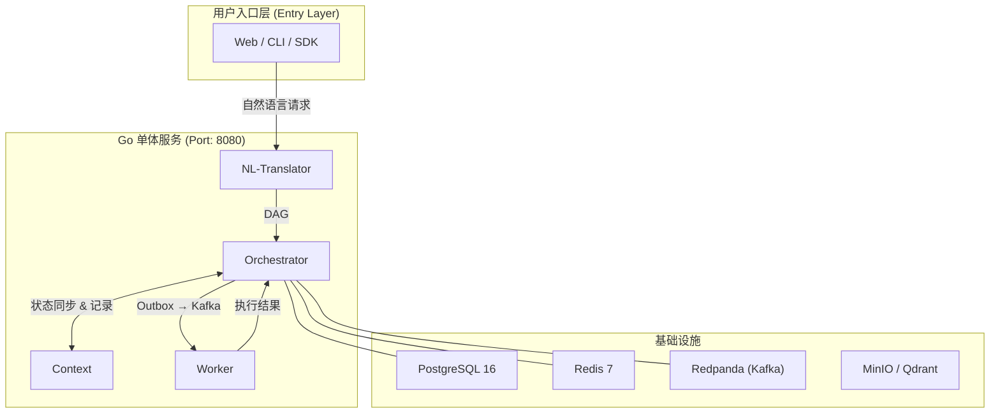

# 灵犀AI原生操作系统 (AIOS)

> **核心理念**: 用户通过**自然语言**直接操作硬件、中间件和应用，**绕过复杂的 GUI 前端交互**，为下一代操作系统做准备。

---

## 阅读指南

### 什么是 AIOS？

**AIOS 是新一代自然语言驱动的操作系统**。

#### 传统操作系统的交互方式

```
用户 ──▶ 点击图标 ──▶ 打开应用 ──▶ 点击菜单 ──▶ 选择功能 ──▶ 填写表单 ──▶ 执行操作
         (复杂的 GUI 交互链路)
```

#### AIOS 的交互方式

```
用户 ──▶ 说一句话 ──▶ 系统自动执行
         (自然语言直达目标)
```

#### 对比示例

| 场景 | 传统 GUI 操作 | AIOS 自然语言操作 |
|------|--------------|------------------|
| 查询数据库 | 打开工具 → 连接服务器 → 选数据库 → 写SQL → 执行 → 查看结果 | "查询用户表中最近一周的注册数据" |
| 部署应用 | 打开终端 → SSH登录 → 拉取代码 → 编译 → 配置 → 启动 | "把最新版本部署到测试环境" |
| 分析日志 | 打开日志平台 → 选时间范围 → 输入过滤条件 → 导出 → 分析 | "分析过去一小时的所有错误日志" |
| 发送邮件 | 打开邮箱 → 新建 → 填写收件人 → 写主题 → 写正文 → 添加附件 → 发送 | "给张三发一封项目进度报告邮件" |

### 核心价值

- 降低使用门槛: 不需要学习复杂的 GUI 操作，会说话就会用
- 提升效率: 一句话完成原本需要多步操作的任务
- 统一交互: 硬件、中间件、应用都用同一种方式操作
- 面向未来: 为下一代自然语言操作系统奠定基础

---

## 系统架构图

### 自然语言操作全景图



### 用户请求处理流程

```
用户: "查询北京的天气并生成总结报告"
                │ 自然语言
                ▼
┌─────────────────────────────────────────────┐
│  NL-Translator                               │
│  解析意图 → 调用 LLM → 生成任务图 (DAG)        │
│                                              │
│  ┌──────────┐    ┌──────────┐               │
│  │ 查询天气  │ ──▶│ 生成总结  │               │
│  │ (TOOL)   │    │ (LLM)    │               │
│  └──────────┘    └──────────┘               │
└─────────────────────────────────────────────┘
                │ REST API
                ▼
┌─────────────────────────────────────────────┐
│  Orchestrator                                │
│  事件驱动调度 → 状态收敛 → 依赖检查 → 重试     │
│  Outbox 保证事件不丢 → Kafka 分发             │
└─────────────────────────────────────────────┘
                │ Kafka 事件
                ▼
┌─────────────────────────────────────────────┐
│  Worker                                      │
│  ┌─────────┐  ┌─────────┐  ┌─────────┐     │
│  │  Bash   │  │  LLM    │  │  天气   │     │
│  │  (沙箱) │  │  工具   │  │  工具   │     │
│  └─────────┘  └─────────┘  └─────────┘     │
└─────────────────────────────────────────────┘
```

---

## 模块职责

### NL-Translator
**做什么**: 自然语言理解层，把用户意图转换为可执行的任务图

- 调用 OpenAI API 解析用户意图
- 生成 DAG 任务图（节点 + 依赖边）
- 支持一步翻译+提交

### Orchestrator
**做什么**: 任务调度内核，协调各模块完成复杂任务

- 接收 DAG 任务图
- 按依赖关系调度执行顺序（事件驱动，DependencyChecker 检查依赖后触发）
- 统一状态管理（StateService 收敛所有状态变更）
- 条件分支支持（condition 字段，不满足时节点自动 SKIPPED）
- 指数退避重试（RetryPolicy: 1s → 2s → 4s → ... → 60s）
- 幂等执行保障（idempotencyKey 去重）
- Outbox 模式保证事件不丢（先写 DB 再异步转发 Kafka）
- 系统中断恢复（Scheduler 30s 兜底扫描超过1分钟的停滞节点）

### Context
**做什么**: 操作审计层，记录一切操作历史

- 记录每个操作的详细信息
- 保存节点快照（用于故障恢复）
- 提供操作追溯和审计能力
- 支持从任意点恢复执行

### Worker
**做什么**: 工具执行层，真正操作硬件、中间件、应用

- 插件式工具架构（Tool 接口 + ToolRegistry）
- 内置 BashTool（沙箱隔离：命令白名单 + 危险模式过滤 + /tmp/ai-sandbox 目录）
- 内置 LlmApiTool（调用 OpenAI 兼容 API）
- 内置 WeatherTool（天气查询示例工具）
- 支持自定义工具注册
- 幂等结果发布（idempotencyKey 作为 Kafka 消息 key）
- 超时控制

---

## 技术栈

| 组件 | 技术 | 说明 |
|------|------|------|
| 语言 | Go 1.23+ | 高性能、并发友好 |
| HTTP 框架 | Gin | 轻量级 Web 框架 |
| 数据库 | pgx (PostgreSQL 16) | 原生 PostgreSQL 驱动 |
| 缓存 | go-redis (Redis 7) | Redis 客户端 |
| 消息队列 | IBM/sarama (Redpanda) | Kafka 兼容客户端 |
| 配置 | Viper | 支持 .env + YAML |
| 日志 | Zap | 高性能结构化日志 |

---

## 快速开始

### 环境准备

```bash
# 安装 Go 1.23+
brew install go          # macOS
# 或访问 https://go.dev/dl/  # Linux

# 确保 Docker 已安装并运行
docker info
```

### 一键安装与启动

```bash
# 1. 安装环境和构建
./scripts/install_lingxi_env.sh

# 2. 编辑 .env 填写 OPENAI_API_KEY
vim .env

# 3. 启动服务
./scripts/startup.sh
```

### 手动启动

```bash
# 启动基础设施
docker compose up -d

# 构建并运行
make run
```

### 测试

```bash
# 运行 API 测试
./scripts/test-apis.sh

# 运行单元测试
go test ./...

# 健康检查
curl http://localhost:8080/api/health
```

---

## 项目结构

```
lingxi-ai-operation-system/
├── cmd/lingxi-ai-os/           # 入口: main.go (服务组装 + 优雅关闭)
├── internal/
│   ├── config/                 # Viper 配置 (.env 支持)
│   ├── database/               # pgx 连接池 + Schema 迁移
│   ├── eventbus/               # Kafka 生产者/消费者 (Sarama)
│   ├── logger/                 # Zap 日志 (dev/prod)
│   ├── model/                  # 数据模型 + 仓储层
│   │   └── repository/         # pgx CRUD 操作
│   ├── outbox/                 # Outbox 模式 (事件先写 DB 再转发 Kafka)
│   │   └── relay.go            # Relay 协程 + SaveEvent 写入
│   ├── redis/                  # go-redis 客户端
│   ├── orchestrator/
│   │   ├── handler/            # Gin HTTP 处理器
│   │   └── service/            # 状态机 + 调度器 + 依赖检查 + 条件分支
│   ├── translator/
│   │   ├── handler/            # Gin HTTP 处理器
│   │   └── service/            # NL → DAG 翻译
│   ├── context/
│   │   ├── handler/            # Gin HTTP 处理器
│   │   └── service/            # 上下文/快照管理
│   └── worker/
│       ├── service/            # 节点执行引擎
│       └── tool/
│           ├── builtin/        # BashTool(沙箱), LlmApiTool, WeatherTool
│           └── tool_test.go    # 工具测试
├── frontend/                   # 前端项目 (React/Vue 等)
│   ├── src/
│   │   ├── components/        # UI 组件
│   │   ├── pages/              # 页面
│   │   ├── hooks/              # 自定义 Hooks
│   │   ├── utils/              # 工具函数
│   │   ├── services/           # API 服务
│   │   ├── stores/             # 状态管理
│   │   ├── styles/             # 样式文件
│   │   └── assets/             # 静态资源
│   └── public/                 # 公共资源
├── scripts/
│   ├── install_lingxi_env.sh   # 环境安装脚本
│   ├── startup.sh              # 后端启动脚本
│   └── test-apis.sh            # API 测试脚本
├── docs/
│   ├── ARCHITECTURE.md         # 架构设计文档
│   ├── API_REFERENCE.md        # API 接口文档
│   └── ONBOARDING.md           # Go 新手上路指南
├── docker-compose.yml          # 基础设施容器
├── Dockerfile                  # 多阶段构建 (后端)
├── Makefile                    # 常用命令
├── go.mod / go.sum             # Go 依赖管理
└── .env.example                # 环境变量模板
```

---

## 环境配置

```bash
cp .env.example .env
```

必要配置:
- `OPENAI_API_KEY` - LLM 服务的 API Key
- `OPENAI_BASE_URL` - LLM 服务的基础 URL
- `POSTGRES_PASSWORD` - PostgreSQL 密码

---

## 文档索引

| 文档 | 内容 | 难度 |
|------|------|------|
| [ARCHITECTURE.md](docs/ARCHITECTURE.md) | 架构设计详解 | ⭐⭐ |
| [API_REFERENCE.md](docs/API_REFERENCE.md) | API 接口文档 | ⭐ |
| [ONBOARDING.md](docs/ONBOARDING.md) | Go 新手上路指南 | ⭐ |

---

## 常见问题

**Q: AIOS 和传统操作系统有什么区别？**
A: 传统操作系统需要用户通过 GUI 点击操作，AIOS 让用户用自然语言直接操作硬件、中间件和应用。

**Q: 为什么用 Go 重写？**
A: Go 编译为单二进制、启动快、内存占用低、并发原生支持，适合部署为轻量级 AI 操作系统。

**Q: 需要多个服务端口吗？**
A: 不需要。Go 版本采用模块化单体架构，所有模块运行在同一个进程的 8080 端口。

**Q: NL-Translator 返回 503？**
A: 检查 `.env` 中的 `OPENAI_API_KEY` 是否配置正确。

**Q: 如何添加自定义工具？**
A: 实现 `Tool` 接口（Name, Description, Type, Execute, ValidateParameters），然后注册到 `ToolRegistry`。参见 [ONBOARDING.md](docs/ONBOARDING.md)。

**Q: Bash 工具安全吗？**
A: BashTool 运行在沙箱环境中，只允许白名单命令，过滤危险模式（管道、重定向、命令链等），工作目录限制在 `/tmp/ai-sandbox`。

**Q: 事件会丢失吗？**
A: 不会。系统使用 Outbox 模式，事件先写入数据库 outbox 表，再由 Relay 协程异步转发到 Kafka，保证事件不丢。

**Q: 如何实现条件分支？**
A: 在 DAG 节点的 `condition` 字段中指定条件（如 `"nodeA.status == success"`），不满足条件的节点会自动标记为 SKIPPED，下游依赖仍可正常推进。

---

## License

MIT License
