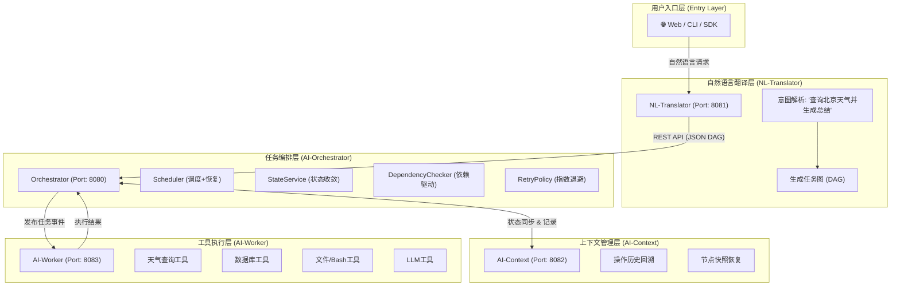
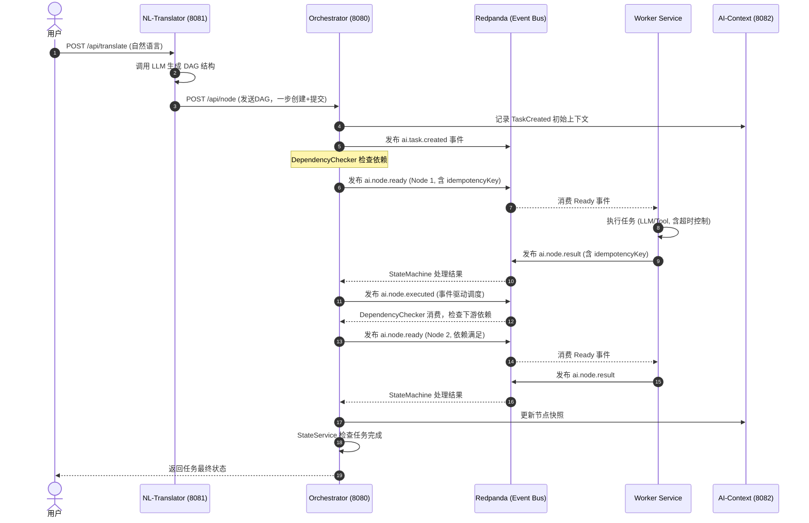
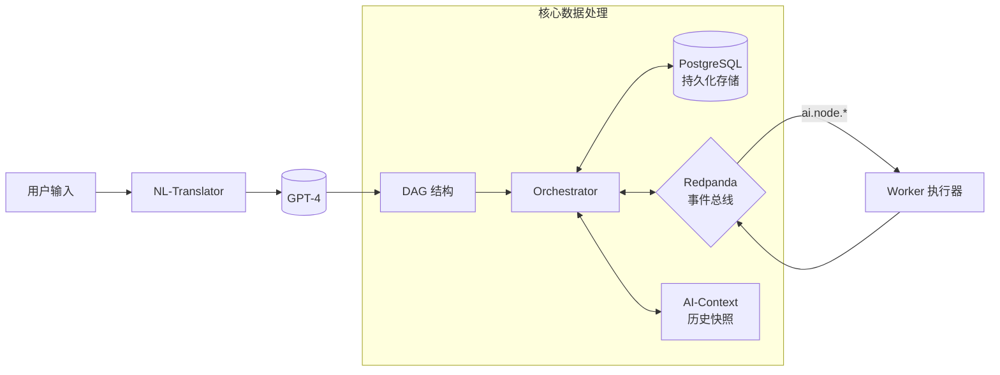
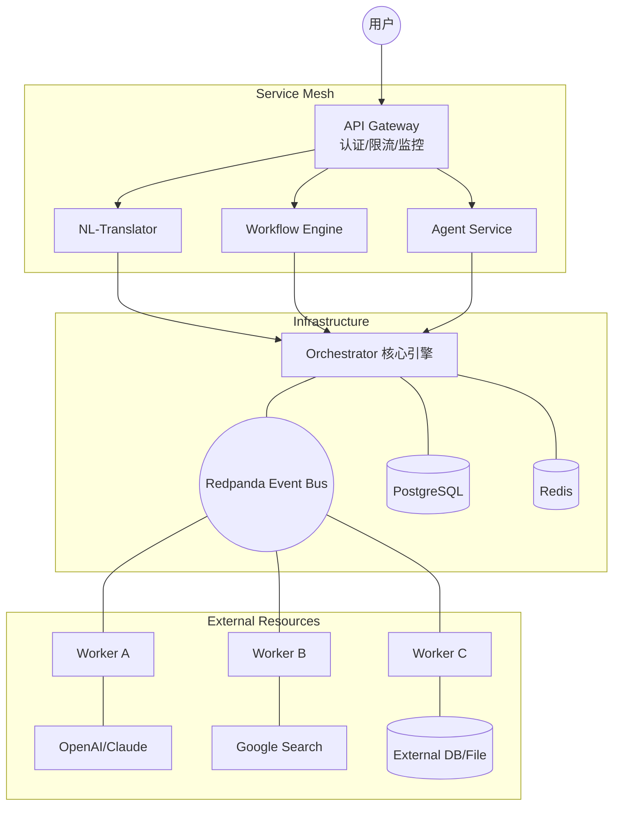

# 灵犀AI原生操作系统 (AIOS)

> **核心理念**: 用户通过**自然语言**直接操作硬件、中间件和应用，**绕过复杂的 GUI 前端交互**，为下一代操作系统做准备。

---

## 📚 阅读指南

本文档面向**零基础读者**，帮助你快速理解整个系统。

### 什么是 AIOS？

**AIOS 是新一代自然语言驱动的操作系统**。

#### 传统操作系统的交互方式

```
用户 ──▶ 点击图标 ──▶ 打开应用 ──▶ 点击菜单 ──▶ 选择功能 ──▶ 填写表单 ──▶ 执行操作
         (复杂的 GUI 交互链路)
```

#### AIOS 的交互方式

```
用户 ──▶ 说一句话 ──▶ 系统自动执行
         (自然语言直达目标)
```

#### 对比示例

| 场景 | 传统 GUI 操作 | AIOS 自然语言操作 |
|------|--------------|------------------|
| 查询数据库 | 打开工具 → 连接服务器 → 选数据库 → 写SQL → 执行 → 查看结果 | "查询用户表中最近一周的注册数据" |
| 部署应用 | 打开终端 → SSH登录 → 拉取代码 → 编译 → 配置 → 启动 | "把最新版本部署到测试环境" |
| 分析日志 | 打开日志平台 → 选时间范围 → 输入过滤条件 → 导出 → 分析 | "分析过去一小时的所有错误日志" |
| 发送邮件 | 打开邮箱 → 新建 → 填写收件人 → 写主题 → 写正文 → 添加附件 → 发送 | "给张三发一封项目进度报告邮件" |

### 核心价值

- 🎯 **降低使用门槛**: 不需要学习复杂的 GUI 操作，会说话就会用
- ⚡ **提升效率**: 一句话完成原本需要多步操作的任务
- 🔧 **统一交互**: 硬件、中间件、应用都用同一种方式操作
- 🚀 **面向未来**: 为下一代自然语言操作系统奠定基础

---

## 🏗️ 系统架构图

### 自然语言操作全景图



### 用户请求处理流程

```
┌─────────────────────────────────────────────────────────────────────────────┐
│                              用户层                                          │
│  ┌─────────────────────────────────────────────────────────────────────┐  │
│  │  用户: "查询北京的天气并生成总结报告"                                     │  │
│  └─────────────────────────────────────────────────────────────────────┘  │
└────────────────────────────────────┬────────────────────────────────────────┘
                                     │ 自然语言 (一句话)
                                     ▼
┌─────────────────────────────────────────────────────────────────────────────┐
│                       自然语言翻译层 (NL-Translator)                         │
│  ┌─────────────────────────────────────────────────────────────────────┐  │
│  │  解析意图 → 生成任务图 (DAG)                                          │  │
│  │                                                                      │  │
│  │  ┌──────────┐    ┌──────────┐                                       │  │
│  │  │ 查询天气  │ ──▶│ 生成总结  │                                       │  │
│  │  │ (TOOL)   │    │ (LLM)    │                                       │  │
│  │  └──────────┘    └──────────┘                                       │  │
│  └─────────────────────────────────────────────────────────────────────┘  │
│                              端口: 8081                                     │
└────────────────────────────────────┬────────────────────────────────────────┘
                                     │ REST API
                                     ▼
┌─────────────────────────────────────────────────────────────────────────────┐
│                       任务编排层 (AI-Orchestrator)                            │
│  ┌─────────────────────────────────────────────────────────────────────┐  │
│  │  事件驱动调度 → 状态收敛(StateService) → 依赖检查 → 指数退避重试         │  │
│  └─────────────────────────────────────────────────────────────────────┘  │
│                              端口: 8080                                     │
└────────────────────────────────────┬────────────────────────────────────────┘
                                     │ REST API / 事件
                                     ▼
┌─────────────────────────────────────────────────────────────────────────────┐
│                       工具执行层 (AI-Worker)                                  │
│  ┌─────────────────────────────────────────────────────────────────────┐  │
│  │  ┌─────────┐  ┌─────────┐  ┌─────────┐  ┌─────────┐  ┌─────────┐ │  │
│  │  │  天气   │  │  数据库  │  │  文件   │  │  Bash   │  │  LLM   │ │  │
│  │  │  查询   │  │  查询   │  │  系统   │  │  命令   │  │  工具   │ │  │
│  │  └─────────┘  └─────────┘  └─────────┘  └─────────┘  └─────────┘ │  │
│  └─────────────────────────────────────────────────────────────────────┘  │
│                              端口: 8083                                     │
└────────────────────────────────────┬────────────────────────────────────────┘
                                     │
                    ┌────────────────┼────────────────┐
                    │                │                │
                    ▼                ▼                ▼
┌─────────────────────────────────────────────────────────────────────────────┐
│                           被操作的目标                                        │
│  ┌─────────────┐  ┌─────────────┐  ┌─────────────┐  ┌─────────────┐      │
│  │   硬件       │  │  中间件      │  │   应用       │  │  外部服务    │      │
│  │  • 服务器    │  │  • 数据库    │  │  • 邮件系统  │  │  • OpenAI   │      │
│  │  • 存储      │  │  • 缓存      │  │  • 办公软件  │  │  • 搜索引擎  │      │
│  │  • 网络      │  │  • 消息队列  │  │  • 业务系统  │  │  • 云服务    │      │
│  └─────────────┘  └─────────────┘  └─────────────┘  └─────────────┘      │
└─────────────────────────────────────────────────────────────────────────────┘
```

### 典型使用场景

| 用户说 | 系统执行 | 操作目标 |
|--------|---------|---------|
| "查询北京天气并生成总结" | 天气工具查询 → LLM总结 | 外部工具 + LLM |
| "查询用户注册数据并生成报告" | 数据库查询 → LLM生成报告 | 中间件/数据库 |
| "分析最近一周的异常日志" | 收集日志 → LLM分析 → 生成报告 | 中间件/日志系统 |

### 🔗 模块间通信详解



### 📊 数据流向图



---

## 🎯 模块职责

### NL-Translator (端口 8081)
**做什么**：自然语言理解层，把用户意图转换为可执行的任务图

```
用户说: "查询北京天气并生成总结报告"
                                    ↓
NL-Translator 解析意图，生成 DAG:
                                    ↓
┌──────────┐    ┌──────────┐
│ 查询天气  │ ──▶│ 生成总结  │
│ (TOOL)   │    │ (LLM)    │
└──────────┘    └──────────┘
```

### AI-Orchestrator (端口 8080)
**做什么**：任务调度内核，协调各模块完成复杂任务

- 接收 DAG 任务图
- 按依赖关系调度执行顺序（事件驱动，DependencyChecker 检查依赖后触发）
- 统一状态管理（StateService 收敛所有状态变更）
- 指数退避重试（RetryPolicy: 1s → 2s → 4s → ... → 60s）
- 幂等执行保障（idempotencyKey 去重）
- 系统中断恢复（Scheduler 自动恢复 CREATED 节点）

### AI-Context (端口 8082)
**做什么**：操作审计层，记录一切操作历史

- 记录每个操作的详细信息
- 保存节点快照（用于故障恢复）
- 提供操作追溯和审计能力
- 支持从任意点恢复执行

### AI-Worker (端口 8083)
**做什么**：工具执行层，真正操作硬件、中间件、应用

- 连接数据库、缓存、消息队列等中间件
- 操作服务器、存储、网络等硬件资源
- 调用邮件系统、办公软件等应用
- 对接 OpenAI、搜索引擎等外部服务
- 支持内置工具（Bash/LLM）和外部工具注册
- 幂等结果发布（idempotencyKey 作为 Kafka 消息 key）

---

## 🚀 快速开始

### 一键启动所有服务

```bash
cd /Users/wanglian/Projects/lingxi-ai-operation-system
./scripts/startup.sh
```

### 手动启动（分步骤）

```bash
# 1. 启动基础设施
docker compose up -d

# 2. 启动上下文服务
cd ai-context && mvn spring-boot:run &

# 3. 启动编排服务
cd ai-orchestrator && mvn spring-boot:run &

# 4. 启动翻译服务
cd ai-nl-translator && mvn spring-boot:run &
```

### 测试你的第一个任务

```bash
# 启动外部天气工具
cd examples && pip install fastapi uvicorn && python weather_tool.py &

# 注册外部工具到 Worker
curl -X POST http://localhost:8083/worker/register \
  -H "Content-Type: application/json" \
  -d '{"endpoint": "http://localhost:8090"}'

# 通过 NL-Translator 创建任务
curl -X POST http://localhost:8081/api/translate \
  -H "Content-Type: application/json" \
  -d '{"prompt": "查询北京的天气"}'

# 查询任务状态
curl http://localhost:8080/api/task/{返回的taskId}

# 查看执行上下文
curl http://localhost:8080/api/task/{taskId}/context
```

---

## 📂 项目结构

```
lingxi-ai-operation-system/
│
├── 🌐 用户接口层
├── nl-translator/                    # 自然语言 → DAG 翻译
│   └── 职责：解析用户意图，生成可执行的任务图
│
├── ⚙️ 核心编排层
├── ai-orchestrator/                 # 任务编排引擎
│   └── 职责：事件驱动调度、状态收敛、依赖检查、指数退避重试、幂等执行
│
├── 📝 上下文层
├── ai-context/                     # 上下文管理
│   └── 职责：记录历史、支持回溯、快照恢复、事件自动记录
│
├── 🔧 工具执行层
├── ai-worker/                      # 工具网关
│   └── 职责：执行具体工具、连接外部API、幂等结果发布
│
└── 🗄️ 基础设施
    ├── PostgreSQL 16                # 持久化存储
    ├── Redis 7.x                    # 缓存
    ├── Redpanda                     # 事件总线 (Kafka兼容)
    └── MinIO/Qdrant                 # 对象存储/向量检索
```

---

## 🔮 未来架构展望



---

## 🎓 学习路径

### 第一阶段：跑起来
1. 运行 `./scripts/startup.sh`
2. 调用 API 创建任务
3. 观察任务执行过程

### 第二阶段：理解原理
1. 阅读 [ORCHESTRATOR_GUIDE.md](docs/guides/ORCHESTRATOR_GUIDE.md) - 理解任务编排
2. 阅读 [NL_TRANSLATOR_GUIDE.md](docs/guides/NL_TRANSLATOR_GUIDE.md) - 理解自然语言处理
3. 阅读 [AI_CONTEXT_GUIDE.md](docs/guides/AI_CONTEXT_GUIDE.md) - 理解上下文管理
4. 阅读 [WORKER_GUIDE.md](docs/guides/WORKER_GUIDE.md) - 理解工具执行

### 第三阶段：二次开发
1. 添加新的节点类型
2. 实现自定义 Worker
3. 扩展 NL-Translator

---

## 📖 文档索引

| 文档 | 内容 | 难度 |
|------|------|------|
| [ORCHESTRATOR_GUIDE.md](docs/guides/ORCHESTRATOR_GUIDE.md) | 任务编排详解 | ⭐⭐ |
| [NL_TRANSLATOR_GUIDE.md](docs/guides/NL_TRANSLATOR_GUIDE.md) | 自然语言翻译详解 | ⭐⭐ |
| [AI_CONTEXT_GUIDE.md](docs/guides/AI_CONTEXT_GUIDE.md) | 上下文管理详解 | ⭐ |
| [WORKER_GUIDE.md](docs/guides/WORKER_GUIDE.md) | 工具执行层详解 | ⭐⭐⭐ |

---

## ❓ 常见问题

**Q: AIOS 和传统操作系统有什么区别？**
A: 传统操作系统需要用户通过 GUI 点击操作，AIOS 让用户用自然语言直接操作硬件、中间件和应用。

**Q: 为什么需要 NL-Translator？**
A: 将用户的自然语言意图转换为系统可执行的任务图（DAG），实现"说一句话，系统自动执行"。

**Q: 为什么需要 Orchestrator？**
A: 复杂任务往往包含多个步骤，Orchestrator 负责协调这些步骤的执行顺序和状态管理。

**Q: 为什么需要 AI-Context？**
A: 记录所有操作历史，支持审计追溯和故障恢复，确保操作可追溯、可恢复。

**Q: AI-Worker 是什么？**
A: 真正执行操作的模块，负责连接数据库、操作服务器、调用外部 API 等，是"干活"的模块。

**Q: 这和 ChatGPT 有什么区别？**
A: ChatGPT 只是对话，AIOS 是真正**执行操作**的系统。用户说"重启服务器"，AIOS 会真的去重启服务器。

---

## License

MIT License
