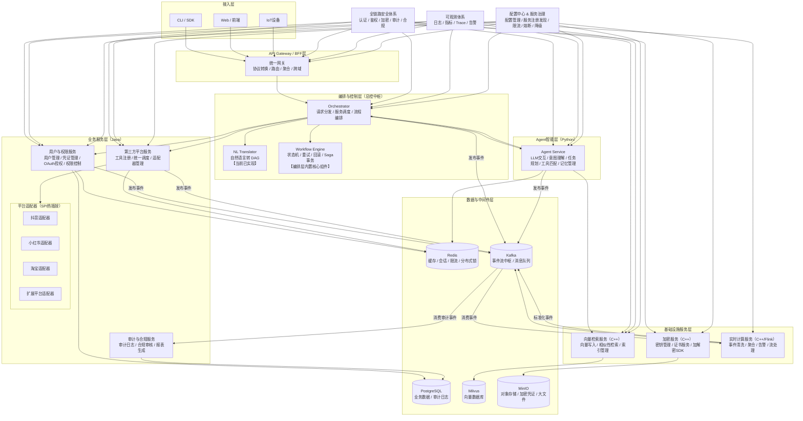

# 灵犀AI原生操作系统 (AIOS)

> **核心定位**: Orchestrator 是灵犀AI原生OS的绝对核心，相当于现代操作系统的CPU + 内核调度器 + 进程管理器。

## 项目概览

灵犀AI原生OS是一个多语言、模块化的AI操作系统，基于深度架构设计文档实现。

### 当前实现模块架构图

```
┌─────────────────────────────────────────────────────────────────────────┐
│                              用户                                         │
└────────────────────────────────────┬────────────────────────────────────┘
                                     │ 自然语言
                                     ▼
┌─────────────────────────────────────────────────────────────────────────┐
│                    NL Translator 模块（用户访问入口）                     │
│  ┌───────────────────────────────────────────────────────────────────┐  │
│  │ TranslateController                                               │  │
│  │   - POST /api/translate           (仅翻译，返回DAG)               │  │
│  │   - POST /api/translate-and-submit (翻译并提交)                   │  │
│  │   - GET /api/task/{taskId}       (查询任务状态)                   │  │
│  └──────────────┬────────────────────────────────────────────────────┘  │
│                 │                                                         │
│  ┌──────────────▼───────────────────┐  ┌───────────────────────────┐  │
│  │ NlToDagService                   │  │ OpenAiClientService       │  │
│  │   - 自然语言转 DAG               │  │   - OpenAI API 调用        │  │
│  └──────────────┬───────────────────┘  └───────────────────────────┘  │
└─────────────────┼─────────────────────────────────────────────────────────┘
                  │ 内部调用
                  ▼
┌─────────────────────────────────────────────────────────────────────────┐
│              AI Orchestrator 模块（内部服务）                            │
│  ┌───────────────────────────────────────────────────────────────────┐  │
│  │ TaskController                                                   │  │
│  │   - POST /api/node  (接收DAG创建任务)                             │  │
│  │   - GET /api/task/{id} (查询任务状态)                              │  │
│  └──────────────┬────────────────────────────────────────────────────┘  │
│                 │                                                         │
│  ┌──────────────▼───────────────────┐  ┌───────────────────────────┐  │
│  │ OrchestratorService              │  │ StateMachineService       │  │
│  │   - 任务编排调度                  │  │   - 状态机管理              │  │
│  └──────────────┬───────────────────┘  └───────────────┬───────────┘  │
│                 │                                         │               │
│  ┌──────────────▼───────────────────┐  ┌───────────────▼───────────┐  │
│  │ EventProducer                    │  │ EventConsumer              │  │
│  │   - 事件发送                      │  │   - 事件消费                │  │
│  └──────────────┬───────────────────┘  └───────────────┬───────────┘  │
└─────────────────┼────────────────────────────────────────┼───────────────┘
                  │                                │
                  ▼                                ▼
┌─────────────────────────────────────────────────────────────────────────┐
│                              基础设施                                    │
│  ┌───────────────────────┐  ┌───────────────────────────┐             │
│  │ Redis 7.x             │  │ Redpanda / Kafka          │             │
│  │   - 状态存储           │  │   - 事件总线               │             │
│  └───────────────────────┘  └───────────────────────────┘             │
└─────────────────────────────────────────────────────────────────────────┘
```

### 完整系统架构图（远景规划）

### 核心特性

- ✨ **7层深度架构**: 网关层 → 规划层 → 调度层 → 执行层 → 状态层 → 事件层 → 资源层
- 🧠 **自然语言驱动**: NLU自动理解用户意图，生成任务DAG
- 🔍 **全链路可观测**: 结构化日志 + 分布式追踪 + 指标收集
- 📜 **可追溯性**: 事件溯源、状态历史、日志回溯
- 🌐 **多语言支持**: Java/Python/C++ 各有所长
- ⚡ **内核级调度**: 多级反馈队列调度算法

### 模块架构

```
lingxi-ai-operation-system/
├── ai-orchestrator/          # 任务编排层（核心调度）
│   └── 职责：接收 Node/DAG，执行编排调度
├── nl-translator/             # 自然语言翻译层
│   └── 职责：通过 LLM API 将自然语言转换为 Node/DAG
└── docs/                      # 文档
```

## 快速开始

### 前置要求

- Java 17+
- Maven 3.9+
- Docker 和 Docker Compose
- OpenAI API Key（用于 nl-translator）

### 启动 Orchestrator 模块

Orchestrator 模块是一个基于 Redpanda 事件驱动的分布式 AI 编排内核。

```bash
# 进入 Orchestrator 目录
cd ai-orchestrator

# 启动依赖服务（Redis + Redpanda）
docker-compose up -d redis redpanda

# 编译项目
mvn clean compile

# 启动应用
mvn spring-boot:run
```

### 启动 NL Translator 模块

NL Translator 模块负责将自然语言转换为 Node/DAG。

```bash
# 在新的终端中，进入 nl-translator 目录
cd nl-translator

# 设置 OpenAI API Key
export OPENAI_API_KEY=your-api-key-here

# 编译项目
mvn clean compile

# 启动应用（端口 8081）
mvn spring-boot:run
```

### 测试 API

用户只能通过 NL Translator 模块访问系统：

```bash
# 1. 翻译并提交任务（自然语言 → DAG → 执行）
TASK_ID=$(curl -s -X POST http://localhost:8081/api/translate-and-submit \
  -H "Content-Type: application/json" \
  -d '{"prompt":"写一篇关于AI的文章并生成摘要"}' | python3 -c "import sys, json; print(json.load(sys.stdin)['taskId'])")

echo "创建任务成功，Task ID: $TASK_ID"

# 2. 等待执行完成
sleep 5

# 3. 通过 nl-translator 查询任务状态
curl -s http://localhost:8081/api/task/$TASK_ID
```

#### 仅翻译不提交（可选）

如果只需要获取 DAG 而不立即执行：

```bash
# 仅翻译，返回 DAG 结构
curl -s -X POST http://localhost:8081/api/translate \
  -H "Content-Type: application/json" \
  -d '{"prompt":"写一篇关于AI的文章并生成摘要"}'
```

> **重要说明**：
> - 用户不直接访问 Orchestrator 模块
> - Orchestrator 仅作为内部服务被 NL Translator 调用
> - 所有用户请求都通过 NL Translator 模块统一处理

### 详细文档

想了解更多？请查看完整的模块指南：

📖 **[Orchestrator 模块完整指南](./ORCHESTRATOR_GUIDE.md)**

这份指南包含：
- 什么是 Orchestrator？
- 核心功能详解
- 所有类的定义和说明
- 完整的工作流程
- 快速上手教程

📖 **[NL Translator 模块完整指南](./NL_TRANSLATOR_GUIDE.md)**

这份指南包含：
- 什么是 NL Translator？
- 如何配置 OpenAI API
- 自然语言到 DAG 的转换原理
- API 接口使用说明
- 快速上手教程

## 项目结构

```
lingxi-ai-operation-system/
├── README.md                           # 本文档
├── ORCHESTRATOR_GUIDE.md              # Orchestrator 模块完整指南
├── NL_TRANSLATOR_GUIDE.md            # NL Translator 模块指南
├── create_orchestrator.md             # Orchestrator SDD 设计文档
├── docker-compose.yml                  # 根目录 Docker 配置
├── ai-orchestrator/                    # 任务编排层 ✨
│   ├── pom.xml                         # Maven 配置
│   ├── docker-compose.yml              # Orchestrator 依赖配置
│   └── src/main/java/com/lingxi/ai/orchestrator/
│       ├── OrchestratorApplication.java
│       ├── controller/                 # API 控制器
│       ├── service/                    # 业务服务
│       ├── model/                      # 数据模型
│       ├── event/                      # 事件处理
│       ├── repository/                 # 数据访问
│       └── config/                     # 配置类
├── nl-translator/                       # 自然语言翻译层 ✨
│   ├── pom.xml                         # Maven 配置
│   └── src/main/java/com/lingxi/ai/translator/
│       ├── NlTranslatorApplication.java
│       ├── controller/                 # API 控制器
│       ├── service/                    # 业务服务
│       ├── model/                      # 数据模型
│       └── config/                     # 配置类
└── ...
```

## 技术栈

| 层级 | 技术选型 |
|------|----------|
| 开发语言 | Java 17+ |
| Web框架 | Spring Boot 3.2.5 |
| 状态存储 | Redis 7.x |
| 事件总线 | Redpanda (Kafka 兼容) |
| 构建工具 | Maven 3.9.x |

## 与现代操作系统的类比

| 现代操作系统 | 灵犀AI原生OS Orchestrator |
|--------------|---------------------------|
| CPU | 任务调度、指令执行 |
| 内核调度器 | 优先级调度、资源分配、时间片轮转 |
| 进程管理器 | 任务创建、状态管理、上下文切换 |
| 系统调用接口 | 统一API网关、请求接入 |
| 设备驱动 | 工具/服务调用适配器 |
| 文件系统 | 状态持久化、上下文存储 |

## License

MIT License
