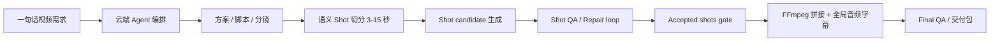

<p align="center">
  
</p>

<h1 align="center">躺营 AI 自媒体运营系统</h1>

<p align="center">
  从一个想法开始，把选题、脚本、分镜、素材生成、审核、渲染和交付串成一条可追踪的视频创作流水线。
</p>

<p align="center">
  <a href="https://github.com/SUSTechWLA/tangying-ai-operation-system/wiki">项目 Wiki</a>
  ·
  <a href="https://github.com/SUSTechWLA/tangying-ai-operation-system/wiki/English">English Wiki</a>
  ·
  <a href="docs/RELEASE_STATUS.md">Release Status</a>
  ·
  <a href="CHANGELOG.md">Changelog</a>
  ·
  <a href="#快速开始">快速开始</a>
  ·
  <a href="#适合谁">适合谁</a>
</p>

<p align="center">
  
  
  
  
</p>

---

## 当前版本

**v0.1.13 - JiMeng CLI settings consolidation**

- Closed beta runbook、beta smoke、fallback fixture、diagnostics、artifact provenance 和 readiness gate 已就绪。
- 视频流水线已对齐 shot 级生产闭环：语义/画面变化切分、3-15 秒时长校验、candidate 级 QA、保守 repair loop、accepted shot gate、FFmpeg final assembly 和 final QA。
- 桌面端已修复 local runner 登录态注入时的重启问题；已安装客户端可以先启动本地 agent，再平滑切换为带用户会话的 runner。
- 即梦 CLI / MCP 登录配置已归入设置页，和文生图片、文生视频 Provider 一起管理；项目页只保留说明和跳转按钮。
- 项目页启动体检会自动运行，只展示未就绪或需留意的问题；具体本地工具命令和排障细节保留在设置页、追踪页和诊断包中。
- 无真实 AIGC provider 时可以跑通 fallback preview、shot QA report、machine-readable repairPlan、accepted shot provenance 和 final assembly diagnostics。
- 当前 release 分支可作为初版受控内测上线基线，用于技术型用户安装、诊断、反馈和小范围创作者试用。
- 邀请真实创作者前，必须在完整本地环境中运行 `BETA_READINESS_REQUIRE_AIGC=1 bash scripts/beta-readiness-check.sh` 并得到 `GO`。

详细版本历史见 [CHANGELOG.md](CHANGELOG.md)。当前可用性和内测门槛见 [docs/RELEASE_STATUS.md](docs/RELEASE_STATUS.md)。

## 一句话理解

躺营不是一个单点的“文生视频按钮”，而是一个把真实创作过程拆成可审核阶段的 AI 视频制片台。它让云端负责编排，让用户电脑负责本地工具执行和文件生产，让创作者在关键节点确认方向，避免黑盒式生成。

<table>
  <tr>
    <td width="33%">
      <h3>给内容创作者</h3>
      <p>输入主题后，系统按视频类型拆出方案、脚本、分镜、素材需求、预览和成片，减少从零组织流程的成本。</p>
    </td>
    <td width="33%">
      <h3>给团队负责人</h3>
      <p>每个阶段都有产物、状态和审核记录，方便知道项目卡在哪里、谁需要确认、哪些素材还缺。</p>
    </td>
    <td width="33%">
      <h3>给技术团队</h3>
      <p>云端编排、本地 runner、工具 manifest、MCP 扩展和桌面端解耦，方便继续接入新模型和新工具。</p>
    </td>
  </tr>
</table>

## 当前能做什么

| 能力 | 体验结果 |
|---|---|
| 影视化 / AIGC shot 视频 | 从故事大纲、详细剧本、角色/场景/道具档案、多视角参考图到语义 shot 切分、candidate 生成、shot 级 QA 和返修 |
| 口播 / 知识类视频 | 先生成口播稿，再按口播设计 HyperFrames、录屏、AIGC 图片/视频素材和最终成片 |
| 分阶段审核 | 方案、脚本、分镜、预览、渲染等节点可确认、拒绝、编辑或重新生成 |
| 本地执行器 | 用户电脑负责本地文件、HyperFrames 项目、渲染和工具执行 |
| 即梦 JiMeng MCP 扩展 | 用户显式安装并登录 Dreamina CLI 后，可通过本地 MCP 自动生成 AIGC 素材 |
| Shot 级抽帧 QA | 每个 shot candidate 独立 QA，失败后生成保守 repairPlan，只有通过或人工批准的 candidate 才能进入 final assembly |
| 手动外部生成兜底 | 没有可用模型或未启用即梦时，系统仍会展示可复制提示词和参考图信息 |

## 创作流程



Shot split policy 固定为 `minShotDurationSec=3`、`maxShotDurationSec=15`、`preferredShotDurationSec=6-8`、`splitByScriptSemantics=true`、`splitByVisualChange=true`。切分优先参考剧情节点、场景、主体、动作、景别、视角、焦段、情绪节奏和旁白/对白语义段落；超过 15 秒必须继续拆分，短于 3 秒只在连续且合并后不超过 15 秒时合并。

成片阶段只消费 accepted shot candidate。最终 voiceover、BGM、ducking、字幕时间轴、响度、转码和 final QA 在 final assembly 阶段统一处理，不在每个 shot 内烧录最终字幕或混最终 BGM。

## 产品架构

<table>
  <tr>
    <td width="25%"><strong>桌面客户端</strong><br/>React + Electron，给真实用户操作项目、审核、追踪和导出。</td>
    <td width="25%"><strong>本地 Agent</strong><br/>管理本机目录、模型配置、本地 artifacts、MCP provider 和 runner。</td>
    <td width="25%"><strong>云端 Backend</strong><br/>负责任务编排、DAG、审核门、工具 manifest、持久化和 API。</td>
    <td width="25%"><strong>工具扩展</strong><br/>HyperFrames、FFmpeg、JiMeng MCP 等工具通过明确命令边界接入。</td>
  </tr>
</table>

## 适合谁

- 想把短视频生产流程标准化的个人创作者和小团队
- 需要“AI 生成 + 人工确认 + 本地交付”的视频工作流
- 希望保留本地文件控制权，不把所有素材、密钥和中间产物交给云端的团队
- 正在验证 AIGC 影视化、口播视频、自动分镜和多 Agent 编排的产品原型

## 快速开始

> 当前 release 分支适合作为初版受控内测上线基线、工程演示版和私有部署原型。真实商用前建议先用自己的模型账号、即梦账号和本地 runner 跑完整链路。

```bash
# 本地 Agent
bash scripts/start-local-backend.sh

# 桌面前端
bash scripts/start-frontend.sh

# 云端 Backend
bash scripts/start-cloud-backend.sh
```

打开桌面端后，进入“躺营导演台”，输入视频主题，选择“口播知识视频”或“影视/AIGC shot 视频”入口即可开始。

Closed beta 安装、诊断和 smoke 验证见 [Closed Beta Runbook](docs/BETA_RUNBOOK.md)。快速自检可运行：

```bash
bash scripts/beta-smoke-check.sh
```

邀请真实创作者前，先启动 cloud/local/frontend/HyperFrames 和 AIGC MCP provider，再运行：

```bash
BETA_READINESS_REQUIRE_AIGC=1 bash scripts/beta-readiness-check.sh
```

只有 readiness 返回 `GO` 时，才把当前环境描述为“一句话生成高质量真实 AIGC 视频”的内测版本；`CONDITIONAL` 只代表 fallback 预览和工程链路可验证。

## MCP 扩展

本地 Agent 支持标准 MCP provider 注册。provider 可以用 Python、Node、Go 或其他语言实现，只要暴露标准 `tools/list` 与 `tools/call` 能力即可；系统只保存 provider 配置，不绑定具体实现语言。

即梦 JiMeng 扩展内置了 Python stdio MCP server，用来封装用户本机 Dreamina CLI。用户端提供显式授权的一键安装向导：

1. 安装或更新 Dreamina CLI。
2. 注册本地 JiMeng MCP provider。
3. 启动 `python3 mcp/jimeng/server.py` 标准 MCP 服务。
4. 获取即梦登录码，在即梦页面完成授权。
5. 开启“自动调用即梦生成素材”。

Dreamina OAuth、积分、任务记录和日志仍保留在用户自己的机器和即梦 CLI 目录中，云端不保存即梦凭据。

更多 provider 配置见 [MCP Provider 接入](docs/mcp-providers.md)。

<details>
<summary><strong>开发者验证命令</strong></summary>

```bash
cd local-backend && go test ./...
cd ../cloud-backend && go test ./...
cd ../frontend && npm run test:director && npm run lint && npm run build
```

API 文档：

```text
Cloud backend: http://localhost:8080/docs
Local agent:   http://localhost:18080/api/local/docs
```

</details>

## 开发与版本管理

- `develop_go` 是 Go/核心系统开发者分支，口头简称 `developgo`；常规功能开发先从该分支拉出 `feature/*`。
- `release` 是发布分支，只接收来自 `develop_go` 或 `hotfix/*` 的合入。
- 每次合入 `release` 都必须更新 `CHANGELOG.md`，并在本 README 只保留当前版本摘要。
- 对外发布必须创建语义化 tag，例如 `v0.1.2`；tag 指向对应 release 提交，不复用旧 tag。
- 临时素材、渲染缓存和本地测试输出不进入发布提交。

完整规范见 [版本管理 Wiki](docs/version-management.md)。

## 项目文档

- [项目介绍（中文）](docs/PROJECT_INTRODUCTION.md)
- [Project Introduction (English)](docs/PROJECT_INTRODUCTION_EN.md)
- [中文 Wiki](https://github.com/SUSTechWLA/tangying-ai-operation-system/wiki)
- [English Wiki](https://github.com/SUSTechWLA/tangying-ai-operation-system/wiki/English)
- [MCP Provider 接入](docs/mcp-providers.md)
- [Closed Beta Runbook](docs/BETA_RUNBOOK.md)
- [Release Status](docs/RELEASE_STATUS.md)
- [Changelog](CHANGELOG.md)
- [版本管理 Wiki](docs/version-management.md)
- [视频抽帧 QA Wiki](docs/video-frame-qa.md)
- [影视类视频创作流程](docs/cinematic-video-workflow.md)

Wiki 中包含产品介绍、系统边界、核心流程、即梦 MCP 使用方式和后续路线图。
