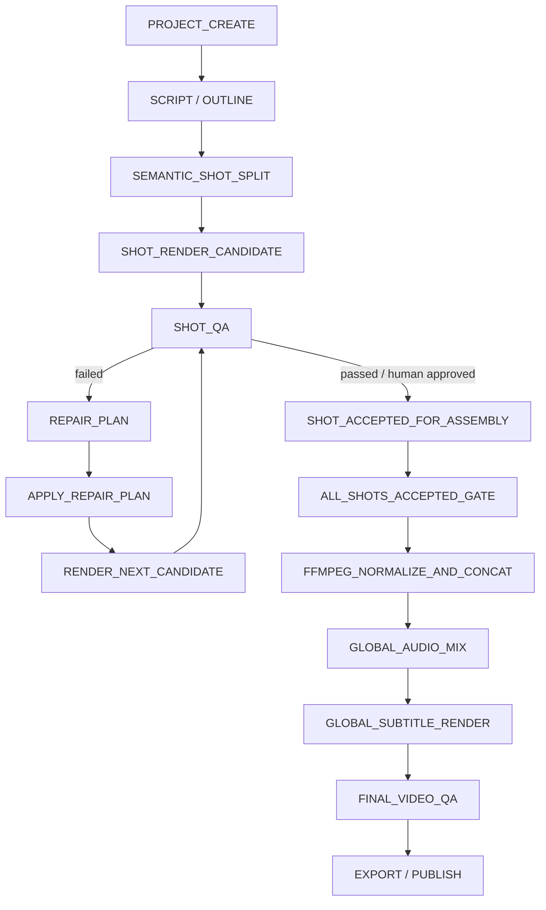

# Closed Beta Runbook

This runbook is for the initial closed beta launch with controlled technical users. It is not a public SaaS deployment guide.

Current beta readiness and launch criteria are tracked in [Release Status](RELEASE_STATUS.md). Historical release notes live in [Changelog](../CHANGELOG.md).

## One-command Source Deployment

After installing the platform dependencies below, a fresh clone can start the Docker backend and HyperFrames service, wait for health, package the desktop client, and open it with one command:

```bash
bash scripts/one-click-deploy.sh up --open
```

Use `bash scripts/one-click-deploy.sh status` to verify health and `bash scripts/one-click-deploy.sh down` to stop managed services without deleting named data volumes. The command prints the packaged `.app` and `.dmg` paths.

## Supported Platforms

- macOS 14+ on Apple Silicon is the primary closed beta target.
- Linux x86_64 is supported for cloud/local/backend development.
- Windows is not a primary beta target yet. Use WSL2 for backend development and expect Electron packaging gaps.

## Dependencies

- Go 1.24+ for `local-backend`; Go 1.25.x is used by `cloud-backend`.
- Node.js 24 and npm for `frontend` and `hyperframes-render-service`.
- Python 3.11+ for MCP services.
- FFmpeg on `PATH`.
- Docker Desktop or Docker Engine for Postgres, Redis, Redpanda, and MinIO.
- Optional: Dreamina/JiMeng CLI for real AIGC image/video generation.

Install Python MCP dependencies:

```bash
python3 -m pip install -r mcp/video_qa/requirements.txt
python3 -m pip install -r mcp/jimeng/requirements.txt
python3 -m pip install -r mcp/ip_avatar_3d/requirements.txt
```

Install Node dependencies:

```bash
cd frontend && npm ci
cd ../hyperframes-render-service && npm ci
```

## Environment Files

Copy the cloud example and edit it before starting cloud backend:

```bash
cp cloud-backend/.env.example cloud-backend/.env
```

Important beta variables:

| Variable | Purpose |
|---|---|
| `AUTH_TOKEN_SECRET` | Long random auth/encryption secret. Required to be strong in `GIN_MODE=release`. |
| `POSTGRES_PASSWORD` | Database password. Do not use defaults in release/production. |
| `MINIO_ACCESS_KEY` / `MINIO_SECRET_KEY` | Object storage credentials. Do not use defaults in release/production. |
| `CORS_ALLOWED_ORIGINS` | Comma-separated frontend origins, for example `http://localhost:3000`. Must not be `*` in release/production. |
| `SANDBOX_ENABLED` | Must be `true` in release/production because code execution tools exist. |
| `SANDBOX_FALLBACK` | Must be `false` in release/production. |
| `HYPERFRAMES_SERVICE_URL` | Default `http://127.0.0.1:8787`. |
| `MODEL_PROVIDER_MODE` | Keep `fake` for closed beta cloud. Real model keys live in the local desktop settings. |
| `TANGYING_CLOUD_API_BASE` | Cloud API base used by local runner. |
| `TANGYING_USER_TOKEN` | User access token for local runner. Never commit it. |
| `TANGYING_DEVICE_ID` | Stable local runner device id. |

Do not put real secrets in docs, tests, screenshots, or issue comments.

## Start Cloud Backend

```bash
bash scripts/start-cloud-backend.sh
```

This starts Docker dependencies, builds `cloud-backend/build/tangying-ai-os`, and runs cloud backend on `http://localhost:8080`.

For release-like validation:

```bash
cd cloud-backend
GIN_MODE=release go run ./cmd/tangying-ai-os
```

Release mode will reject weak auth/database/MinIO secrets, wildcard CORS, disabled sandbox, and sandbox fallback.

## Start Local Backend / Local Agent

Local agent only:

```bash
bash scripts/start-local-backend.sh
```

Local runner enabled:

```bash
TANGYING_CLOUD_API_BASE=http://127.0.0.1:8080 \
TANGYING_USER_TOKEN=<access-token> \
TANGYING_DEVICE_ID=<stable-device-id> \
bash scripts/start-local-backend.sh
```

Local agent listens on `http://127.0.0.1:18080`.

## Start Frontend / Electron

Web dev:

```bash
bash scripts/start-frontend.sh
```

Electron dev:

```bash
cd frontend
npm run electron:dev
```

## Start HyperFrames Render Service

```bash
cd hyperframes-render-service
HYPERFRAMES_PROJECT_ROOT="$HOME/Library/Application Support/TangyingAIOS/projects" \
HYPERFRAMES_OUTPUT_ROOT="$HOME/Library/Application Support/TangyingAIOS/projects" \
npm run dev
```

Health check:

```bash
curl http://127.0.0.1:8787/health
```

## FFmpeg Check

```bash
ffmpeg -version
ffprobe -version
```

If missing, install FFmpeg and restart local agent and HyperFrames render service.

## MCP Provider Configuration

List configured providers:

```bash
curl http://127.0.0.1:18080/api/local/mcp-providers
```

Check provider status:

```bash
curl http://127.0.0.1:18080/api/local/mcp-providers/status
```

Register JiMeng stdio provider:

```bash
curl -X POST http://127.0.0.1:18080/api/local/jimeng/setup/register-mcp \
  -H 'Content-Type: application/json' \
  -d '{"transport":"stdio"}'
```

## JiMeng / Dreamina / AIGC Provider

- JiMeng/Dreamina is optional for closed beta smoke.
- If not configured or if credits are insufficient, the system must label outputs as fallback preview/storyboard.
- Real Dreamina credentials stay in the local CLI and local agent config. Cloud backend must not store them.
- Tests and CI must never call real paid AIGC providers.

## OpenAI-Compatible Model Provider

Cloud beta uses `MODEL_PROVIDER_MODE=fake`. Configure real OpenAI-compatible providers in the desktop settings for:

- `text_to_text`
- `text_to_image`
- `text_to_video`

The local agent masks API keys in normal responses and diagnostics.

## Beta Smoke

Run:

```bash
bash scripts/beta-smoke-check.sh
```

The script checks Go, Node, npm, Python, FFmpeg, key ports, release env safety, cloud/local Go tests, frontend lint/build, `mcp/video_qa` unittest, and HyperFrames render service build. It does not install dependencies or call real providers.

To run only the no-provider fallback fixture:

```bash
bash scripts/beta-fallback-fixture.sh
```

It writes a 2-shot fallback preview plus the same machine-readable pipeline reports expected from beta diagnostics under `scripts/tmp/beta-fallback-fixture/`: `artifact_manifest.json`, `video_frame_qa.json`, `shot_qa_reports.json`, `shot_repair_plan.json`, `shot_list.json`, `shot_split_report.json`, `shot_duration_validation.json`, `shot_candidates.json`, `repair_plans.json`, `accepted_shots.json`, `assembly_plan.json`, `subtitle_timeline.json`, `audio_mix_plan.json`, `final_qa_report.json`, and `provenance_summary.json`.

## Shot Production Pipeline

Closed beta video projects must follow this production contract:



Shot split policy:

| Field | Value |
|---|---|
| `minShotDurationSec` | `3` |
| `maxShotDurationSec` | `15` |
| `preferredShotDurationSec` | `6-8` |
| `splitByScriptSemantics` | `true` |
| `splitByVisualChange` | `true` |

Shot splitting must prefer story and visual boundaries over fixed time buckets: scene changes, subject changes, action goal changes, shot size changes, focal length or perspective changes, time jumps, emotion shifts, information-point changes, and narration/dialogue paragraph boundaries. A shot longer than 15 seconds must be split again; a shot shorter than 3 seconds may only merge with a compatible neighbor when the merged unit remains at most 15 seconds.

Shot material packages must be readable by non-technical users and must avoid repeating the same visual description as every asset prompt. For every video shot that needs external generation, the package exposes:

- `aigcPlan`: the copyable AIGC video prompt for background or partial motion only. It must include text-safe blank areas and must tell the provider not to generate readable Chinese text, subtitles, logos, watermarks, or UI copy.
- `hyperframesPlan`: the local HyperFrames plan for exact Chinese text, subtitles, keyframes, UI cards, charts, and visual emphasis.
- `ffmpegFusionPlan`: the compositing plan that crops, overlays, normalizes, and merges the AIGC material and HyperFrames layer into the complete shot.

If a shot contains important text, the AIGC layer should leave that region blank or lightly textured. The exact text must be rendered by HyperFrames or final subtitle rendering, not by the AIGC provider.

Creator-facing shot workspace checks:

- Entering the `产物` page should auto-select the Shot workflow from the creation profile. Every Shot must visibly separate IP A-roll, HyperFrames/HyperKeyframes text and effects, AIGC enrichment, and composition; voice / knowledge Shots prioritize narration and IP continuity, while cinematic / AIGC Shots prioritize script intent, continuity references, storyboard/keyframes, and AIGC visual direction.
- With `aigcPolicy=disabled`, the Shot must still expose an AIGC design marked `designed=true`, `enabled=false`, `executionPolicy=disabled`, and it must create zero executable external-generation requests.
- The shot page should read top-to-bottom as steps 1-6. Upload and backfill actions must live inside the relevant step instead of a separate advanced section.
- Image artifacts should be visible thumbnails with click-to-enlarge and regeneration guidance. Video artifacts should have inline controls plus a large playback dialog.
- Subtitle artifacts should be parsed into a time-coded text timeline when available, not shown only as "generated".
- Normal success states such as `valid`, `registered`, `preview ready`, or raw `local://projects/...` paths should not be the primary user-facing message. Show actionable warnings and failures, but keep successful media focused on what the creator can read or watch.
- AIGC video provider calls must use the AIGC layer prompt (`aigcPrompt`, `aigcVideoPrompt`, or `aigcPlan.prompt`). HyperFrames text-layer prompts are for local overlay/keyframe generation and must not be sent as the Dreamina/JiMeng video prompt.

Shot QA state flow:

```text
PLANNED
  -> GENERATING
  -> CANDIDATE_RENDERED
  -> SHOT_QA_RUNNING
  -> SHOT_QA_PASSED / SHOT_QA_FAILED / HUMAN_REVIEW_REQUIRED
  -> ACCEPTED_FOR_ASSEMBLY
```

If QA fails, the system creates a new candidate instead of overwriting the failed one:

```text
SHOT_QA_FAILED
  -> CREATE_REPAIR_PLAN
  -> APPLY_REPAIR_PLAN
  -> RENDER_NEXT_CANDIDATE
  -> SHOT_QA_AGAIN
```

Default repair policy is `maxRepairAttemptsPerShot=3`, `maxAigcRegenerationAttemptsPerShot=2`, `preferLocalRepairBeforeAigcRegen=true`, and `preservePassedDimensions=true`. Repair plans must lock passed dimensions such as `prompt_alignment`, `character_identity`, `scene`, `action`, `text_intent`, `duration`, and `style`, then patch only failed dimensions.

Final assembly rules:

- Final assembly only consumes accepted candidate artifacts.
- Failed candidates must not enter FFmpeg concat.
- Every accepted shot must be 3-15 seconds and QA passed or human approved.
- FFmpeg normalization aligns resolution, fps, pixel format, and codec before concat.
- Voiceover alignment, BGM mixing/ducking, loudness, final subtitles, final transcode, and final QA run on the global timeline after concat.
- Final subtitles use global timestamps; shot-level subtitles are preview-only unless explicitly marked as non-final.
- Final QA failure blocks export/publish.

## Beta Readiness Gate

Before inviting real creators, run the readiness gate after starting cloud backend, local agent, frontend/Electron, HyperFrames render service, and any real AIGC MCP provider:

```bash
bash scripts/beta-readiness-check.sh
```

For one-sentence, high-quality real AIGC trials, require a healthy video provider and configured model routes:

```bash
BETA_READINESS_REQUIRE_AIGC=1 bash scripts/beta-readiness-check.sh
```

The gate writes `readiness-input.json`, `readiness-report.json`, and `beta-smoke.log` under `scripts/tmp/beta-readiness/`.

Decision meanings:

| Decision | Meaning | Who can use it |
|---|---|---|
| `GO` | Smoke, diagnostics, FFmpeg, HyperFrames, local agent, structured shot QA, model routes, and real AIGC video provider are all confirmed. | Small controlled creator cohort can try real video creation. |
| `CONDITIONAL` | Fallback preview and engineering checks work, but real AIGC or live service readiness is incomplete. | Internal engineering/design review only. Do not promise high-quality AIGC output. |
| `BLOCKED` | A core gate such as smoke, diagnostics, FFmpeg, QA report, or required real AIGC provider is missing. | Do not invite users until fixed. |

Minimum entry criteria for creator trials:

- `BETA_READINESS_REQUIRE_AIGC=1 bash scripts/beta-readiness-check.sh` returns `GO`.
- At least one JiMeng/Dreamina MCP video generation has produced a real `aigc_video` artifact with `isFallback=false`.
- A diagnostics zip can be exported after a failed or successful run.
- Every shot has a structured QA report and machine-readable `repairPlan`.
- Every final assembly consumes only accepted shot candidates and writes `assembly_plan.json`, `subtitle_timeline.json`, `audio_mix_plan.json`, `final_qa_report.json`, and `provenance_summary.json`.
- Testers understand this is closed beta and provider credits/rate limits can still interrupt generation.

## Logs

Common locations:

| Component | Logs |
|---|---|
| Local agent | `~/Library/Application Support/TangyingAIOS/logs/local-agent.jsonl` on macOS |
| Local diagnostics | `~/Library/Application Support/TangyingAIOS/diagnostics/beta-diagnostics.zip` |
| Cloud backend | terminal output or container logs |
| HyperFrames render service | terminal output from `npm run dev` |
| JiMeng/Dreamina CLI | user-managed Dreamina CLI log directory |

## Export Diagnostics

From frontend: open `导出` and click `导出诊断包`.

From CLI:

```bash
curl -X POST http://127.0.0.1:18080/api/local/diagnostics \
  -H 'Content-Type: application/json' \
  -d '{"reason":"closed-beta-support"}'
```

The zip contains app version, git commit, recent task IDs, redacted environment status, local logs, MCP provider config/status summary, recent artifact metadata, shot QA reports, shot split reports, shot duration validation, shot candidates, repair plans, accepted shots, assembly plan, subtitle timeline, audio mix plan, final QA report, artifact manifest/provenance summary, and failure stacks. It does not include raw uploaded source media or artifact `content` files by default.

## Real AIGC vs Fallback

Treat an artifact as real AIGC only when provenance says:

- `sourceType` is `aigc_video` or `aigc_image`.
- `isFallback` is `false`.
- `providerName` is set, for example `jimeng`.
- `providerJobId` or ready `storageRef` exists.
- `sourceSummary.externalVideoRequirementSatisfied=true` for AIGC shot video runs.

Treat it as fallback when any of these appear:

- `sourceType=fallback_storyboard`, `fallback_ip_composite`, or `fallback_preview`.
- `isFallback=true`.
- `fallbackReason` is non-empty.
- `sourceSummary.readyVideoCount=0` while video requests exist.

Fallback output is useful for QA and review, but must not be described as a real JiMeng/Dreamina AIGC video result.

For a local three-layer talking-head verification, `fallback_ip_composite` is the expected provenance when AIGC execution is disabled. Confirm that `hyperframes/assets/data.json` contains `shot_visual_layers_v1`, the three `designedLayers`, an execution policy for every layer, readable `visualLayers` summaries on every Shot, and preserved `shotGenerationPlans`. The final MP4 must retain the requested canvas, use the packaged IP A-roll as the continuous picture/audio base, and show HyperFrames text without covering the eyes or mouth.

## Common Errors

| Symptom | Cause | Action |
|---|---|---|
| Cloud exits in release mode | Weak secret, wildcard CORS, sandbox disabled, or sandbox fallback enabled | Fix `.env` and restart. |
| Local runner does not pick jobs | Missing `TANGYING_CLOUD_API_BASE`, `TANGYING_USER_TOKEN`, or `TANGYING_DEVICE_ID` | Start local agent with all three variables. |
| Desktop project page says local executor is not started | Port `18080` is owned by a stale or manually started local agent, or the desktop app has not injected the login session into its bundled runner | Stop the manual `scripts/start-local-backend.sh` process, restart the installed desktop app, then log in again if the project page still reports runner unavailable. |
| HyperFrames render fails | Render service down, path outside allowed roots, or FFmpeg missing | Check `/health`, root env vars, and FFmpeg. |
| JiMeng request is blocked | Prompt/reference preflight failed | Rewrite prompt as visual timed story beats or attach usable references. |
| No real AIGC video ready | Provider failed, credits insufficient, timeout, or request deferred | Check `assetProvenance`, `sourceSummary`, and provider logs; fallback preview is expected. |
| QA says `RERENDER_HTML` | Text/subtitle/UI safe area issue | Re-render HTML overlays or recomposite with FFmpeg. |
| QA says `REGEN_AIGC_WITH_REFERENCE` | Missing references for AIGC consistency | Add reference assets before regenerating shot. |

## Known Closed Beta Limits

- No public multi-tenant hardening.
- Real AIGC generation depends on local provider login, credits, rate limits, and provider UI/CLI stability.
- Video QA is deterministic frame metrics plus shot spec lint. OCR/ASR/PyIQA/VLM judge are schema-ready but not bundled.
- Fallback storyboard render is for preview, QA, and recovery, not proof of real provider success.
- `CONDITIONAL` readiness is not enough for a "one sentence creates high-quality video" promise.
- Windows packaging is not a primary beta path.
