# 躺营 AIOS 项目架构图文导览

> 适用版本：v4.0 beta  
> 阅读对象：产品、研发、测试、部署同学  
> 核心结论：这是一个面向个人创作者的视频创作 Agent 系统，采用「前端桌面工作台 + 本地轻量执行器 + 云端 AIOS Core + HyperFrames 渲染服务」的分层架构。

## 1. 一句话理解

躺营 AIOS 当前不是泛办公平台，而是一条视频创作生产线：用户在导演工作台输入想法，云端 Dynamic Agent Runtime 把自然语言目标编译成可执行 DAG，本地 Runner 负责重媒体和本地文件任务，Artifact 体系记录脚本、分镜、Prompt、视频、发布包等阶段性产物，人工审核和质量门禁负责把控关键节点。

```text
选题/想法
→ 创意方案
→ 脚本/口播稿
→ 分镜/镜头计划
→ 资产与 Prompt
→ 预览/渲染
→ Artifact 审核
→ 发布包
→ 发布记录与运营复盘
```

## 2. 总体架构图

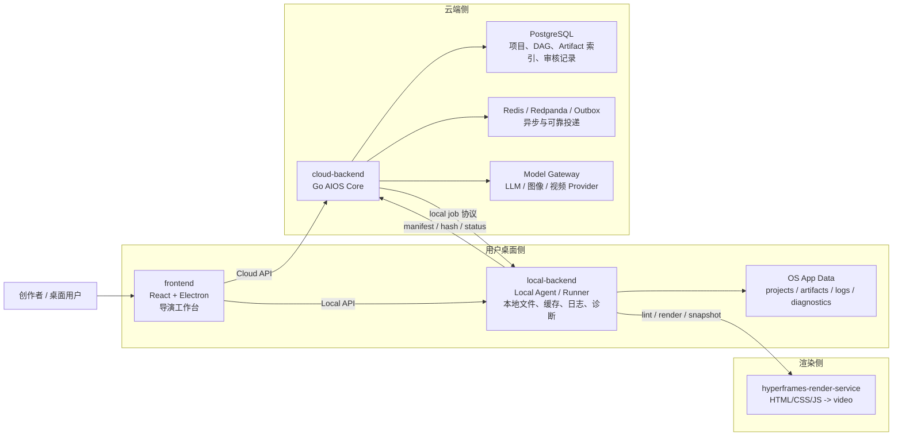

这张图体现了项目最重要的边界：云端负责“计划、编排、状态和索引”，本地负责“用户文件、重媒体处理和用户自配 Provider”。本地运行时不能依赖 PostgreSQL、Redis、Kafka、MinIO、Docker，也不能打包云端 LLM API Key。

## 3. 代码目录边界

```text
frontend/                    React + Electron 前端，默认入口是导演工作台
local-backend/               本地轻量执行器与 local-agent
cloud-backend/               Go AIOS Core，负责动态 Agent、编排、API、模型网关
hyperframes-render-service/  HyperFrames 渲染服务
skill-capabilities/          能力/技能相关配置
scripts/                     本地开发、构建、启动脚本
docs/                        架构、部署、使用、测试文档
```

关键边界规则：

- `frontend` 只做用户体验、状态展示和 API 调用，不直接承担编排决策。
- `local-backend` 只处理本地文件、缓存、日志、诊断、白名单本地命令和 Runner 任务。
- `cloud-backend/internal/core` 是通用引擎层，不写死视频业务规则。
- `cloud-backend/internal/agents/video` 是当前视频创作业务入口。
- `cloud-backend/internal/agents/publish` 是 beta 发布兼容层，后续会迁移到 `distribution`。

## 4. 前端层：导演工作台

前端由 React + Electron 组成，默认入口在 `frontend/src/App.tsx`，登录后进入 `frontend/src/pages/DirectorStudioPage.tsx`。

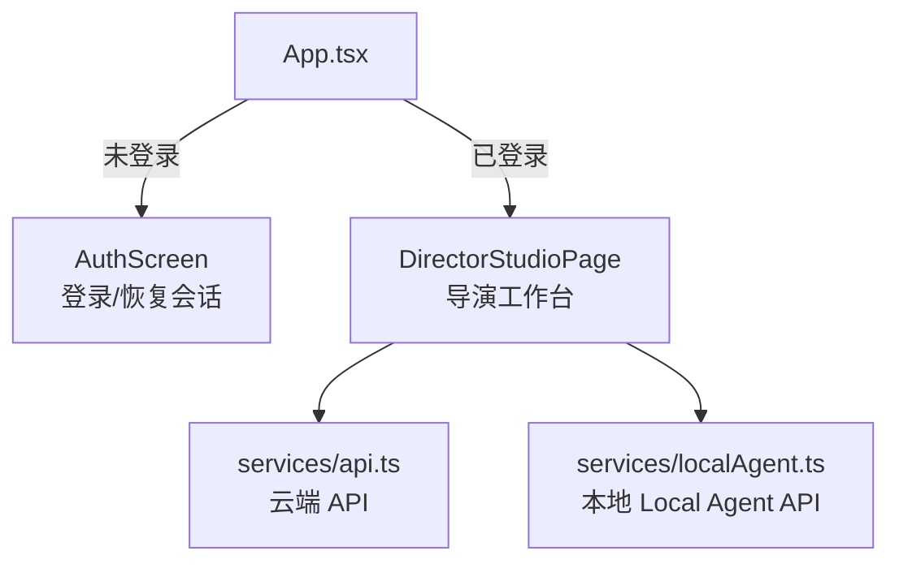

导演工作台承担的用户侧工作包括：

- 创建视频项目、选择模式和目标时长。
- 启动 Dynamic Agent Run 或项目工作流。
- 展示阶段树、运行状态、Artifact、审核入口和发布素材。
- 在 Electron 环境下检查本地服务健康状态。
- 导出发布文案 Markdown/JSON 等交付物。

前端主要调用集中在 `frontend/src/services/api.ts`，包括：

- `/api/auth/*`：登录和会话。
- `/api/video-projects/*`：视频项目、工作流、阶段审批、项目 Artifact。
- `/api/agent/runs/*`：动态 Agent 运行、追踪和 Review。
- `/api/publish`、`/api/ai/*`：beta 发布兼容接口。

## 5. 云端层：AIOS Core

云端核心位于 `cloud-backend/internal/core`，承担平台机制；视频业务位于 `cloud-backend/internal/agents/video`。

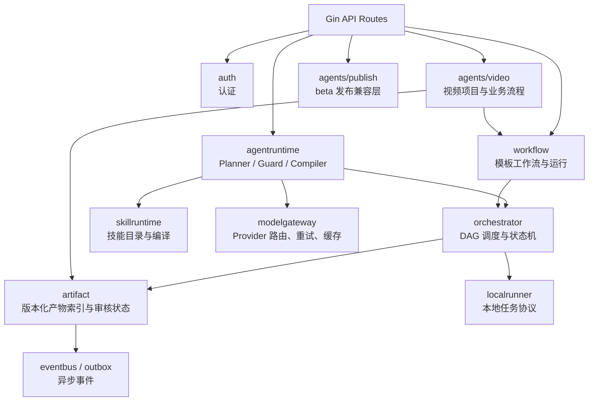

核心模块说明：

| 模块 | 责任 |
| --- | --- |
| `agentruntime` | 从自然语言生成 AgentPlan，并经过 Guard 校验、Compiler 编译为临时 DAG |
| `orchestrator` | 执行 DAG，管理节点状态、依赖、重试、暂停、恢复和 CONTROL/Review 节点 |
| `workflow` | 维护工作流模板、Workflow Run、阶段审批与 checkpoint |
| `skillruntime` | 加载 skill manifest，形成可路由、可编译的能力目录 |
| `modelgateway` | 统一模型调用入口，屏蔽 Provider 差异，提供缓存与重试 |
| `artifact` | 管理版本化产物、存储引用、审核状态、stale 级联 |
| `localrunner` | 云端与本地 Runner 的注册、心跳、领任务、回传进度协议 |
| `eventbus/outbox` | 可靠事件投递和异步任务衔接 |

## 6. Dynamic Agent Runtime

Dynamic Agent Runtime 是项目 v4 架构的主心脏。它把用户的一句话变成可执行 DAG。

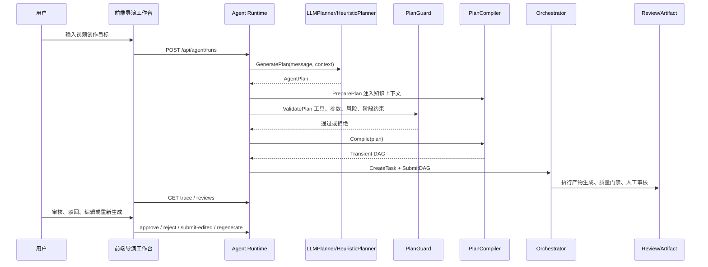

关键代码入口：

- `cloud-backend/internal/core/agentruntime/runner.go`：`Start` 串联 Planner、Guard、Compiler、Orchestrator。
- `cloud-backend/internal/core/agentruntime/planner.go`：启发式 Planner，会根据领域和工具清单生成步骤。
- `cloud-backend/internal/core/agentruntime/llm_planner.go`：LLM Planner 路径。
- `cloud-backend/internal/core/agentruntime/plan_guard.go`：校验工具存在性、参数、引用、成本、风险、本地能力和阶段约束。
- `cloud-backend/internal/core/agentruntime/plan_compiler.go`：注入知识上下文、质量门禁、人工 Review 节点，并编译为 DAG。
- `cloud-backend/internal/core/agentruntime/handler.go`：`/api/agent/runs` 及审核相关 API。

## 7. Plan 到 DAG 的编译模型

`AgentPlan` 是逻辑计划，`DAGRequest` 是执行计划。Compiler 会根据工具 Manifest 和审批策略自动扩展节点。

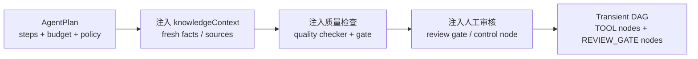

常见扩展规则：

- 如果工具有质量策略，Compiler 会插入质量检查工具和质量门禁节点。
- 如果工具需要人工审批，Compiler 会插入 `REVIEW_GATE` 节点。
- 如果步骤引用上游输出，Guard 会校验 `{{step.output.field}}` 是否指向真实上游。
- 对视频领域，Stage Director 会限制某阶段能用什么工具、最多调用几次、是否必须人工审核。

## 8. 视频业务层

视频业务主要位于 `cloud-backend/internal/agents/video`。

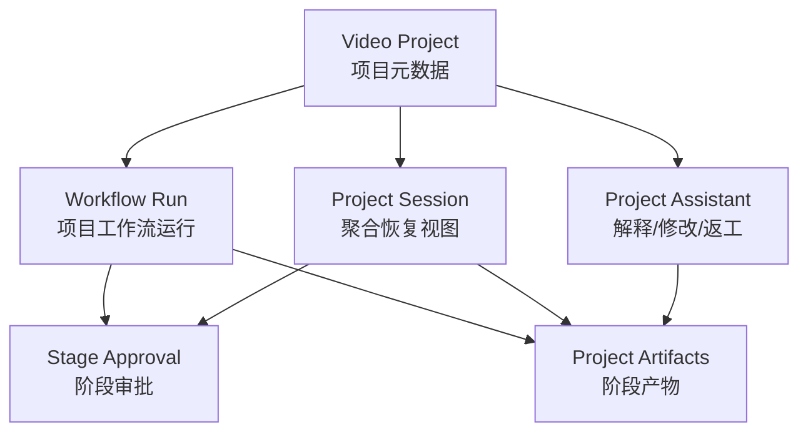

当前 beta 已覆盖：

- 视频项目 CRUD：`/api/video-projects`
- 项目 session 聚合视图：`/api/video-projects/:id/session`
- 工作流运行：`/api/video-projects/:id/workflow-runs`
- 阶段审批：`/api/video-projects/:id/stages/:stage/approve`
- 项目 Artifact 查询：`/api/video-projects/:id/artifacts`
- 项目助手：`/api/video-projects/:id/assistant/*`

视频项目模型包含模式、状态、技能版本、工作流版本、生成方式、画幅、目标时长、语言、本地路径提示等字段。当前支持的生产模式包括：

- `aigc_shot`：AIGC 镜头型视频。
- `voice_visual`：口播可视化视频。

## 9. Artifact 资产体系

Artifact 是系统的长期资产索引，不只是中间文件。云端保存索引、状态、版本、hash 和本地引用，本地保存正文和媒体文件。

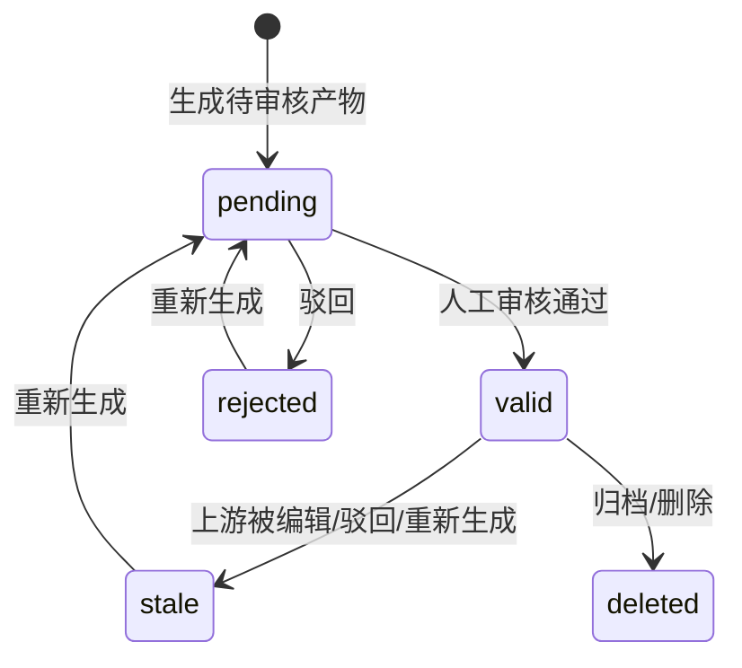

Artifact 关键字段：

| 字段 | 含义 |
| --- | --- |
| `projectId` | 所属视频项目 |
| `stageName` | 所属阶段，如 script、storyboard、render |
| `kind` | 产物类型，如 MARKDOWN、VIDEO、FINAL_REVIEW、PROJECT_PACKAGE |
| `version` | 同阶段同单元的版本号 |
| `storageType` | 新产物归一为 `local` |
| `storageRef` | 本地存储引用 |
| `contentHash` | 内容 hash |
| `isCurrent` | 是否当前有效版本 |
| `status` | valid、stale、rejected、failed、deleted 等 |
| `humanApproved` | 是否人工确认 |
| `dependsOn` | 上游产物依赖 |

典型产物包括：

```text
creative_brief
script
voiceover_script
beat_plan
shot_list
keyframe_prompt
video_prompt
keyframe_image
video_clip
subtitle
audio
cover
final_video
publish_package
operation_report
```

当用户驳回、编辑或重新生成上游产物时，`agentruntime` 会触发 `artifact` 的 stale 级联，提醒下游脚本、分镜、视频或发布包已经过期。

## 10. 本地执行体系

本地运行时由两部分组成：

- `localagent`：提供本地 HTTP API，管理路径、日志、配置、诊断和本地 Artifact。
- `localrunner` / `localtool`：向云端注册 Runner、心跳、领取本地任务，并通过白名单命令执行。

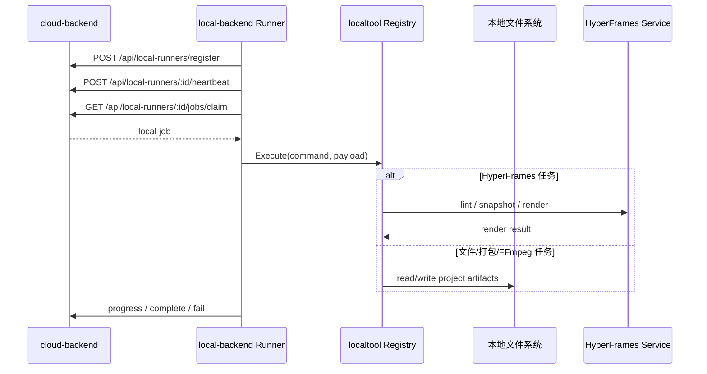

本地 API 入口在 `local-backend/internal/localagent/server.go`，包括：

- `GET /api/local/health`
- `GET /api/local/paths`
- `POST /api/local/logs`
- `GET/PUT /api/local/model-providers`
- `POST /api/local/artifacts`
- `GET/DELETE /api/local/artifacts/:id`
- `DELETE /api/local/projects/:id`
- `POST /api/local/diagnostics`
- `GET /api/local/docs`
- `GET /api/local/openapi.json`

本地命令必须经过白名单，典型命令包括：

```text
HYPERFRAMES_PROJECT_GENERATE
HYPERFRAMES_RENDER
HYPERFRAMES_LINT
HYPERFRAMES_SNAPSHOT
FFMPEG_PROBE
FFMPEG_ASSEMBLE
AUDIO_NORMALIZE
ASR_TRANSCRIBE
ARTIFACT_PACKAGE
FINAL_REVIEW
```

## 11. HyperFrames 渲染链路

HyperFrames 用于口播可视化、信息图、动效视频和发布素材生成。

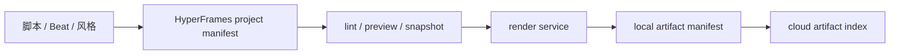

这里仍然遵守本地优先原则：视频正文和大文件留在本地，云端保存索引、hash、状态和 trace。

## 12. 发布与运营路线

当前发布层是 beta 兼容层，代码位于 `cloud-backend/internal/agents/publish`，保留接口包括：

- `POST /api/publish`
- `POST /api/ai/generate`
- `POST /api/ai/generate-from-media`
- `POST /api/ai/polish`
- `POST /api/ai/polish/submit`
- `GET /api/ai/polish/result`
- `GET /api/trace/recent`
- `GET /api/trace/:taskId`
- `GET /api/tools`

后续计划迁移到 `distribution`：

```text
cloud-backend/internal/agents/distribution/
├── package
├── platform
├── plan
├── record
└── compliance
```

运营复盘暂时以“发布记录 + 手动数据回填 + 复盘文档/报告”为起点，后续收敛为 Operation Agent。

## 13. 数据和状态流

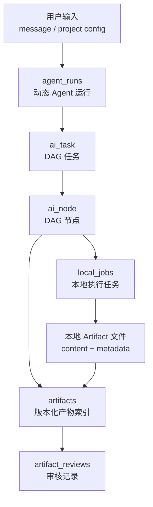

核心表族：

- `agent_runs`：Dynamic Agent Run 状态、计划和 task 关联。
- `ai_task`、`ai_node`、`ai_node_dependency`：DAG 任务与节点。
- `workflow_templates`、`workflow_runs`：模板工作流和运行实例。
- `video_projects`：视频项目。
- `artifacts`：版本化产物索引。
- `artifact_reviews`：人工审核记录。
- `local_runners`、`local_jobs`、`local_job_logs`：本地执行协议。
- `outbox`：可靠事件投递。

## 14. 典型端到端流程

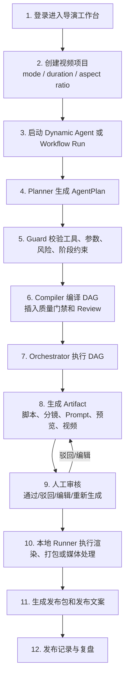

## 15. API 文档机制

OpenAPI 不是手写文档，而是从代码里的权威 spec 生成：

- 云端 spec：`cloud-backend/internal/core/apispec/cloud_spec.go`
- 云端生成文档：`cloud-backend/docs/API_REFERENCE.md`
- 前端生成类型：`frontend/src/utils/api-types.generated.ts`
- 本地 spec：`local-backend/internal/localagent/openapi.go`
- 本地生成文档：`local-backend/docs/API_REFERENCE.md`

变更 API 时需要同步：

```bash
cd cloud-backend
make gen-docs
make api-docs-check
```

本地 API 文档生成：

```bash
cd local-backend
go run ./cmd/gen-local-apidocs
```

## 16. 开发与验证

本地开发：

```bash
bash scripts/start-local-backend.sh
bash scripts/start-frontend.sh
```

云端开发：

```bash
cd cloud-backend
cp .env.example .env
docker compose up -d
go build -o build/tangying-ai-os cmd/tangying-ai-os/main.go
./build/tangying-ai-os
```

推荐验证：

```bash
cd local-backend && go test ./...
cd ../cloud-backend && go test ./...
cd ../cloud-backend && go test -race ./...
cd ../frontend && npm run build
```

API 文档检查：

```bash
cd cloud-backend && make api-docs-check
```

## 17. 架构演进路线

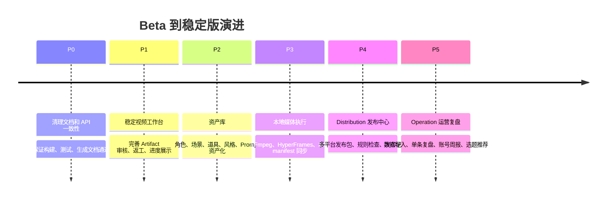

## 18. 读代码建议

如果要快速上手，可以按下面顺序读：

1. `docs/ARCHITECTURE.md`：原始架构设计和路线图。
2. `frontend/src/App.tsx`、`frontend/src/pages/DirectorStudioPage.tsx`：用户入口。
3. `frontend/src/services/api.ts`：前端如何调用云端 API。
4. `cloud-backend/cmd/tangying-ai-os/main.go`：云端服务组装和路由注册。
5. `cloud-backend/internal/core/agentruntime/runner.go`：动态 Agent 主链路。
6. `cloud-backend/internal/core/agentruntime/plan_guard.go`：计划安全和一致性校验。
7. `cloud-backend/internal/core/agentruntime/plan_compiler.go`：计划如何编译成 DAG。
8. `cloud-backend/internal/agents/video/handler`：视频项目和工作流 API。
9. `cloud-backend/internal/core/artifact`：Artifact 版本、审核和 stale 规则。
10. `local-backend/internal/localagent/server.go`、`local-backend/internal/localtool/registry.go`：本地执行边界。

## 19. 总结

这个项目的架构核心是“云端编排 + 本地执行 + Artifact 闭环”。云端不直接吞掉用户的大文件，而是维护计划、状态、索引和审核流；本地承接文件和媒体处理；前端把复杂流程收束成导演工作台；Dynamic Agent Runtime 负责把自然语言创作目标变成可验证、可审核、可追踪的执行 DAG。

