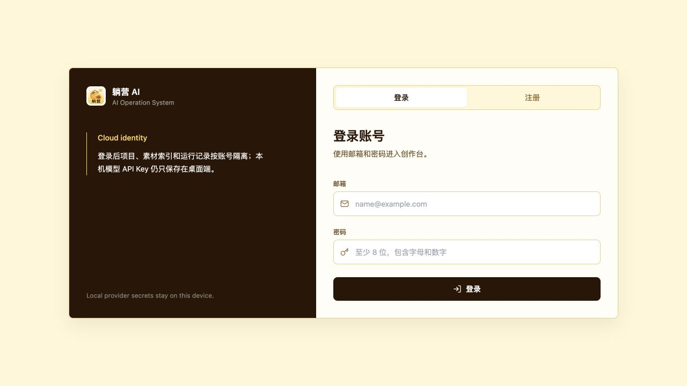
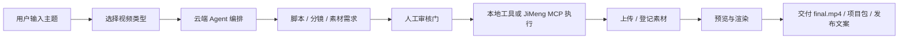

# 躺营 AI 视频创作助手

> 面向创作者和小团队的 AI 视频制片工作台：从一句话选题开始，串起脚本、分镜、素材生成、人工审核、本地渲染和交付。



## 项目定位

躺营不是一个黑盒式“文生视频按钮”，而是一套可追踪、可审核、可扩展的视频创作流水线。系统将真实视频生产拆成多个阶段，由云端负责编排，用户端负责任务执行和本地文件管理，创作者在关键节点确认方向和质量。

它目前更适合作为内测版、私有部署原型和工程演示版使用。对真实用户开放时，应明确说明外部模型账号、即梦积分、本地 runner 和模型 API 配置由用户自行管理。

## 核心卖点

| 面向对象 | 价值 |
|---|---|
| 内容创作者 | 输入主题后自动组织脚本、分镜、提示词、素材需求、预览和交付物，降低从零搭流程的成本。 |
| 小团队 | 项目状态、审核记录、缺失素材和失败节点可追踪，避免“生成到哪一步了”不可见。 |
| 技术团队 | 云端编排、本地执行、工具 manifest、MCP provider 分层清晰，便于继续接入更多模型和本地工具。 |

## 当前能力

### 1. 口播 / 知识类视频

- 支持观点、知识、教程和图文卡片视频。
- 云端生成脚本、时间窗、画面结构、Prompt 和审核节点。
- 本地 runner 生成 HyperFrames 项目、预览快照、最终渲染文件和交付包。
- 本地 IP 数字人口播渲染工具可以使用波波 / 阿斯特角色资产生成 A-roll：参考图高保真 puppet 负责角色层，音频分析负责口型，动作时间轴负责眨眼、呼吸、点头、左右手/双手展示、脚步弹跳、重心变化和发光，分段 prosody 计划负责本地预览声音节奏，FFmpeg 负责合成最终视频。
- 用户可在方案、脚本、预览、成片等节点审核、修改或重生成。

### 2. 影视化 / AIGC Shot 视频

- 支持角色、场景、连续性、关键帧、逐 shot 任务包和外部生成结果回填。
- 每个视频 shot 的素材包会拆成 `aigcPlan`、`hyperframesPlan` 和 `ffmpegFusionPlan`：AIGC 生成无文字背景或局部动态并留出文字安全区，HyperFrames 本地渲染标题、字幕、关键帧和 UI 图形，FFmpeg 负责融合成完整 shot。
- 没有配置外部生成 API 时，系统会给用户展示可复制的 Prompt、负面提示、参考图路径、锁定要求和回填位置。
- 已支持 `LOCAL_FILE_IMPORT`，用户可以把外部平台生成的图片/视频上传回对应 shot。

### 3. 即梦 JiMeng MCP 扩展

- 用户显式授权后，客户端可一键安装/检测 Dreamina CLI。
- 用户注册本地 JiMeng MCP provider 后，云端编排可以通过本地 runner 调用 `LOCAL_MCP_TOOL_CALL`。
- JiMeng OAuth、积分、任务记录和日志仍留在用户本机和即梦 CLI 目录中，云端不保存即梦凭据。
- 未启用即梦时，系统自动回到“复制生成包 + 手动上传”的低门槛流程。

## 创作流程



## 系统架构

| 模块 | 责任 |
|---|---|
| `frontend` | React + Electron 用户端，负责项目启动、状态追踪、审核、素材回填、即梦安装向导和本地设置。 |
| `cloud-backend` | Go 云端服务，负责登录、项目、Agent plan、DAG、审核门、工具 manifest、视频工作流和 API。 |
| `local-backend` | Go 本地 agent，负责本地文件、runner 注册、本地工具、MCP provider、JiMeng CLI 适配和 artifact 上传读取。 |
| `assets/characters` | 本地 IP 角色资产协议，当前包含 `bobo` 和 `aster` 的 `svg2d` puppet、rig、参考图 cutout 和声音画像。 |
| `skill-capabilities` / `cloud-backend/skills` | 视频创作角色、工具和工作流能力定义。 |
| `.github/workflows/ci.yml` | 基础 CI：前端 lint/build、Go 测试和仓库 whitespace 检查。 |

## 用户端体验边界

- 基础模型 API Key 由用户在本地填写，只保存到用户机器，不上传云端。
- 即梦 CLI 安装需要用户显式点击确认，系统不会静默安装外部工具。
- 影视化素材生成可以自动走 JiMeng MCP，也可以手动复制生成包到任意外部模型网站。
- 本地 IP 数字人口播不调用 AIGC 视频生成；生产级声音建议上传匹配 IP 的自然口播音频，本地 `say` 分段 prosody 只作为节奏和口型预览。
- 本地文件以 `local://projects/...` 形式登记，云端保存引用和依赖关系，不强制上传大文件。

## 内测上线建议

可以用于小范围内测，但建议在产品说明中写清楚：

- 用户需要安装桌面端并保持本地 agent 在线。
- 口播链路依赖基础文生文能力；影视化链路至少需要本地文件导入能力。
- 即梦自动生成依赖用户自己的 Dreamina CLI 登录态、会员权益和积分。
- 失败节点可在“执行追踪”查看，后续仍需要增强面向非技术用户的错误恢复引导。

## 开发验证

```bash
cd frontend && npm run test:director && npm run lint && npm run build
cd ../cloud-backend && go test ./...
cd ../local-backend && go test ./...
```

## 分支与发布约定

- `release`：保持干净，只放可上线核心代码和项目首页 README。
- `develop_go`：合入最新 release 后继续开发、验证和更新文档。
- 参考文档、实施计划、截图和 Wiki 素材优先放在 `develop_go` 或 Wiki，不反向污染 `release`。
