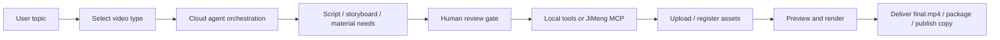

# Tangying AI Video Creation Assistant

> An AI video production workspace for creators and small teams. Start with one idea, then move through script, storyboard, asset generation, human review, local rendering, and delivery.


## Positioning

Tangying is not a black-box text-to-video button. It is a traceable, reviewable, and extensible production pipeline. The cloud backend orchestrates the workflow, while the user-side desktop client and local agent execute local tools, manage files, and keep sensitive provider credentials on the user's machine.

The current version is best suited for private beta testing, engineering demos, and self-hosted prototypes. Before opening it to real users, communicate clearly that external model accounts, JiMeng credits, the local runner, and model API settings are user-managed.

## Why It Matters

| Audience | Value |
|---|---|
| Creators | Turn a topic into script, storyboard, prompts, asset requests, previews, and delivery assets with less manual coordination. |
| Small teams | Track project state, review records, missing materials, failed nodes, and delivery readiness in one workspace. |
| Engineering teams | Extend the system through clean boundaries: cloud orchestration, local runner, tool manifests, and MCP providers. |

## Current Capabilities

### 1. Voice / Knowledge Videos

- Works for opinion, knowledge, tutorial, and visual-card videos.
- The cloud backend generates scripts, time windows, visual structure, prompts, and review gates.
- The local runner creates HyperFrames projects, preview snapshots, final renders, and delivery packages.
- The local IP talking-avatar renderer can create A-roll with Bobo or Aster assets: a high-fidelity reference-image puppet carries the character layer, audio analysis drives mouth shapes, motion timelines drive blink, breath, nod, gesture, and glow, and FFmpeg composes the final video.
- Users can approve, edit, reject, or regenerate key stages.

### 2. Cinematic / AIGC Shot Videos

- Supports character, scene, continuity, keyframe, per-shot task packages, and external generation result import.
- Each video shot package is split into `aigcPlan`, `hyperframesPlan`, and `ffmpegFusionPlan`: AIGC generates text-free background or partial motion with blank safe areas, HyperFrames renders exact titles, subtitles, keyframes, and UI graphics locally, and FFmpeg merges the layers into the complete shot.
- When no external generation API is configured, the UI presents copyable prompts, negative prompts, reference paths, lock constraints, and the exact upload slot.
- `LOCAL_FILE_IMPORT` lets users upload externally generated images or videos back into the correct shot.

### 3. JiMeng / Dreamina MCP Extension

- The desktop client provides an explicit opt-in setup flow for installing and checking Dreamina CLI.
- After the user registers the local JiMeng MCP provider, cloud orchestration can call it through `LOCAL_MCP_TOOL_CALL`.
- Dreamina OAuth state, credits, task history, and logs remain on the user's machine and in the Dreamina CLI directory. The cloud does not store Dreamina credentials.
- If JiMeng is not enabled, the system falls back to a low-friction manual flow: copy task package, generate externally, upload result.

## Production Flow



## Architecture

| Module | Responsibility |
|---|---|
| `frontend` | React + Electron desktop client for project launch, tracking, review, material import, JiMeng setup, and local settings. |
| `cloud-backend` | Go cloud service for auth, projects, agent plans, DAGs, review gates, tool manifests, video workflows, and APIs. |
| `local-backend` | Go local agent for files, runner registration, local tools, MCP providers, JiMeng CLI adapter, and artifact read/write. |
| `assets/characters` | Local IP character asset protocol, currently including `bobo` and `aster` `svg2d` puppets, rigs, reference-image cutouts, voice profiles, segmented prosody defaults, and richer limb motion channels. |
| `skill-capabilities` / `cloud-backend/skills` | Video creation roles, tools, and workflow capability definitions. |
| `.github/workflows/ci.yml` | Basic CI for frontend lint/build, Go tests, and repository whitespace checks. |

## User-Side Boundaries

- Model API keys are configured locally by the user and are not uploaded to the cloud.
- Dreamina CLI installation requires explicit user confirmation. The app does not silently install external tools.
- Cinematic asset generation can use JiMeng MCP automatically or fall back to manual external generation.
- Local IP talking-avatar rendering does not call AIGC video generation. Production voice should use uploaded natural narration that matches the character; the segmented local `say` fallback is only for timing, lip-sync, and rhythm preview.
- Local files are registered as `local://projects/...` references. The cloud stores references and dependency metadata instead of forcing large media uploads.

## Beta Readiness Notes

This version is suitable for small private beta testing with clear constraints:

- Users must run the desktop client and keep the local agent online.
- Voice videos require a base text-generation model provider.
- Cinematic workflows require local file import; JiMeng automation additionally requires the user's Dreamina CLI login, membership, and credits.
- Failed nodes are visible in the trace page, but non-technical recovery guidance still needs improvement.

## Verification

```bash
cd frontend && npm run test:director && npm run lint && npm run build
cd ../cloud-backend && go test ./...
cd ../local-backend && go test ./...
```

## Branch Policy

- `release`: clean, launchable core code plus the project-facing README.
- `develop_go`: merge latest `release`, continue development, and maintain detailed docs.
- Reference plans, screenshots, and Wiki assets should live in `develop_go` or the Wiki, not in `release`.
