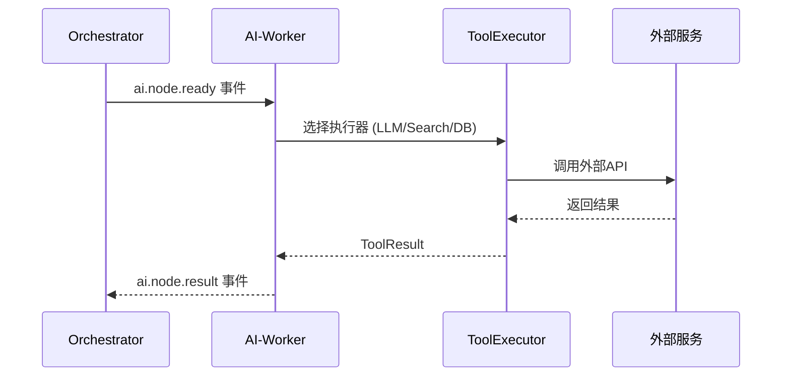

# 灵犀AI OS AI-Worker 模块完整指南

> **状态**: 规划中 - 本文档描述未来要实现的模块

---

## 目录

1. [什么是 AI-Worker？](#什么是-ai-worker)
2. [核心功能](#核心功能)
3. [技术架构](#技术架构)
4. [工具注册表](#工具注册表)
5. [模块间交互](#模块间交互)
6. [API 设计](#api-设计)

---

## 什么是 AI-Worker？

**AI-Worker（工具执行器）** 是灵犀AI OS的工具执行层，负责：

- 连接外部 API 和服务（搜索、数据库、文件系统等）
- 执行 LLM 调用
- 提供统一的工具调用接口
- 管理工具的注册、发现和执行

### 定位

```
┌─────────────────────────────────────────────────────────────────────────────┐
│                           AIOS 模块分层                                       │
└─────────────────────────────────────────────────────────────────────────────┘

  用户入口层 ──▶ NL-Translator ──▶ Orchestrator ──▶ AI-Worker
                                                       │
                                    ┌──────────────────┼──────────────────┐
                                    │                  │                  │
                                    ▼                  ▼                  ▼
                              ┌─────────┐       ┌─────────┐       ┌─────────┐
                              │  LLM    │       │ 搜索    │       │ 数据库  │
                              │  工具   │       │ 工具    │       │  工具   │
                              └─────────┘       └─────────┘       └─────────┘
```

### 与 Orchestrator 的关系

- Orchestrator 是"调度器"，决定**做什么任务**
- AI-Worker 是"执行器"，负责**完成任务**

就像操作系统中：
- 调度器（Scheduler）决定哪个进程运行
- 执行器（CPU）真正执行指令

---

## 核心功能

### 1. 工具网关

统一入口处理所有工具调用：

```http
POST /api/tools/execute
Content-Type: application/json

{
  "tool": "openai_llm",
  "parameters": {
    "model": "gpt-4",
    "prompt": "写一篇关于AI的文章"
  }
}
```

### 2. 工具注册表

动态注册和管理工具：

```http
POST /api/tools/register
Content-Type: application/json

{
  "name": "google_search",
  "type": "SEARCH",
  "description": "谷歌搜索",
  "endpoint": "/api/tools/google/search",
  "schema": {
    "query": {"type": "string", "required": true},
    "num_results": {"type": "integer", "default": 10}
  }
}
```

### 3. 内置工具

| 工具名称 | 类型 | 描述 | 外部依赖 |
|---------|------|------|---------|
| openai_llm | LLM | OpenAI GPT模型调用 | OpenAI API |
| google_search | Search | 谷歌搜索 | Google Search API |
| postgres_query | Database | PostgreSQL查询 | PostgreSQL |
| file_read | File | 读取文件 | 本地文件系统/MinIO |
| http_request | Network | 发起HTTP请求 | - |

### 4. 工具执行器

```java
public interface ToolExecutor {

    // 执行工具
    ToolResult execute(ToolRequest request);

    // 获取工具元信息
    ToolMetadata getMetadata();
}
```

### 5. 结果标准化

所有工具执行结果统一返回：

```json
{
  "success": true,
  "data": {
    "content": "这是生成的文章..."
  },
  "metadata": {
    "executionTime": 1500,
    "tokens": 500
  }
}
```

---

## 技术架构

### 架构图

```
┌─────────────────────────────────────────────────────────────────────────────┐
│                           AI-Worker 架构                                     │
└─────────────────────────────────────────────────────────────────────────────┘

                           ┌─────────────┐
                           │ Orchestrator │
                           └──────┬──────┘
                                  │ 事件驱动 (ai.node.ready → ai.node.result)
                                  ▼
┌─────────────────────────────────────────────────────────────────────────────┐
│                              工具网关层                                       │
│  ┌─────────────────────────────────────────────────────────────────────┐  │
│  │                      ToolGatewayService                              │  │
│  │   • 接收执行请求                                                      │  │
│  │   • 参数验证                                                          │  │
│  │   • 结果标准化                                                        │  │
│  └─────────────────────────────────────────────────────────────────────┘  │
└────────────────────────────────────┬────────────────────────────────────────┘
                                     │
                    ┌────────────────┼────────────────┐
                    │                │                │
                    ▼                ▼                ▼
┌─────────────────────────────────────────────────────────────────────────────┐
│                              工具执行层                                       │
│  ┌──────────────┐  ┌──────────────┐  ┌──────────────┐  ┌──────────────┐ │
│  │ LLMExecutor  │  │ SearchExe    │  │ DatabaseExe  │  │ FileExecutor │ │
│  │              │  │              │  │              │  │              │ │
│  │ • OpenAI     │  │ • Google     │  │ • PostgreSQL │  │ • MinIO      │ │
│  │ • Anthropic  │  │ • Bing       │  │ • MySQL      │  │ • Local FS   │ │
│  └──────────────┘  └──────────────┘  └──────────────┘  └──────────────┘ │
└─────────────────────────────────────────────────────────────────────────────┘
                                     │
                                     ▼
┌─────────────────────────────────────────────────────────────────────────────┐
│                              外部服务层                                       │
│  ┌─────────┐  ┌─────────┐  ┌─────────┐  ┌─────────┐  ┌─────────┐       │
│  │ OpenAI  │  │ Google  │  │ Postgres│  │  MinIO  │  │ 其他API │       │
│  └─────────┘  └─────────┘  └─────────┘  └─────────┘  └─────────┘       │
└─────────────────────────────────────────────────────────────────────────────┘
```

### 项目结构（规划）

```
ai-worker/
├── pom.xml
└── src/main/java/com/lingxi/ai/worker/
    ├── AiWorkerApplication.java
    ├── controller/
    │   └── ToolController.java           # 工具API
    ├── service/
    │   ├── ToolGatewayService.java      # 工具网关
    │   └── ToolRegistryService.java     # 工具注册表
    ├── executor/
    │   ├── ToolExecutor.java            # 工具执行器接口
    │   ├── LLMExecutor.java             # LLM执行器
    │   ├── SearchExecutor.java          # 搜索执行器
    │   ├── DatabaseExecutor.java        # 数据库执行器
    │   └── FileExecutor.java            # 文件执行器
    ├── model/
    │   ├── Tool.java                    # 工具定义
    │   ├── ToolRequest.java             # 执行请求
    │   └── ToolResult.java              # 执行结果
    └── config/
        └── WorkerConfig.java            # 配置类
```

---

## 工具注册表

### 工具定义

```java
public class Tool {
    String name;              // 工具唯一名称
    ToolType type;            // 工具类型
    String description;        // 工具描述
    String endpoint;          // 调用端点
    Map<String, Parameter> parameters;  // 参数定义
    boolean enabled;          // 是否启用
}

public enum ToolType {
    LLM,          // 大语言模型
    SEARCH,       // 搜索引擎
    DATABASE,     // 数据库
    FILE,         // 文件系统
    NETWORK,      // 网络请求
    CUSTOM        // 自定义
}
```

### 内置工具详情

#### 1. OpenAI LLM 工具

```json
{
  "name": "openai_llm",
  "type": "LLM",
  "description": "调用 OpenAI GPT 模型生成内容",
  "parameters": {
    "model": {
      "type": "string",
      "default": "gpt-4",
      "enum": ["gpt-4", "gpt-3.5-turbo"]
    },
    "prompt": {
      "type": "string",
      "required": true
    },
    "temperature": {
      "type": "number",
      "default": 0.7
    },
    "max_tokens": {
      "type": "integer",
      "default": 2000
    }
  }
}
```

#### 2. 谷歌搜索工具

```json
{
  "name": "google_search",
  "type": "SEARCH",
  "description": "使用谷歌搜索获取信息",
  "parameters": {
    "query": {
      "type": "string",
      "required": true
    },
    "num_results": {
      "type": "integer",
      "default": 10
    },
    "language": {
      "type": "string",
      "default": "zh-CN"
    }
  }
}
```

#### 3. PostgreSQL 查询工具

```json
{
  "name": "postgres_query",
  "type": "DATABASE",
  "description": "执行 PostgreSQL 查询",
  "parameters": {
    "sql": {
      "type": "string",
      "required": true
    },
    "params": {
      "type": "array",
      "default": []
    },
    "max_rows": {
      "type": "integer",
      "default": 100
    }
  }
}
```

#### 4. 文件读取工具

```json
{
  "name": "file_read",
  "type": "FILE",
  "description": "读取文件内容",
  "parameters": {
    "path": {
      "type": "string",
      "required": true
    },
    "encoding": {
      "type": "string",
      "default": "UTF-8"
    }
  }
}
```

---

## 模块间交互

### 事件流

```
┌─────────────────────────────────────────────────────────────────────────────┐
│                           完整执行流程                                       │
└─────────────────────────────────────────────────────────────────────────────┘

Orchestrator                          AI-Worker                           外部服务
    │                                    │                                   │
    │  发布 ai.node.ready                │                                   │
    │ ──────────────────────────────────▶                                   │
    │                                    │                                   │
    │                                    │ 接收节点任务                       │
    │                                    │ 根据 node.type 选择执行器          │
    │                                    │                                   │
    │                                    │ ───────────────────────────────▶ │
    │                                    │              调用 OpenAI API     │
    │                                    │ ◀───────────────────────────────│
    │                                    │              返回执行结果        │
    │                                    │                                   │
    │  发布 ai.node.result                │                                   │
    │ ◀──────────────────────────────────                                   │
    │                                    │                                   │
    │  状态机更新节点状态                                                     │
```

### 工具执行时序



---

## API 设计

### 基础信息

- **基础URL**: `http://localhost:8083` (规划)
- **内容类型**: `application/json`

### API 端点

| 方法 | 路径 | 说明 |
|------|------|------|
| GET | `/api/tools` | 列出所有可用工具 |
| GET | `/api/tools/{name}` | 获取工具详情 |
| POST | `/api/tools/register` | 注册新工具 |
| POST | `/api/tools/unregister/{name}` | 注销工具 |
| POST | `/api/tools/execute` | 执行工具 |
| GET | `/api/health` | 健康检查 |

### API 示例

#### 1. 列出所有工具

```bash
curl http://localhost:8083/api/tools
```

响应：
```json
{
  "tools": [
    {
      "name": "openai_llm",
      "type": "LLM",
      "description": "OpenAI GPT模型调用"
    },
    {
      "name": "google_search",
      "type": "SEARCH",
      "description": "谷歌搜索"
    }
  ],
  "total": 2
}
```

#### 2. 执行工具

```bash
curl -X POST http://localhost:8083/api/tools/execute \
  -H "Content-Type: application/json" \
  -d '{
    "tool": "openai_llm",
    "parameters": {
      "model": "gpt-4",
      "prompt": "写一篇关于AI的文章"
    }
  }'
```

响应：
```json
{
  "success": true,
  "data": {
    "content": "人工智能（AI）是...",
    "model": "gpt-4",
    "usage": {
      "prompt_tokens": 10,
      "completion_tokens": 500,
      "total_tokens": 510
    }
  },
  "metadata": {
    "executionTime": 2500
  }
}
```

#### 3. 注册自定义工具

```bash
curl -X POST http://localhost:8083/api/tools/register \
  -H "Content-Type: application/json" \
  -d '{
    "name": "my_custom_tool",
    "type": "CUSTOM",
    "description": "我的自定义工具",
    "endpoint": "/api/tools/my-custom",
    "schema": {
      "input": {"type": "string", "required": true}
    }
  }'
```

---

## 与现有模块的集成

### Orchestrator 端配置

在 `ai-orchestrator` 的 `application.yml` 中添加：

```yaml
worker:
  service:
    url: http://localhost:8083
```

### 事件主题

| 主题 | 方向 | 说明 |
|------|------|------|
| `ai.node.ready` | Orchestrator → Worker | 节点可执行 |
| `ai.node.result` | Worker → Orchestrator | 节点执行结果 |

### Node 类型映射

| Node Type | Worker Executor | 说明 |
|-----------|-----------------|------|
| LLM | LLMExecutor | 大语言模型调用 |
| SEARCH | SearchExecutor | 搜索查询 |
| DATABASE | DatabaseExecutor | 数据库操作 |
| FILE | FileExecutor | 文件操作 |
| TOOL | GenericExecutor | 通用工具 |

---

## 实现状态

| 组件 | 状态 | 说明 |
|------|------|------|
| ToolGatewayService | 规划中 | 工具网关 |
| ToolRegistryService | 规划中 | 工具注册 |
| LLMExecutor | 规划中 | 需要 OpenAI API |
| SearchExecutor | 规划中 | 需要 Google/Bing API |
| DatabaseExecutor | 规划中 | PostgreSQL 支持 |
| FileExecutor | 规划中 | MinIO/LocalFS |

---

## 下一步

- 等待 Orchestrator 模块稳定后开始实现
- 设计完整的状态管理和错误处理机制
- 实现第一个工具：OpenAI LLM 调用

---

## 相关文档

- [Orchestrator 模块](./ORCHESTRATOR_GUIDE.md) - 任务编排
- [NL-Translator 模块](./NL_TRANSLATOR_GUIDE.md) - 自然语言翻译
- [AI-Context 模块](./AI-CONTEXT_GUIDE.md) - 上下文管理
