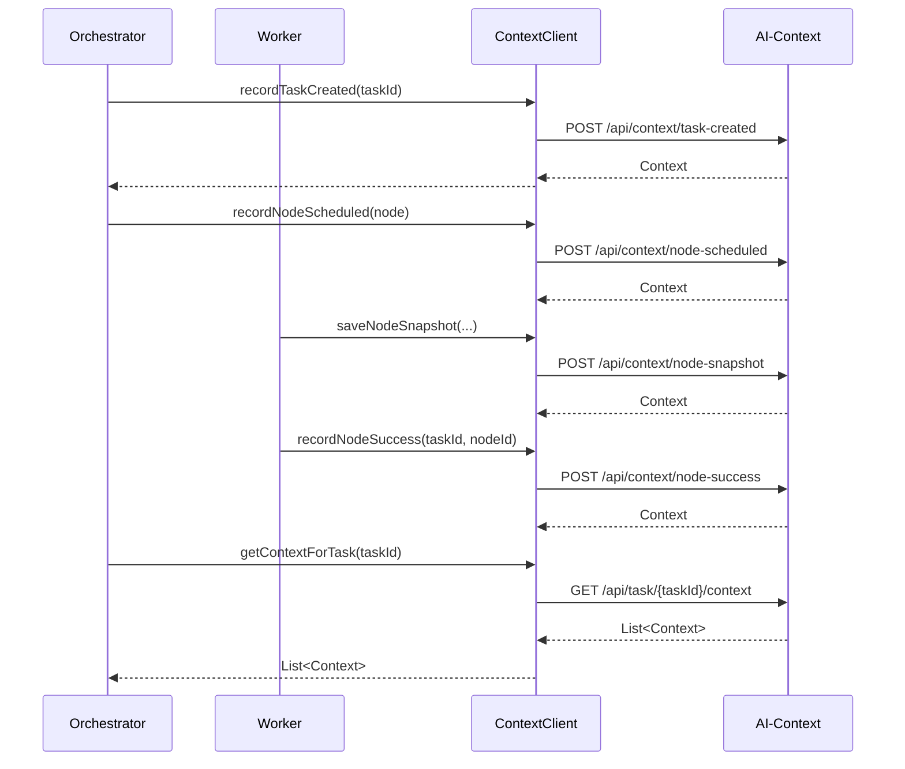

# 灵犀AI OS AI-Context 模块完整指南

> **状态**: ✅ 已实现 - 本文档描述当前已实现的模块
> **最后更新**: 2026-04-22

---

## 目录

1. [什么是 AI-Context？](#什么是-ai-context)
2. [核心功能](#核心功能)
3. [技术栈](#技术栈)
4. [项目结构](#项目结构)
5. [完整 API 接口](#完整-api-接口)
6. [类定义详解](#类定义详解)
7. [工作流程](#工作流程)
8. [快速开始](#快速开始)

---

## 什么是 AI-Context？

**AI-Context（上下文管理器）** 是灵犀AI OS的上下文管理层，负责：

- 记录任务执行过程中的所有操作历史
- 保存节点的快照数据，支持故障恢复
- 提供历史状态追溯能力
- 支持跨模块的上下文查询

简单来说，AI-Context 就像飞机的"黑匣子"，记录一切，支持回溯。

### 定位

```
┌─────────────────────────────────────────────────────────────────────────────┐
│                           AIOS 模块分层                                       │
└─────────────────────────────────────────────────────────────────────────────┘

  用户入口层 ──▶ NL-Translator ──▶ Orchestrator ──▶ Worker
                                    │
                                    ▼
                              AI-Context ◀────── 记录上下文
                                    │
                              持久化存储 (PostgreSQL)
```

---

## 核心功能

### 1. 任务上下文记录
- 记录任务创建、成功、失败等关键事件
- 记录 DAG 提交和验证事件
- 提供任务级别的历史查询

### 2. 节点上下文记录
- 记录节点调度、就绪、成功、失败、重试等事件
- 记录节点间的依赖关系变化

### 3. 节点快照管理
- 保存节点的完整状态快照
- 支持从快照恢复节点状态
- 用于故障恢复和调试

### 4. 上下文查询
- 按任务ID查询上下文历史
- 按节点ID查询快照
- 支持时间范围查询

### 5. 事件自动记录
- 监听 Kafka 事件总线，自动记录关键事件
- 支持多种事件类型（任务/节点生命周期、节点执行完成等）
- 新增 `ai.node.executed` 事件监听，记录节点执行完成事件

---

## 技术栈

| 技术 | 版本 | 用途 |
|------|------|------|
| Java | 17+ | 开发语言 |
| Spring Boot | 3.2.5 | 应用框架 |
| Spring Data JPA | 3.2.x | 数据访问 |
| PostgreSQL | 16 | 持久化存储 (jsonb) |
| Maven | 3.9.x | 构建工具 |

---

## 项目结构

```
ai-context/
├── pom.xml
└── src/main/java/com/lingxi/ai/context/
    ├── AiContextApplication.java        # 启动入口
    ├── entity/
    │   ├── Context.java                # 上下文实体
    │   └── ContextType.java            # 上下文类型枚举
    ├── repository/
    │   └── ContextRepository.java       # 数据访问接口
    ├── service/
    │   └── ContextService.java         # 业务服务
    ├── controller/
    │   └── ContextController.java      # REST API
    ├── event/
    │   └── ContextEventConsumer.java   # Kafka 事件消费（自动记录上下文）
    └── config/
        └── DatabaseInitializer.java     # 数据库初始化
```

---

## 完整 API 接口

### 基础信息
- **基础URL**: `http://localhost:8082`
- **内容类型**: `application/json`

### API 列表

#### 1. 上下文查询

| 方法 | 路径 | 说明 |
|------|------|------|
| GET | `/api/task/{taskId}/context` | 获取任务上下文历史 |
| GET | `/api/node/{nodeId}/snapshot/latest` | 获取节点最新快照 |

#### 2. 任务上下文记录

| 方法 | 路径 | 说明 |
|------|------|------|
| POST | `/api/context/task-created` | 记录任务创建 |
| POST | `/api/context/task-success` | 记录任务成功 |
| POST | `/api/context/task-failed` | 记录任务失败 |
| POST | `/api/context/dag-submitted` | 记录DAG提交 |
| POST | `/api/context/dag-validated` | 记录DAG验证 |

#### 3. 节点上下文记录

| 方法 | 路径 | 说明 |
|------|------|------|
| POST | `/api/context/node-scheduled` | 记录节点调度 |
| POST | `/api/context/node-ready` | 记录节点就绪 |
| POST | `/api/context/node-success` | 记录节点成功 |
| POST | `/api/context/node-failed` | 记录节点失败 |
| POST | `/api/context/node-retry` | 记录节点重试 |
| POST | `/api/context/node-snapshot` | 记录节点快照 |

#### 4. 系统

| 方法 | 路径 | 说明 |
|------|------|------|
| GET | `/api/health` | 健康检查 |

### API 详细说明

#### 1. 查询任务上下文

```bash
curl http://localhost:8082/api/task/task-001/context
```

响应：
```json
[
  {
    "id": 1,
    "contextType": "TASK_CREATED",
    "taskId": "task-001",
    "message": "Task created",
    "createdAt": "2024-01-15T10:30:00"
  },
  {
    "id": 2,
    "contextType": "DAG_SUBMITTED",
    "taskId": "task-001",
    "message": "DAG submitted successfully",
    "createdAt": "2024-01-15T10:30:05"
  }
]
```

#### 2. 记录任务创建

```bash
curl -X POST http://localhost:8082/api/context/task-created \
  -H "Content-Type: application/json" \
  -d '{"taskId": "task-001"}'
```

#### 3. 记录节点快照

```bash
curl -X POST http://localhost:8082/api/context/node-snapshot \
  -H "Content-Type: application/json" \
  -d '{
    "taskId": "task-001",
    "nodeId": "node-001",
    "type": "LLM",
    "name": "weather_query",
    "status": "RUNNING",
    "input": {"city": "北京", "type": "realtime"},
    "output": {},
    "retryCount": 0,
    "maxRetry": 3,
    "priority": 5,
    "workerGroup": "default",
    "version": 1,
    "errorMessage": null
  }'
```

#### 4. 获取节点最新快照

```bash
curl http://localhost:8082/api/node/node-001/snapshot/latest
```

响应：
```json
{
  "nodeId": "node-001",
  "snapshot": {
    "nodeId": "node-001",
    "taskId": "task-001",
    "type": "LLM",
    "name": "weather_query",
    "status": "RUNNING",
    "input": {"city": "北京", "type": "realtime"},
    "output": {},
    "retryCount": 0,
    "maxRetry": 3,
    "priority": 5,
    "workerGroup": "default",
    "version": 1,
    "snapshotTime": 1705312200000
  }
}
```

#### 5. 记录节点失败

```bash
curl -X POST http://localhost:8082/api/context/node-failed \
  -H "Content-Type: application/json" \
  -d '{
    "taskId": "task-001",
    "nodeId": "node-001",
    "errorMessage": "Connection timeout"
  }'
```

#### 6. 健康检查

```bash
curl http://localhost:8082/api/health
```

响应：
```json
{"status": "UP", "service": "ai-context"}
```

---

## 类定义详解

### 枚举类

#### ContextType（上下文类型枚举）
**文件位置**: `entity/ContextType.java`

```java
public enum ContextType {
    TASK_CREATED,       // 任务已创建
    TASK_SUCCESS,       // 任务成功完成
    TASK_FAILED,        // 任务执行失败
    NODE_SCHEDULED,     // 节点已调度
    NODE_READY,         // 节点就绪
    NODE_SUCCESS,       // 节点执行成功
    NODE_FAILED,        // 节点执行失败
    NODE_RETRY,         // 节点重试
    NODE_SNAPSHOT,      // 节点快照
    DAG_SUBMITTED,      // DAG 已提交
    DAG_VALIDATED       // DAG 已验证
}
```

### 实体类

#### Context（上下文实体）
**文件位置**: `entity/Context.java`

| 字段 | 类型 | 说明 |
|------|------|------|
| id | Long | 主键，自增 |
| contextType | ContextType | 上下文类型 |
| taskId | String | 所属任务ID |
| nodeId | String | 所属节点ID（可选） |
| metadata | Map<String, Object> | 元数据（jsonb） |
| message | String | 描述信息 |
| snapshotData | Map<String, Object> | 快照数据（jsonb） |
| createdAt | LocalDateTime | 创建时间 |

### 仓储类

#### ContextRepository
**文件位置**: `repository/ContextRepository.java`

```java
public interface ContextRepository extends JpaRepository<Context, Long> {

    List<Context> findByTaskIdOrderByCreatedAtDesc(String taskId);

    List<Context> findByNodeIdAndContextTypeOrderByCreatedAtDesc(
        String nodeId, ContextType contextType);

    List<Context> findByTaskIdAndContextType(String taskId, ContextType contextType);
}
```

### 服务类

#### ContextService
**文件位置**: `service/ContextService.java`

| 方法 | 说明 |
|------|------|
| `recordTaskCreated(taskId)` | 记录任务创建 |
| `recordTaskSuccess(taskId)` | 记录任务成功 |
| `recordTaskFailed(taskId)` | 记录任务失败 |
| `recordDagSubmitted(taskId)` | 记录DAG提交 |
| `recordDagValidated(taskId)` | 记录DAG验证 |
| `recordNodeScheduled(...)` | 记录节点调度 |
| `recordNodeReady(...)` | 记录节点就绪 |
| `recordNodeSuccess(...)` | 记录节点成功 |
| `recordNodeFailed(...)` | 记录节点失败 |
| `recordNodeRetry(...)` | 记录节点重试 |
| `recordNodeSnapshot(...)` | 记录节点快照 |
| `getLatestSnapshotForNode(nodeId)` | 获取节点最新快照 |

---

## 工作流程

### 模块调用关系



---

## 快速开始

### 步骤 1：启动 PostgreSQL

```bash
docker run -d \
  --name lingxi-postgres \
  -e POSTGRES_USER=wanglian \
  -e POSTGRES_PASSWORD=123 \
  -e POSTGRES_DB=lingxi_db \
  -p 5432:5432 \
  postgres:16-alpine
```

### 步骤 2：编译并启动

```bash
cd ai-context
mvn spring-boot:run
```

### 步骤 3：测试 API

```bash
# 健康检查
curl http://localhost:8082/api/health

# 记录任务创建
curl -X POST http://localhost:8082/api/context/task-created \
  -H "Content-Type: application/json" \
  -d '{"taskId": "test-001"}'

# 查询上下文
curl http://localhost:8082/api/task/test-001/context
```

---

## 事件自动记录

AI-Context 通过 `ContextEventConsumer` 监听 Kafka 事件总线，自动将关键事件持久化为上下文记录。

### 监听的 Kafka Topics

| Topic | 触发时机 | 记录的上下文类型 |
|-------|---------|-----------------|
| `ai.task.created` | 任务创建 | TASK_CREATED |
| `ai.task.validated` | 任务验证通过 | — |
| `ai.task.running` | 任务开始执行 | — |
| `ai.task.success` | 任务成功完成 | TASK_SUCCESS |
| `ai.task.failed` | 任务失败 | TASK_FAILED |
| `ai.node.created` | 节点创建 | — |
| `ai.node.scheduled` | 节点调度 | NODE_SCHEDULED |
| `ai.node.running` | 节点开始执行 | — |
| `ai.node.success` | 节点执行成功 | NODE_SUCCESS |
| `ai.node.executed` | 节点执行完成（事件驱动调度） | NODE_SUCCESS |
| `ai.node.failed` | 节点执行失败 | NODE_FAILED |
| `ai.context.events` | 通用上下文事件 | 按事件类型 |

### 事件处理逻辑

```
1. 从 Kafka 消费事件（Map<String, Object> 格式）
   │
   ├─► 优先使用 event_type 字段判断事件类型
   │
   └─► 若无 event_type，从 status 字段推断
       │
       ├─► SUCCESS → ai.node.success
       ├─► FAILED  → ai.node.failed
       └─► RUNNING → ai.node.running
   ▼
2. 根据 taskId + nodeId 调用 ContextService 记录上下文
   │
   ▼
3. 持久化到 PostgreSQL (ai_context 表)
```

### ai.node.executed 事件

这是去中心化架构升级后新增的事件，由 Orchestrator 的 StateMachine 在节点执行成功后发布。DependencyChecker 消费此事件进行依赖检查和下游调度。AI-Context 同时消费此事件，将其记录为 NODE_SUCCESS 上下文，确保完整的执行历史追溯。

---

## 数据库表结构

```sql
CREATE TABLE ai_context (
    id BIGSERIAL PRIMARY KEY,
    context_type VARCHAR(50),
    task_id VARCHAR(64),
    node_id VARCHAR(64),
    metadata JSONB,
    message VARCHAR(1000),
    snapshot_data JSONB,
    created_at TIMESTAMP DEFAULT CURRENT_TIMESTAMP
);

CREATE INDEX idx_context_task ON ai_context(task_id);
CREATE INDEX idx_context_node ON ai_context(node_id);
```

---

## 下一步

- 了解 [Orchestrator 模块](./ORCHESTRATOR_GUIDE.md)
- 了解 [NL-Translator 模块](./NL_TRANSLATOR_GUIDE.md)
- 了解 [Worker 模块](./WORKER_GUIDE.md)
