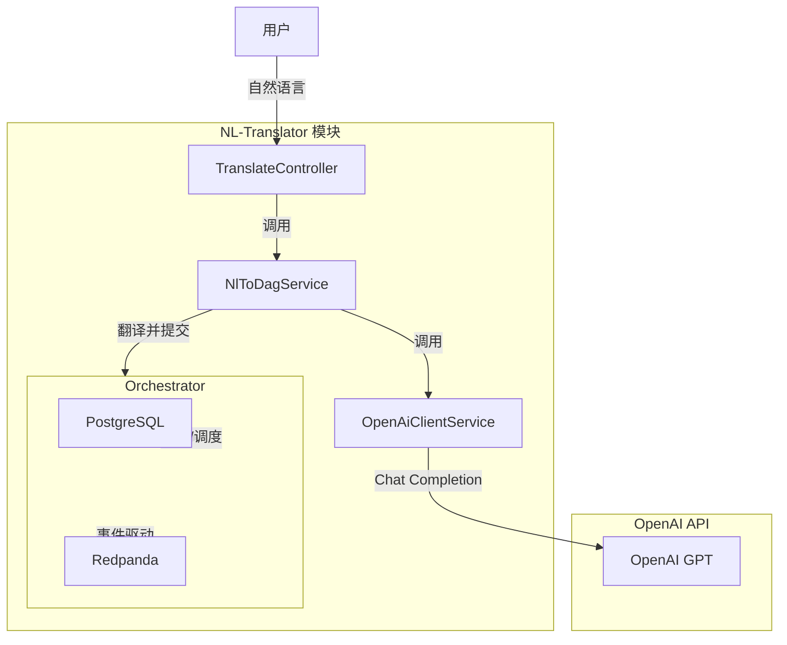
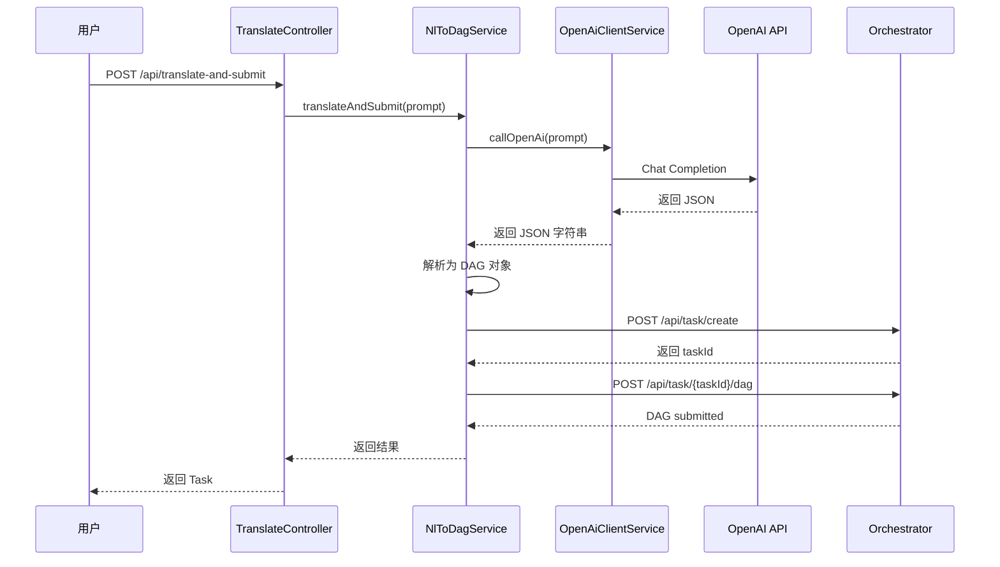

# 灵犀AI OS NL-Translator 模块完整指南

> **状态**: ✅ 已实现 - 本文档描述当前已实现的模块
> **最后更新**: 2026-04-18

---

## 目录

1. [什么是 NL-Translator？](#什么是-nl-translator)
2. [核心功能](#核心功能)
3. [技术栈](#技术栈)
4. [项目结构](#项目结构)
5. [完整 API 接口](#完整-api-接口)
6. [类定义详解](#类定义详解)
7. [工作流程](#工作流程)
8. [快速开始](#快速开始)

---

## 什么是 NL-Translator？

**NL-Translator（自然语言翻译器）** 是灵犀AI OS的自然语言处理模块，负责：

- 接收用户的自然语言任务描述
- 通过 OpenAI API 将自然语言转换为结构化的 DAG
- 可选地直接将生成的 DAG 提交给 Orchestrator 执行

简单来说，NL-Translator 就是连接用户自然语言和系统执行引擎的桥梁。

### 整体架构图



---

## 核心功能

### 1. 自然语言到 DAG 转换
- 使用结构化 Prompt 引导 LLM 输出符合要求的 JSON
- 自动解析 LLM 响应为 DAG 对象
- 节点初始化状态为 CREATED

### 2. OpenAI API 集成
- 支持配置 API Key、Model、Temperature 等参数
- 使用环境变量或配置文件管理敏感信息
- 超时控制和错误处理

### 3. 自动提交
- 提供翻译并提交接口
- 通过 RestTemplate 调用 Orchestrator API
- 完整的错误处理和日志记录

---

## 技术栈

| 技术 | 版本 | 用途 |
|------|------|------|
| Java | 17+ | 开发语言 |
| Spring Boot | 3.2.5 | 应用框架 |
| Spring Web | 3.2.5 | REST API |
| OpenAI Java SDK | 0.18.2 | OpenAI API 客户端 |
| Maven | 3.9.x | 构建工具 |

---

## 项目结构

```
ai-nl-translator/
├── pom.xml
└── src/main/java/com/lingxi/ai/translator/
    ├── NlTranslatorApplication.java          # 启动入口
    ├── controller/
    │   └── TranslateController.java         # 翻译API
    ├── service/
    │   ├── NlToDagService.java             # 核心翻译服务
    │   └── OpenAiClientService.java        # OpenAI客户端
    ├── model/
    │   ├── DAG.java                       # DAG模型
    │   ├── Node.java                      # 节点模型
    │   ├── Task.java                      # 任务模型
    │   └── DAGRequest.java                # 请求模型
    └── config/
        ├── OpenAiConfig.java               # OpenAI配置
        └── WebClientConfig.java            # WebClient配置
```

---

## 完整 API 接口

### 基础信息
- **基础URL**: `http://localhost:8081`
- **内容类型**: `application/json`

### API 列表

| 方法 | 路径 | 说明 |
|------|------|------|
| POST | `/api/translate` | 仅翻译，返回 DAG |
| POST | `/api/translate-and-submit` | 翻译并提交给 Orchestrator |
| GET | `/api/task/{taskId}` | 查询任务状态（代理 Orchestrator） |
| GET | `/api/health` | 健康检查 |

### API 详细说明

#### 1. 仅翻译

将自然语言翻译为 DAG 结构，但不执行。

```bash
curl -X POST http://localhost:8081/api/translate \
  -H "Content-Type: application/json" \
  -d '{"prompt": "查询北京天气并生成总结报告"}'
```

响应：
```json
{
  "prompt": "查询北京天气并生成总结报告",
  "dag": {
    "nodes": [
      {
        "id": "node-1",
        "type": "TOOL",
        "name": "weather_query",
        "input": {"city": "北京", "type": "realtime"},
        "status": "CREATED"
      },
      {
        "id": "node-2",
        "type": "LLM",
        "name": "summarize",
        "input": {},
        "deps": ["node-1"],
        "status": "CREATED"
      }
    ],
    "edges": [
      {"from": "node-1", "to": "node-2"}
    ]
  }
}
```

#### 2. 翻译并提交

将自然语言翻译为 DAG，并自动提交给 Orchestrator 执行。

```bash
curl -X POST http://localhost:8081/api/translate-and-submit \
  -H "Content-Type: application/json" \
  -d '{"prompt": "查询北京的天气"}'
```

响应：
```json
{
  "taskId": "550e8400-e29b-41d4-a716-446655440000",
  "prompt": "查询北京的天气",
  "dag": {
    "nodes": [...]
  },
  "status": "RUNNING"
}
```

#### 3. 查询任务状态

代理查询 Orchestrator 的任务状态。

```bash
curl http://localhost:8081/api/task/550e8400-e29b-41d4-a716-446655440000
```

响应：
```json
{
  "taskId": "550e8400-e29b-41d4-a716-446655440000",
  "status": "RUNNING",
  "nodes": [...]
}
```

#### 4. 健康检查

```bash
curl http://localhost:8081/api/health
```

响应：
```json
{"status": "UP", "service": "nl-translator"}
```

### 错误处理

当 OpenAI API Key 未配置时：

```json
{
  "error": "API key is not configured",
  "type": "ConfigurationError",
  "hint": "Please set OPENAI_API_KEY environment variable or update openai.api-key in application.yml"
}
```

---

## 类定义详解

### 配置类

#### OpenAiConfig
**文件位置**: `config/OpenAiConfig.java`

| 字段 | 类型 | 说明 |
|------|------|------|
| apiKey | String | OpenAI API Key |
| model | String | 模型名称（如 gpt-4-turbo-preview） |
| temperature | Double | 温度参数（0-2，默认 0.7） |
| maxTokens | Integer | 最大 Token 数 |
| timeout | Integer | 超时时间（毫秒） |

### 模型类

#### DAG
```java
@Data
public class DAG {
    private List<Node> nodes;
    private List<Edge> edges;
}
```

#### Node
```java
@Data
public class Node {
    private String id;
    private String type;        // LLM / TOOL
    private String name;        // 工具名称
    private String status;      // CREATED
    private Map<String, Object> input;
    private List<String> deps;  // 依赖节点ID列表
}
```

### 服务类

#### OpenAiClientService
**文件位置**: `service/OpenAiClientService.java`

| 方法 | 说明 |
|------|------|
| `callOpenAi(userPrompt)` | 调用 OpenAI Chat Completion API |

**System Prompt 设计要点**：
- 明确指示 LLM 的角色（任务分解专家）
- 详细定义 Node 的 JSON 格式
- 提供示例输出
- 要求返回纯 JSON，无额外文字

#### NlToDagService
**文件位置**: `service/NlToDagService.java`

| 方法 | 说明 |
|------|------|
| `translateToDag(prompt)` | 将自然语言翻译为 DAG 对象 |
| `translateAndSubmit(prompt)` | 翻译并提交给 Orchestrator |
| `getTaskStatus(taskId)` | 代理查询 Orchestrator 任务状态 |

---

## 工作流程

### 完整执行时序图



### DAG 生成流程

```
用户输入: "查询北京天气并生成总结报告"
                        │
                        ▼
            ┌─────────────────────────┐
            │   OpenAI API 调用        │
            │   System: 任务分解专家    │
            │   User: 写一篇关于AI的文章 │
            └────────────┬────────────┘
                         │
                         ▼
            ┌─────────────────────────┐
            │   LLM 返回 JSON         │
            │   {                     │
            │     "nodes": [...],     │
            │     "edges": [...]      │
            │   }                     │
            └────────────┬────────────┘
                         │
                         ▼
            ┌─────────────────────────┐
            │   解析为 DAG 对象        │
            │   节点状态设为 CREATED   │
            └────────────┬────────────┘
                         │
                         ▼
            ┌─────────────────────────┐
            │   提交给 Orchestrator    │
            │   1. 创建任务           │
            │   2. 提交 DAG           │
            └─────────────────────────┘
```

---

## 快速开始

### 步骤 1：配置 OpenAI API Key

```bash
# 设置环境变量（推荐）
export OPENAI_API_KEY=sk-your-api-key-here

# 或者修改 application.yml 中的默认值
```

### 步骤 2：编译并启动

```bash
cd ai-nl-translator
mvn spring-boot:run
```

### 步骤 3：测试

```bash
# 仅翻译
curl -X POST http://localhost:8081/api/translate \
  -H "Content-Type: application/json" \
  -d '{"prompt": "查询北京天气并生成总结报告"}'

# 翻译并提交
curl -X POST http://localhost:8081/api/translate-and-submit \
  -H "Content-Type: application/json" \
  -d '{"prompt": "查询北京的天气"}'
```

### 配置说明

**application.yml**:
```yaml
openai:
  api-key: ${OPENAI_API_KEY:your-api-key-here}
  model: gpt-4-turbo-preview
  temperature: 0.7
  max-tokens: 2000
  timeout: 30000

orchestrator:
  url: ${ORCHESTRATOR_URL:http://localhost:8080}
```

---

## 下一步

- 了解 [Orchestrator 模块](./ORCHESTRATOR_GUIDE.md)
- 了解 [AI-Context 模块](./AI_CONTEXT_GUIDE.md)
- 了解 [Worker 模块](./WORKER_GUIDE.md)
