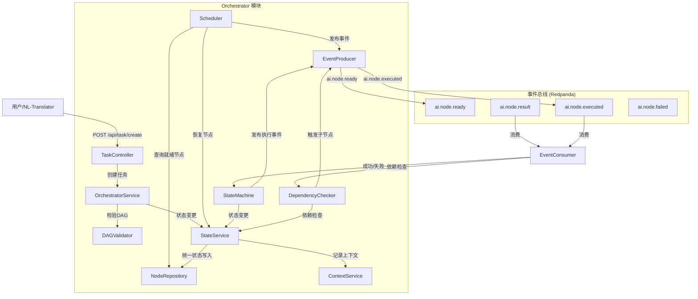
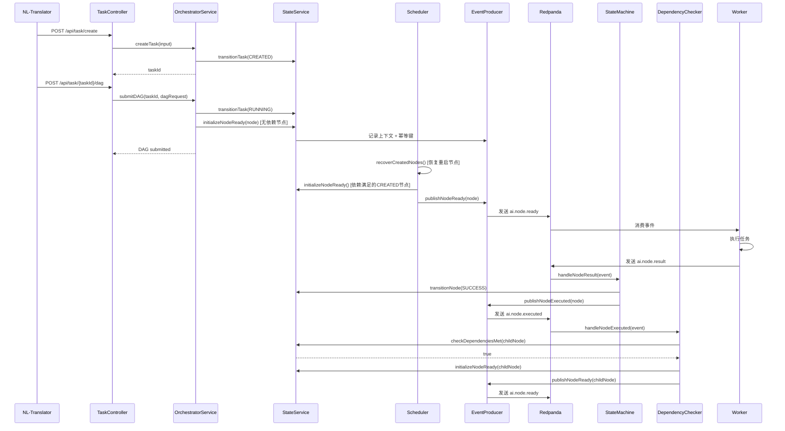

# 灵犀AI OS Orchestrator 模块完整指南

> **状态**: ✅ 已实现 - 去中心化事件驱动架构
> **最后更新**: 2026-04-22

---

## 目录

1. [什么是 Orchestrator？](#什么是-orchestrator)
2. [核心功能](#核心功能)
3. [技术栈](#技术栈)
4. [项目结构](#项目结构)
5. [完整 API 接口](#完整-api-接口)
6. [类定义详解](#类定义详解)
7. [工作流程](#工作流程)
8. [快速开始](#快速开始)

---

## 什么是 Orchestrator？

**Orchestrator（编排器）** 是灵犀AI OS的核心调度模块，负责：

- 接收 NL-Translator 转换的 DAG 任务请求
- 按依赖关系调度执行节点
- 管理任务和节点的生命周期状态
- 通过事件驱动与 Worker 通信（去中心化调度）
- 通过 StateService 统一收敛状态写入
- 通过 DependencyChecker 实现依赖驱动调度
- 通过 Context 记录操作历史

### 架构演进

系统已从「中心化调度」升级为「去中心化事件驱动」架构：

| 维度 | 旧架构 | 新架构 |
|------|--------|--------|
| 调度方式 | StateMachine 直接触发子节点 | DependencyChecker 通过事件驱动 |
| 状态写入 | 分散在4个服务中 | 统一收敛到 StateService |
| 事件流 | ai.node.ready + ai.node.result | 新增 ai.node.executed / ai.node.failed |
| 重试策略 | 立即重试 | 指数退避重试（RetryPolicy） |
| 幂等性 | 无 | taskId+nodeId 作为幂等键 |
| 恢复能力 | 无 | Scheduler 自动恢复 CREATED 节点 |

### 整体架构图



---

## 核心功能

### 1. DAG 任务编排
- 接收结构化的 DAG 请求（节点 + 边）
- 节点支持多种类型：LLM、TOOL 等
- 支持节点优先级和重试配置
- 边定义节点间的依赖关系
- 自动为节点生成幂等键（taskId + nodeId）

### 2. 依赖驱动调度（去中心化）
- 定时扫描就绪节点（每秒一次）
- **恢复机制**：自动检查 CREATED 节点依赖是否满足
- 乐观锁防止重复调度
- 支持任务暂停/恢复
- 节点成功后发布 `ai.node.executed` 事件
- DependencyChecker 消费事件，检查子节点依赖
- 依赖满足后自动触发子节点

### 3. 状态收敛（StateService）
- **统一状态写入入口**：所有节点/任务状态变更必须通过 StateService
- 自动发布对应事件（ai.task.completed, ai.task.failed 等）
- 自动记录上下文（Context）
- 依赖检查：`checkDependenciesMet(nodeId)`
- 完成检查：`checkTaskCompleted(taskId)`
- 失败检查：`checkTaskFailed(taskId)`

### 4. 生产级能力
- **幂等机制**：taskId + nodeId 作为幂等键，Kafka 消息使用此 key
- **指数退避重试**：1s → 2s → 4s → 8s → ... → max 60s
- **节点状态 RETRYING**：区分首次执行和重试
- **失败终止策略**：无可重试节点时自动标记任务 FAILED
- **系统恢复**：Scheduler 自动恢复系统重启前的 CREATED 节点

### 5. 事件驱动
- 通过 Redpanda 发布节点就绪事件
- 监听节点结果事件更新状态
- 发布节点执行成功/失败事件
- Worker 消费事件执行具体任务

---

## 技术栈

| 技术 | 版本 | 用途 |
|------|------|------|
| Java | 17+ | 开发语言 |
| Spring Boot | 3.2.5 | 应用框架 |
| Spring Kafka | 3.1.x | Redpanda 客户端 |
| Spring Data JPA | 3.2.x | PostgreSQL 访问 |
| Redpanda | latest | 事件总线 |
| PostgreSQL | 16 | 持久化存储 |
| Maven | 3.9.x | 构建工具 |

---

## 项目结构

```
ai-orchestrator/
├── pom.xml
├── docker-compose.yml
└── src/main/java/com/lingxi/ai/orchestrator/
    ├── OrchestratorApplication.java           # 启动入口
    ├── controller/
    │   └── TaskController.java               # 任务API
    ├── service/
    │   ├── OrchestratorService.java          # 核心编排
    │   ├── Scheduler.java                    # 节点调度器（含恢复）
    │   ├── StateMachine.java                 # 状态机
    │   ├── StateService.java                 # 状态收敛层（新增）
    │   ├── DependencyChecker.java            # 依赖驱动调度（新增）
    │   ├── RetryPolicy.java                  # 指数退避重试（新增）
    │   ├── DAGValidator.java                 # DAG校验
    │   └── TaskExecutionControl.java         # 任务执行控制
    ├── event/
    │   ├── EventProducer.java                # 事件发送
    │   └── EventConsumer.java                # 事件消费
    ├── repository/
    │   ├── TaskRepository.java               # 任务仓储
    │   ├── NodeRepository.java               # 节点仓储
    │   └── NodeDependencyRepository.java     # 依赖仓储
    ├── entity/
    │   ├── Task.java                        # 任务实体
    │   ├── Node.java                        # 节点实体（含 idempotencyKey）
    │   ├── NodeDependency.java               # 依赖实体
    │   ├── TaskStatus.java                   # 任务状态枚举
    │   ├── NodeStatus.java                   # 节点状态枚举（含 RETRYING）
    │   └── NodeType.java                     # 节点类型枚举
    ├── model/
    │   └── DAGRequest.java                  # DAG请求模型
    ├── context/
    │   └── ContextService.java              # 上下文服务代理
    └── config/
        ├── KafkaConfig.java                  # Kafka配置
        └── RedisConfig.java                  # Redis配置
```

---

## 完整 API 接口

### 基础信息
- **基础URL**: `http://localhost:8080`
- **内容类型**: `application/json`

### API 列表

#### 1. 任务管理

| 方法 | 路径 | 说明 |
|------|------|------|
| POST | `/api/task/create` | 创建新任务 |
| POST | `/api/task/{taskId}/dag` | 提交 DAG |
| POST | `/api/node` | 一键提交DAG（创建任务+提交DAG，兼容NL-Translator） |
| GET | `/api/task/{taskId}` | 查询任务详情 |
| POST | `/api/task/{taskId}/pause` | 暂停任务 |
| POST | `/api/task/{taskId}/resume` | 恢复任务 |
| GET | `/api/task/{taskId}/pause-reason` | 获取暂停原因 |
| GET | `/api/task/{taskId}/context` | 获取任务上下文 |

#### 2. 节点管理

| 方法 | 路径 | 说明 |
|------|------|------|
| POST | `/api/node/{nodeId}/success` | 标记节点成功（外部回调） |
| POST | `/api/node/{nodeId}/failure` | 标记节点失败（外部回调） |
| POST | `/api/node/{nodeId}/retry` | 重试节点 |
| GET | `/api/node/{nodeId}/snapshot/latest` | 获取节点最新快照 |
| POST | `/api/node/{nodeId}/restore` | 从快照恢复 |

#### 3. 系统

| 方法 | 路径 | 说明 |
|------|------|------|
| GET | `/api/health` | 健康检查 |

### API 详细说明

#### 1. 创建任务

```bash
curl -X POST http://localhost:8080/api/task/create \
  -H "Content-Type: application/json" \
  -d '{"input": {"prompt": "查询北京的天气"}}'
```

响应：
```json
{
  "taskId": "550e8400-e29b-41d4-a716-446655440000",
  "status": "CREATED"
}
```

#### 2. 提交 DAG

```bash
curl -X POST http://localhost:8080/api/task/550e8400-e29b-41d4-a716-446655440000/dag \
  -H "Content-Type: application/json" \
  -d '{
    "nodes": [
      {
        "id": "node-1",
        "type": "TOOL",
        "name": "weather_query",
        "input": {"tool": "weather_query", "parameters": {"city": "北京", "type": "realtime"}},
        "maxRetry": 3
      },
      {
        "id": "node-2",
        "type": "LLM",
        "name": "summarize",
        "input": {"tool": "llm", "parameters": {"prompt": "总结以下文章"}},
        "maxRetry": 3
      }
    ],
    "edges": [
      {"from": "node-1", "to": "node-2"}
    ]
  }'
```

响应：
```json
{
  "taskId": "550e8400-e29b-41d4-a716-446655440000",
  "message": "DAG submitted successfully"
}
```

#### 3. 一键提交DAG（兼容NL-Translator）

```bash
curl -X POST http://localhost:8080/api/node \
  -H "Content-Type: application/json" \
  -d '{
    "nodes": [{"nodeId": "node-1", "type": "LLM", "name": "test"}],
    "edges": []
  }'
```

响应：
```json
{
  "taskId": "550e8400-e29b-41d4-a716-446655440000",
  "status": "CREATED",
  "message": "DAG submitted successfully"
}
```

#### 4. 查询任务

```bash
curl http://localhost:8080/api/task/550e8400-e29b-41d4-a716-446655440000
```

响应：
```json
{
  "taskId": "550e8400-e29b-41d4-a716-446655440000",
  "status": "RUNNING",
  "nodes": [
    {
      "id": "node-1",
      "status": "SUCCESS",
      "idempotencyKey": "550e8400-...-node-1",
      "output": {"content": "文章内容..."},
      "retryCount": 0,
      "maxRetry": 3,
      "version": 2
    },
    {
      "id": "node-2",
      "status": "READY",
      "idempotencyKey": "550e8400-...-node-2",
      "retryCount": 0,
      "maxRetry": 3,
      "version": 1
    }
  ]
}
```

#### 5. 暂停/恢复任务

```bash
# 暂停任务
curl -X POST http://localhost:8080/api/task/550e8400-e29b-41d4-a716-446655440000/pause \
  -H "Content-Type: application/json" \
  -d '{"reason": "Manual pause by user"}'

# 恢复任务
curl -X POST http://localhost:8080/api/task/550e8400-e29b-41d4-a716-446655440000/resume
```

#### 6. 重试节点

```bash
curl -X POST http://localhost:8080/api/node/node-1/retry
```

#### 7. 健康检查

```bash
curl http://localhost:8080/api/health
```

---

## 类定义详解

### 核心服务类

#### StateService（状态收敛层）
所有节点/任务状态变更的唯一入口。

| 方法 | 说明 |
|------|------|
| `transitionNode(nodeId, newStatus, output, errorMessage)` | 统一节点状态变更 + 事件发布 + 上下文记录 |
| `transitionTask(taskId, newStatus)` | 统一任务状态变更 + 事件发布 + 上下文记录 |
| `checkDependenciesMet(nodeId)` | 检查节点依赖是否全部 SUCCESS |
| `checkTaskCompleted(taskId)` | 检查任务是否所有节点 SUCCESS |
| `checkTaskFailed(taskId)` | 检查任务是否有不可重试的失败节点 |
| `initializeNodeReady(node)` | 初始化节点为 READY（含幂等键生成） |

#### DependencyChecker（依赖驱动调度）
消费 `ai.node.executed` 事件，检查子节点依赖是否满足。

| 方法 | 说明 |
|------|------|
| `onNodeExecuted(nodeId, taskId)` | 处理节点执行完成事件，触发依赖检查 |

#### RetryPolicy（指数退避重试策略）

| 方法 | 说明 |
|------|------|
| `getRetryDelay(retryCount)` | 获取重试延迟（1s, 2s, 4s...max 60s） |
| `shouldRetry(retryCount, maxRetry)` | 判断是否应该重试 |

### 实体类

#### Task（任务实体）

| 字段 | 类型 | 说明 |
|------|------|------|
| id | String | 任务ID（UUID） |
| userId | String | 用户ID |
| status | TaskStatus | 任务状态 |
| input | Map | 输入数据 |
| output | Map | 输出数据 |
| createdAt | LocalDateTime | 创建时间 |

#### Node（节点实体）

| 字段 | 类型 | 说明 |
|------|------|------|
| id | String | 节点ID |
| taskId | String | 所属任务ID |
| type | NodeType | 节点类型（LLM/TOOL） |
| name | String | 节点名称/工具名 |
| status | NodeStatus | 节点状态 |
| input | Map | 输入数据 |
| output | Map | 输出数据 |
| errorMessage | String | 错误信息 |
| retryCount | int | 当前重试次数 |
| maxRetry | int | 最大重试次数 |
| priority | int | 优先级（1-10） |
| workerGroup | String | Worker分组 |
| idempotencyKey | String | 幂等键（taskId+nodeId） |
| version | int | 乐观锁版本号 |
| createdAt | LocalDateTime | 创建时间 |

### 枚举类

#### TaskStatus
```java
public enum TaskStatus {
    CREATED,   // 已创建
    RUNNING,   // 运行中
    PAUSED,    // 已暂停
    SUCCESS,   // 成功
    FAILED     // 失败
}
```

#### NodeStatus
```java
public enum NodeStatus {
    CREATED,    // 已创建
    READY,      // 就绪（依赖满足）
    RUNNING,    // 运行中
    RETRYING,   // 重试中（指数退避等待）
    SUCCESS,    // 成功
    FAILED      // 失败
}
```

#### NodeType
```java
public enum NodeType {
    LLM,       // 大语言模型
    TOOL       // 工具调用
}
```

---

## 工作流程

### 去中心化事件驱动时序图



### 节点调度流程（含恢复）

```
┌─────────────────────────────────────────────────────────────┐
│                    Scheduler (每秒执行)                     │
└─────────────────────────────────────────────────────────────┘
                              │
                              ▼
                    ┌─────────────────────┐
                    │ 恢复 CREATED 节点    │  ← 新增：系统重启恢复
                    │ recoverCreatedNodes  │
                    └────────┬────────────┘
                             │
                    ┌────────▼────────────┐
                    │ 检查依赖是否满足     │
                    │ checkDependenciesMet │
                    └────────┬────────────┘
                             │
              ┌──────────────┼──────────────┐
              ▼                                 ▼
         [满足]                              [不满足]
    initializeNodeReady                    跳过
              │
              ▼
    ┌─────────────────┐
    │ 查询就绪节点     │
    │ findReadyNodes() │
    └────────┬────────┘
             │
             ▼
    ┌─────────────────┐
    │ 检查任务是否暂停 │
    │ canScheduleNodes│
    └────────┬────────┘
             │
             ▼
    ┌─────────────────┐
    │ 尝试获取锁       │
    │ updateWithLock  │
    └────────┬────────┘
             │
             ▼
    ┌─────────────────┐
    │ 发布NodeReady事件│
    │ publishNodeReady│
    └─────────────────┘
```

### Redpanda Topic 设计

| Topic | 说明 | 生产者 | 消费者 |
|-------|------|--------|--------|
| `ai.node.ready` | 节点就绪，Worker可以执行 | Orchestrator | Worker |
| `ai.node.result` | 节点执行结果 | Worker | Orchestrator |
| `ai.node.executed` | 节点执行成功事件 | Orchestrator | Orchestrator (DependencyChecker) |
| `ai.node.failed` | 节点执行失败事件 | Orchestrator | Context |
| `ai.task.completed` | 任务完成事件 | Orchestrator (StateService) | Context |
| `ai.task.failed` | 任务失败事件 | Orchestrator (StateService) | Context |

---

## 快速开始

### 步骤 1：启动基础设施

```bash
cd /Users/wanglian/Projects/lingxi-ai-operation-system
docker compose up -d
```

### 步骤 2：编译并启动

```bash
cd ai-orchestrator
mvn spring-boot:run
```

### 步骤 3：测试完整流程

```bash
# 1. 创建任务
TASK_RESP=$(curl -s -X POST http://localhost:8080/api/task/create \
  -H "Content-Type: application/json" \
  -d '{"input": {"prompt": "测试任务"}}')
TASK_ID=$(echo $TASK_RESP | python3 -c "import sys,json; print(json.load(sys.stdin)['taskId'])")
echo "Task ID: $TASK_ID"

# 2. 提交 DAG
curl -X POST "http://localhost:8080/api/task/${TASK_ID}/dag" \
  -H "Content-Type: application/json" \
  -d '{
    "nodes": [
      {"id": "n1", "type": "LLM", "name": "test_node", "input": {"tool": "llm", "parameters": {"prompt": "hello"}}}
    ],
    "edges": []
  }'

# 3. 查询任务
sleep 2
curl "http://localhost:8080/api/task/${TASK_ID}"
```

---

## 下一步

- 了解 [NL-Translator 模块](./NL_TRANSLATOR_GUIDE.md)
- 了解 [AI-Context 模块](./AI_CONTEXT_GUIDE.md)
- 了解 [Worker 模块](./WORKER_GUIDE.md)
