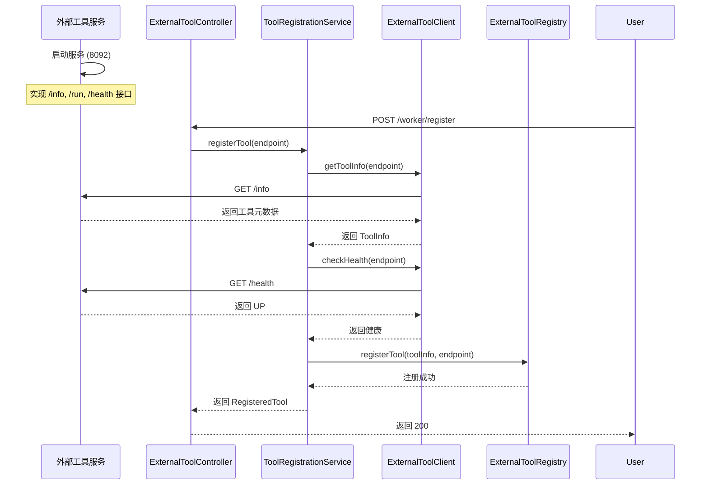
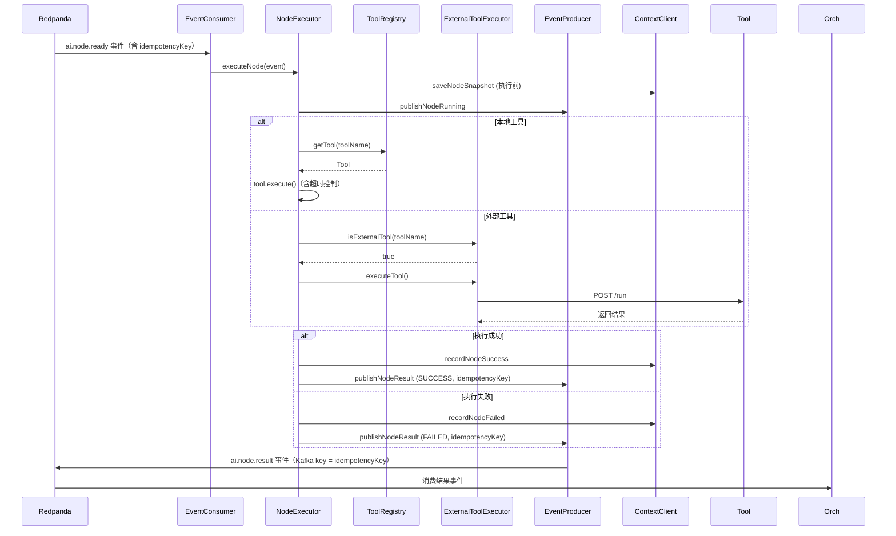

# 灵犀AI OS Worker 模块完整指南

> **状态**: ✅ 已实现 - 本文档描述当前已实现的模块
> **最后更新**: 2026-04-22

---

## 目录

1. [什么是 Worker？](#什么是-worker)
2. [核心功能](#核心功能)
3. [技术栈](#技术栈)
4. [项目结构](#项目结构)
5. [完整 API 接口](#完整-api-接口)
6. [工具系统](#工具系统)
7. [工作流程](#工作流程)
8. [事件模型](#事件模型)
9. [快速开始](#快速开始)

---

## 什么是 Worker？

**Worker（工具执行器）** 是灵犀AI OS的执行引擎模块，负责：

- 监听 Orchestrator 发布的任务事件
- 执行具体的节点任务（LLM 调用或工具调用）
- 支持内置工具和外部工具
- 向 Orchestrator 报告执行结果（含幂等键，防止重复处理）

简单来说，Worker 就是"干活的人"，负责实际执行用户请求的操作。

### 定位

```
┌─────────────────────────────────────────────────────────────────────────────┐
│                           AIOS 模块分层                                       │
└─────────────────────────────────────────────────────────────────────────────┘

  用户入口层 ──▶ NL-Translator ──▶ Orchestrator ──▶ Worker
                                                                  │
                                              ┌─────────────────────┼─────────────────────┐
                                              │                     │                     │
                                              ▼                     ▼                     ▼
                                        ┌──────────┐         ┌──────────┐         ┌──────────┐
                                        │ 内置工具  │         │外部工具   │         │  LLM    │
                                        │ Bash/文件 │         │ HTTP调用  │         │ OpenAI  │
                                        └──────────┘         └──────────┘         └──────────┘
```

---

## 核心功能

### 1. 事件驱动执行
- 监听 Redpanda 的 `ai.node.ready` Topic
- 消费节点任务事件
- 执行完成后发布 `ai.node.result` 事件

### 2. 内置工具
- **BashTool**: 执行 Bash 命令
- **LlmApiTool**: 调用 OpenAI API

### 3. 外部工具管理
- 支持注册外部 HTTP 工具
- 外部工具只需实现 `/info`, `/run`, `/health` 三个接口
- 支持工具注销

### 4. 上下文记录
- 执行前保存节点快照
- 执行后更新节点状态
- 记录成功/失败上下文

### 5. 幂等执行
- 每个 NodeTaskEvent 携带 `idempotencyKey`
- 执行结果使用幂等键作为 Kafka 消息 key，确保同一节点不会重复处理
- 幂等键默认为 `taskId + "-" + nodeId`，由 Orchestrator 在 DAG 提交时生成

### 6. 超时控制
- 工具执行设有超时机制（通过 `WorkerConfig.toolTimeoutSeconds` 配置）
- 超时后自动标记为 FAILED 并发布失败结果

---

## 技术栈

| 技术 | 版本 | 用途 |
|------|------|------|
| Java | 17+ | 开发语言 |
| Spring Boot | 3.2.5 | 应用框架 |
| Spring Kafka | 3.1.x | Redpanda 客户端 |
| Spring WebFlux | 3.2.5 | 异步 HTTP 客户端 |
| Maven | 3.9.x | 构建工具 |

---

## 项目结构

```
ai-worker/
├── pom.xml
└── src/main/java/com/lingxi/ai/worker/
    ├── WorkerApplication.java                    # 启动入口
    ├── controller/
    │   ├── WorkerController.java                # 基础API (/api)
    │   └── ExternalToolController.java         # 外部工具API (/worker)
    ├── service/
    │   └── NodeExecutor.java                   # 节点执行器（含幂等键、超时控制）
    ├── event/
    │   ├── EventConsumer.java                  # 事件消费（ai.node.ready）
    │   └── EventProducer.java                  # 事件生产（ai.node.result，含幂等键）
    ├── model/
    │   ├── NodeTaskEvent.java                  # 节点任务事件（含 idempotencyKey）
    │   ├── NodeResultEvent.java                # 节点结果事件（含 idempotencyKey）
    │   └── NodeStatus.java                     # 节点状态枚举
    ├── tool/
    │   ├── Tool.java                          # 工具接口
    │   ├── ToolType.java                      # 工具类型枚举
    │   ├── ToolRegistry.java                   # 工具注册表
    │   ├── ToolContext.java                    # 工具执行上下文
    │   ├── ToolResult.java                     # 工具执行结果
    │   ├── builtin/
    │   │   ├── BashTool.java                  # Bash工具
    │   │   └── LlmApiTool.java                # LLM API工具
    │   └── spi/
    │       └── BuiltinToolProvider.java       # 内置工具提供者
    ├── externaltool/
    │   ├── client/
    │   │   └── ExternalToolClient.java        # 外部工具HTTP客户端
    │   ├── controller/
    │   │   └── ExternalToolController.java    # 外部工具管理API
    │   ├── registry/
    │   │   └── ExternalToolRegistry.java      # 外部工具注册表
    │   ├── service/
    │   │   ├── ExternalToolExecutor.java      # 外部工具执行器
    │   │   ├── ToolRegistrationService.java   # 工具注册服务
    │   │   └── ToolHealthCheckService.java    # 健康检查服务
    │   └── model/
    │       ├── ToolInfo.java
    │       ├── ToolRegisterRequest.java
    │       ├── ToolExecuteRequest.java
    │       ├── ToolResponse.java
    │       ├── ToolHealth.java
    │       └── RegisteredTool.java
    ├── client/
    │   └── ContextClient.java                  # 上下文服务客户端
    ├── util/
    │   └── TraceContext.java                   # 链路追踪上下文
    └── config/
        ├── KafkaConfig.java
        ├── OpenAiConfig.java
        ├── WebClientConfig.java
        └── WorkerConfig.java
```

---

## 完整 API 接口

### 1. Worker 基础 API

**基础URL**: `http://localhost:8083`

| 方法 | 路径 | 说明 |
|------|------|------|
| GET | `/api/health` | 健康检查 |
| GET | `/api/tools` | 获取所有已注册工具列表 |

#### 健康检查

```bash
curl http://localhost:8083/api/health
```

响应：
```json
{"status": "UP", "service": "ai-worker"}
```

#### 获取工具列表

```bash
curl http://localhost:8083/api/tools
```

响应：
```json
{
  "count": 2,
  "tools": [
    {"name": "bash", "description": "Execute bash commands", "type": "BUILTIN"},
    {"name": "llm", "description": "OpenAI LLM API", "type": "BUILTIN"}
  ]
}
```

---

### 2. 外部工具管理 API

**基础URL**: `http://localhost:8083/worker`

| 方法 | 路径 | 说明 |
|------|------|------|
| POST | `/worker/register` | 注册外部工具 |
| POST | `/worker/unregister` | 注销外部工具 |
| GET | `/worker/tools` | 获取所有已注册外部工具 |
| GET | `/worker/tools/{toolName}` | 获取指定工具详情 |

#### 注册外部工具

```bash
curl -X POST http://localhost:8083/worker/register \
  -H "Content-Type: application/json" \
  -d '{"endpoint": "http://localhost:8092"}'
```

响应：
```json
{
  "code": 200,
  "message": "success",
  "data": {
    "toolName": "test_tool",
    "toolVersion": "1.0.0",
    "status": "REGISTERED"
  }
}
```

#### 获取外部工具列表

```bash
curl http://localhost:8083/worker/tools
```

响应：
```json
{
  "code": 200,
  "message": "success",
  "data": {
    "count": 1,
    "tools": [
      {
        "toolName": "test_tool",
        "toolVersion": "1.0.0",
        "description": "Test tool for demonstration",
        "endpoint": "http://localhost:8092",
        "status": "HEALTHY",
        "registeredAt": "2024-01-15T10:30:00"
      }
    ]
  }
}
```

#### 注销外部工具

```bash
curl -X POST http://localhost:8083/worker/unregister \
  -H "Content-Type: application/json" \
  -d '{"endpoint": "http://localhost:8092"}'
```

---

## 工具系统

### 内置工具

#### BashTool
执行 Bash 命令。

```java
// 工具名称: "bash"
// 参数:
//   - command: String - 要执行的命令
//   - timeout: Integer - 超时时间（秒），可选，默认30
```

示例：
```json
{
  "command": "ls -la /tmp",
  "timeout": 60
}
```

#### LlmApiTool
调用 OpenAI API。

```java
// 工具名称: "llm"
// 参数:
//   - prompt: String - 提示词
//   - model: String - 模型名称，可选，默认 gpt-4
//   - temperature: Double - 温度参数，可选，默认 0.7
```

示例：
```json
{
  "prompt": "请介绍一下人工智能",
  "model": "gpt-4",
  "temperature": 0.7
}
```

### 外部工具接口规范

外部工具需要实现以下三个 HTTP 接口：

#### 1. GET /info
获取工具元数据。

响应：
```json
{
  "toolName": "weather_query",
  "toolVersion": "1.0.0",
  "description": "查询天气",
  "parameters": {
    "type": "object",
    "properties": {
      "city": {"type": "string", "description": "城市名称"}
    }
  }
}
```

#### 2. POST /run
执行工具。

请求：
```json
{
  "taskId": "task-001",
  "nodeId": "node-001",
  "input": {
    "city": "北京"
  }
}
```

响应：
```json
{
  "code": 200,
  "message": "success",
  "data": {
    "city": "北京",
    "temperature": 25,
    "weather": "晴"
  }
}
```

#### 3. GET /health
健康检查。

响应：
```json
{
  "status": "UP"
}
```

### 工具注册流程



---

## 工作流程

### 节点执行时序图



### 完整数据流

```
1. Orchestrator 发布 ai.node.ready 事件
   │
   │  {
   │    "taskId": "task-001",
   │    "nodeId": "node-001",
   │    "type": "LLM",
   │    "idempotencyKey": "task-001-node-001",
   │    "payload": {
   │      "tool": "llm",
   │      "parameters": {
   │        "prompt": "写一篇文章"
   │      }
   │    }
   │  }
   ▼
2. Worker 消费事件（EventConsumer）
   │
   ▼
3. NodeExecutor 决定执行方式
   │
   ├─► 本地工具: ToolRegistry.getTool("llm")
   │   └─► 含超时控制（WorkerConfig.toolTimeoutSeconds）
   │
   └─► 外部工具: ExternalToolRegistry.getTool("weather")
              │
              ▼
         HTTP POST /run（异步，响应式）
              │
              ▼
4. 执行结果发布 ai.node.result 事件
   │
   │  {
   │    "taskId": "task-001",
   │    "nodeId": "node-001",
   │    "status": "SUCCESS",
   │    "output": {"result": "文章内容..."},
   │    "idempotencyKey": "task-001-node-001"
   │  }
   │
   │  Kafka 消息 key = "task-001-node-001"（确保幂等）
   ▼
5. Orchestrator 消费结果，调用 StateMachine 处理状态流转
   │
   ▼
6. StateMachine 发布 ai.node.executed 事件
   │
   ▼
7. DependencyChecker 检查下游节点依赖，触发新的 ai.node.ready
```

---

## 事件模型

### NodeTaskEvent（ai.node.ready 消费）

Worker 从 `ai.node.ready` Topic 消费的事件模型：

| 字段 | 类型 | 说明 |
|------|------|------|
| taskId | String | 任务ID |
| nodeId | String | 节点ID |
| type | String | 节点类型（LLM/TOOL） |
| payload | Map\<String, Object\> | 执行参数 |
| traceId | String | 链路追踪ID |
| idempotencyKey | String | 幂等键（taskId + "-" + nodeId） |

### NodeResultEvent（ai.node.result 生产）

Worker 执行完成后向 `ai.node.result` Topic 发布的事件模型：

| 字段 | 类型 | 说明 |
|------|------|------|
| taskId | String | 任务ID |
| nodeId | String | 节点ID |
| status | NodeStatus | 执行状态（SUCCESS/FAILED） |
| output | Map\<String, Object\> | 执行输出（成功时） |
| traceId | String | 链路追踪ID |
| errorMessage | String | 错误信息（失败时） |
| idempotencyKey | String | 幂等键，同时作为 Kafka 消息 key |

### Kafka Topic 映射

| Topic | 角色 | 消费/生产 | 说明 |
|-------|------|-----------|------|
| `ai.node.ready` | 消费者 | 消费 | 接收待执行节点任务 |
| `ai.node.result` | 生产者 | 生产 | 发布节点执行结果 |

---

## 快速开始

### 步骤 1：启动基础设施

```bash
cd /Users/wanglian/Projects/lingxi-ai-operation-system
docker compose up -d
```

### 步骤 2：编译并启动 Worker

```bash
cd ai-worker
mvn spring-boot:run
```

### 步骤 3：测试

```bash
# 健康检查
curl http://localhost:8083/api/health

# 查看工具列表
curl http://localhost:8083/api/tools
```

### 步骤 4：注册外部工具（可选）

```bash
# 启动测试工具服务
cd examples
pip install fastapi uvicorn
python test_tool_final.py &

# 注册工具
curl -X POST http://localhost:8083/worker/register \
  -H "Content-Type: application/json" \
  -d '{"endpoint": "http://localhost:8092"}'

# 查看已注册工具
curl http://localhost:8083/worker/tools
```

---

## 下一步

- 了解 [Orchestrator 模块](./ORCHESTRATOR_GUIDE.md)
- 了解 [NL-Translator 模块](./NL_TRANSLATOR_GUIDE.md)
- 了解 [AI-Context 模块](./AI_CONTEXT_GUIDE.md)
