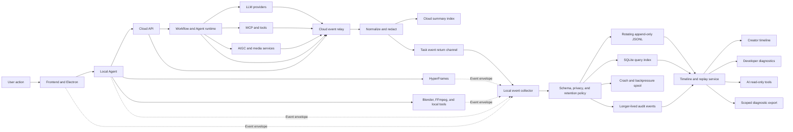

# Observability, Logging, and Traceability Design

## Status

Approved in conversation on 2026-07-27. This document defines the product logging, distributed trace, diagnostic, recovery, and audit architecture for the Tangying desktop client, Local Agent, cloud backend, workflow and agent runtimes, MCP and tool calls, HyperFrames, Blender, FFmpeg, and related media services.

Implementation is intentionally out of scope for this document. A separate implementation plan must break the approved design into testable changes.

## Intent

Make every important creation operation understandable and recoverable for three audiences:

- Creators need a plain-language timeline, visible intermediate artifacts, actionable failures, and safe regeneration from a completed step.
- Developers need correlated structured events, causal error chains, performance evidence, and scoped diagnostic exports.
- AI diagnostic agents need standard read-only tools that return redacted, bounded, evidence-backed data.

The logging system must not become another source of task failure, expose user content, invalidate LLM KV caches, or require centralized collection of complete user traces.

## Confirmed decisions

- Use a local-first architecture.
- The canonical local event journal is append-only JSONL; SQLite is a rebuildable query index.
- Cloud services retain only redacted task summaries and content-free operational telemetry by default. Detailed task evidence returns to the user's local event store.
- Keep the normal creator timeline and the developer diagnostic console as separate product surfaces.
- Normal runtime events are retained for 14 days, failed-run evidence for 30 days, and approval, regeneration, configuration-change, and other audit events for 180 days.
- Use a default local observability capacity of 2 GB, configurable by the user.
- Diagnostic exports are scoped to a selected project, task, run, Shot, or time range. A user previews the manifest and explicitly approves any upload.
- Every new task receives an immutable tool and MCP registry snapshot. New registrations enter the next task and never mutate the current task's system-prompt prefix.
- Logs reference versioned artifacts and hashes instead of copying raw prompts, media, or model files.
- Retrying, falling back, correcting, resuming, and regenerating are explicit trace events. No recovery behavior is silent.

## Current-state audit

The repository has substantial logging, but not a coherent observability system.

- The cloud backend has hundreds of Zap calls, while `cloud-backend/internal/core/logger/logger.go` only initializes a global logger. It does not provide request context propagation, durable sinks, rotation, retention, or a shared event envelope.
- The Gin server uses the default middleware. There is no project-wide correlation middleware that propagates task, workflow-run, Agent-run, stage, Shot, artifact, tool-call, and provider-job identifiers.
- Workflow runs persist a `trace_id`, but it is not consistently carried into structured log context across services.
- `decision_logs` provide useful audit data, but simplified writes can omit a meaningful workflow-run identifier.
- Some cloud logs currently include raw user input or prompts. Those fields must be removed from operational logs.
- The Local Agent mostly uses unstructured `log.Printf` calls. Its local log ingestion endpoint can append redacted JSONL, but the running product does not consistently send useful events into it.
- The Local Agent has no complete indexed search, trace-tree, tail, retention, rotation, or crash-recovery service for logs.
- Electron primarily forwards selected subprocess output to the console and does not provide structured durable desktop logs.
- HyperFrames primarily uses console output and does not share the same correlation contract.
- The current diagnostic archive can gather broad cross-project metadata while still containing no execution logs when the local log directory is empty. Diagnostic export must become explicitly scoped.
- Existing video diagnostics are useful state snapshots, but they are not an ordered causal event timeline.

These findings motivate an incremental adapter-based migration rather than a big-bang replacement.

## Goals

1. Correlate a creator action with every downstream workflow, Agent, LLM, MCP, tool, renderer, media, artifact, verification, and correction operation.
2. Identify the first causal failure instead of presenting a cascade of secondary errors.
3. Safely resume interrupted work and regenerate a completed stage without overwriting history.
4. Give users plain-language status and remediation without exposing raw JSON.
5. Give developers and AI bounded access to precise technical evidence.
6. Keep sensitive content local and prevent secrets from entering any sink or diagnostic package.
7. Preserve system-prompt and tool-definition byte stability within a task for KV-cache efficiency.
8. Keep logging overhead small and prevent logging failures from stopping the creation pipeline.

## Non-goals

- Replacing the product workflow engine with a tracing platform.
- Uploading full prompts, source media, Blender assets, or local filesystem contents to a centralized log service.
- Providing arbitrary filesystem or database access to an AI agent.
- Guaranteeing bit-identical output from inherently nondeterministic third-party generation services.
- Recording every rendered frame, streamed token, heartbeat, or polling iteration as a separate event.

## Architecture



### Local-first boundary

Local components emit directly into the Local Agent collector. Cloud components emit the same event envelope, then apply cloud-side allowlisting and redaction before events are returned to the client. The cloud summary index contains state, duration, stable error codes and fingerprints, software versions, and correlation identifiers, but not raw user content.

Cloud infrastructure may retain content-free service telemetry needed to operate the service. It is separate from the user's canonical task journal and follows the same classification and redaction contract.

If the desktop is offline, cloud-to-local events remain in a bounded, encrypted relay spool. Synchronization is idempotent by `eventId`.

## Event contract

Every producer uses a versioned event contract. Language-specific SDKs may differ internally, but their serialized events and semantics must pass the same contract suite.

```json
{
  "schemaVersion": "1.0",
  "eventId": "evt_...",
  "occurredAt": "2026-07-27T12:00:00.000Z",
  "ingestedAt": "2026-07-27T12:00:00.040Z",
  "producerSequence": 1842,
  "severity": "INFO",
  "eventType": "stage.completed",
  "messageKey": "workflow.stage.completed",
  "source": {
    "service": "cloud-backend",
    "component": "workflow-runner",
    "environment": "production"
  },
  "correlation": {
    "traceId": "trc_...",
    "spanId": "spn_...",
    "parentSpanId": "spn_...",
    "sessionId": "ses_...",
    "projectId": "prj_...",
    "taskId": "tsk_...",
    "workflowRunId": "wfr_...",
    "agentRunId": "agr_...",
    "stageId": "script",
    "shotId": "shot_01",
    "artifactId": "art_...",
    "toolCallId": "call_...",
    "providerJobId": "job_..."
  },
  "execution": {
    "status": "COMPLETED",
    "attempt": 1,
    "durationMs": 1240
  },
  "runtime": {
    "appVersion": "0.1.x",
    "gitCommit": "...",
    "workflowVersion": "...",
    "toolRegistrySnapshotId": "...",
    "promptTemplateVersion": "...",
    "provider": "...",
    "model": "..."
  },
  "evidence": {
    "inputRefs": ["artifact://..."],
    "outputRefs": ["artifact://..."],
    "inputHash": "...",
    "outputHash": "...",
    "sizeBytes": 2048
  },
  "error": null,
  "privacy": {
    "classification": "INTERNAL",
    "redactedFields": []
  }
}
```

Fields that do not apply are omitted instead of populated with misleading empty identifiers. Required fields vary by event type and are enforced by versioned schemas.

`eventId` is globally unique and is the synchronization deduplication key. `producerSequence` is monotonic within one producer process. `occurredAt` preserves the producer's clock, while `ingestedAt` records collector receipt. Timeline reconstruction uses causal edges and producer sequence before timestamps, so clock skew between the desktop and cloud cannot reorder cause and effect.

Schema changes are additive within a major version. Breaking changes require a new major `schemaVersion`, a journal reader that supports the prior version, and an index migration or rebuild path. Unknown additive fields are preserved by the journal and ignored safely by older indexers.

### Correlation context

The system uses W3C-compatible trace context at HTTP, WebSocket, job-queue, MCP, and subprocess boundaries. The product identifiers remain explicit fields because they are essential for access control and user-facing timelines.

- `traceId` identifies one end-to-end user intent.
- `spanId` identifies one bounded operation.
- `parentSpanId` builds the execution tree.
- `workflowRunId` identifies one immutable workflow execution.
- `agentRunId` identifies one Agent execution within a workflow.
- `toolCallId` identifies one logical external call across attempts.
- `attempt` distinguishes retries without fragmenting the logical call.

Subprocesses receive a minimal correlation environment or command payload containing identifiers only. Secrets and user content are not propagated as trace baggage.

### Event naming

Event types use stable lower-case dotted names. The common lifecycle is:

- `<domain>.<operation>.queued`
- `<domain>.<operation>.started`
- `<domain>.<operation>.progress`
- `<domain>.<operation>.completed`
- `<domain>.<operation>.failed`
- `<domain>.<operation>.cancelled`

State events describe what happened. Localized `messageKey` values describe how a user interface may explain it. Free-form log messages are supplementary and must not be the machine-readable contract.

## Required instrumentation

| Domain | Required events and evidence |
|---|---|
| Request and session | Request accepted, authentication result, task created, cancellation requested |
| Run manifest | Application, commit, workflow, configuration, tool registry, provider, and model fingerprints |
| Workflow | Queue, start, stage transition, checkpoint, pause, resume, completion, cancellation, failure |
| Agent | Agent start, context references, plan validation, decision, result submission |
| LLM | Provider, model, template version, duration, input/output/cached tokens, cache hit, stable failure code |
| MCP and tools | Registry snapshot, server connection, discovery, call start, redacted argument summary, result summary, retry |
| Shot production | Shot plan and A-roll, text layer, AIGC layer, composition, QA, approval, and accepted-candidate state |
| Media execution | Blender, HyperFrames, FFmpeg, voice, subtitle, rendering, probing, concatenation, and packaging stages |
| Artifacts | Creation, validation, version derivation, materialization, preview availability, export |
| Verify | Rule version, expected summary, actual summary, evidence, pass, warning, or failure |
| Correct | Triggering verification, repair strategy, mutation scope, before and after versions, re-verification result |
| User decision | Approval, rejection, selected-text revision, contextual media revision, regeneration, rollback |
| Recovery | Retry, fallback, compensation, rollback, checkpoint resume, recovery verification |
| Final result | Terminal status, verified outputs, duration, warning summary |

Progress events are coalesced by meaningful stage change, 10-percent progress boundary, or 30-second interval. The system does not emit one event per frame, token, poll, or heartbeat.

### Severity policy

- `INFO` records important state changes.
- `WARN` records recovered failures, degraded quality, or conditions likely to require attention.
- `ERROR` records failed operations and must include a stable error code and remediation metadata.
- `DEBUG` is task-scoped, temporary, and expires automatically.

## LLM, tool registry, and KV-cache observability

At task creation, the runtime queries the database-backed tool and MCP registry, normalizes definitions into a deterministic order and serialization, and produces an immutable `toolRegistrySnapshotId` and content hash.

The snapshot is fixed for the task. A tool registered while the task is running is visible only to a later task. The current task's system-prompt prefix must remain byte-for-byte unchanged.

LLM events record:

- `promptTemplateVersion`
- `systemPromptHash`
- `toolRegistrySnapshotId`
- `cacheKeyHash`
- `cacheHit`
- `inputTokens`
- `cachedTokens`
- `outputTokens`
- `durationMs`

They do not record the full system prompt, user prompt, secret, or unredacted tool arguments. Detailed prompt content remains a versioned local artifact when the product already requires it for creator review; logs reference that artifact and its hash.

## Error model and root-cause analysis

Stable error codes use `DOMAIN.COMPONENT.REASON`, for example:

- `AUTH.SESSION.EXPIRED`
- `WORKFLOW.STAGE.TIMEOUT`
- `AGENT.PLAN.VALIDATION_FAILED`
- `LLM.PROVIDER.RATE_LIMITED`
- `LLM.RESPONSE.SCHEMA_INVALID`
- `MCP.CONNECTION.UNAVAILABLE`
- `MCP.TOOL.NOT_FOUND`
- `TOOL.ARGUMENT.SCHEMA_INVALID`
- `ARTIFACT.FILE.MISSING`
- `ARTIFACT.HASH.MISMATCH`
- `RENDER.BLENDER.PROCESS_FAILED`
- `RENDER.FFMPEG.CODEC_UNSUPPORTED`
- `MEDIA.AUDIO.DURATION_MISMATCH`

An error contains a stable code, class, fingerprint, retryability, causal event, user message key, developer detail, suggested action key, evidence references, and an optional protected stack reference.

The fingerprint is derived from stable dimensions such as error code, component, provider or tool identifier, and normalized top stack frames. Dynamic error text is excluded.

Root-cause analysis follows these rules:

1. Build a causal graph from `traceId`, parent spans, `causedByEventId`, and operation attempts.
2. Mark the first failure that explains downstream failures as the root cause.
3. Mark missing-output and cancellation errors caused by an upstream failure as propagation errors.
4. Fold repeated fingerprints into one error group with counts and timestamps.
5. Attach retry attempts to the original logical call.
6. Record fallback or quality degradation explicitly.
7. Verify every automatic recovery and distinguish recovered from terminal failures.

## Verification and correction evidence

Every Verify operation records its rule version, expected and actual summaries, artifact hashes, result, evidence references, and whether automatic correction is permitted.

Every Correct operation references the failed verification, records the chosen strategy and mutation scope, preserves before and after artifact versions, and runs verification again. This makes the system able to answer why a change occurred, what changed, and whether the change was actually successful.

## Checkpoints, replay, and regeneration

Every durable stage boundary creates an immutable checkpoint containing:

- workflow and non-secret configuration snapshots
- tool and MCP registry snapshot
- user decisions effective at that point
- input and output artifact identifiers and hashes
- downstream dependency edges
- verification results
- supported random seeds, provider job identifiers, and idempotency keys

Regeneration never overwrites a run. It creates a new `workflowRunId` with `parentRunId`, `replayFromStageId`, and a human or machine-readable reason. Unchanged upstream artifacts are reused; the selected stage and its downstream dependencies are invalidated and regenerated. Old versions and audit history remain accessible.

Three recovery modes are supported:

- Resume an interrupted run from the latest verified checkpoint.
- Rerun a failed or user-selected stage in a derived run.
- Reproduce the orchestration from the immutable run manifest for diagnosis.

External generation may not be bit-identical. Replay guarantees reproducible orchestration decisions and evidence, not identical output from nondeterministic providers.

### Crash recovery

At startup, the Local Agent:

1. indexes journal events not yet present in SQLite;
2. finds spans and runs without terminal events;
3. reconciles workflow state, checkpoints, and actual files;
4. classifies interrupted work as recoverable, user-action-required, or terminal;
5. reuses idempotency keys to avoid duplicate paid calls;
6. resumes only from a checkpoint that previously passed verification.

## Local storage

```text
observability/
├── events/
│   ├── 2026-07-27-001.jsonl
│   └── 2026-07-26-001.jsonl.zst
├── index/
│   └── events.db
├── spool/
│   └── pending-events.jsonl
├── crash/
│   └── crash-<timestamp>.json
├── manifests/
│   └── run-<workflowRunId>.json
└── diagnostics/
    └── diagnostic-<timestamp>-<scope>.zip
```

JSONL is the forensic source of truth and is append-only. SQLite runs in WAL mode and provides indexed filtering, timelines, and span trees. The index must be fully rebuildable from journal files.

Files rotate daily or at 64 MB, whichever occurs first. Closed files are compressed and receive a checksum. Critical state, approval, failure, and checkpoint events are flushed durably; ordinary events may use an asynchronous buffer of up to approximately one second.

Each closed journal file records its own checksum and the previous file's checksum in the local manifest. This provides a lightweight tamper-evident chain for audit and support investigations without treating the journal as an authorization source.

If the collector or index is unavailable, producers write to a bounded spool. Backpressure first removes duplicate DEBUG events. It must not discard state transitions, errors, audit decisions, or checkpoints.

### Retention and capacity

- Successful ordinary-run events: 14 days.
- Failed-run evidence: 30 days.
- Approval, regeneration, configuration-change, and other audit events: 180 days.
- Default total local capacity: 2 GB, user configurable.

Cleanup prioritizes expired DEBUG data, expired successful-run logs, expired failed-run logs, and already-exported diagnostic packages. Audit events are eligible only after 180 days. Active runs, unresolved crashes, and incomplete recovery evidence are protected.

Every cleanup emits a content-free audit record describing the removed time range, classifications, and byte count.

## Product surfaces

### Creator timeline

The creator UI never exposes raw JSON, internal object graphs, tool arguments, or stack traces. It displays:

- current activity and progress
- completed stages and duration
- reviewable prompts, images, audio, Shot candidates, and videos
- plain-language failure reason
- automatic repair attempts
- recommended next action
- a safe `Regenerate from this step` action

Completed tasks and stages remain enterable. Selecting a stage shows the artifact and decision that existed at that version. A completed stage with a deliverable cannot render as content-free merely because a raw metadata lookup failed; artifact reconciliation must either find the output or report a concrete integrity error.

### Developer diagnostic console

The diagnostic console is an independent route and authorization surface. It provides:

- project, task, run, Shot, stage, component, time, severity, and error-code filters
- trace tree and span-duration waterfall
- root, propagated, and repeated error grouping
- LLM token, cached-token, provider, and duration evidence
- MCP connectivity, discovery, call, and retry evidence
- Local Agent, Blender, HyperFrames, and FFmpeg subprocess evidence
- artifact versions, hashes, file existence, and dependency edges
- checkpoint, regeneration, fallback, correction, and rollback history
- redacted event detail and protected error-stack access
- scoped diagnostic preview and export

Summary data loads first. Detailed events and stacks load only when requested.

## AI diagnostic tools

The Agent registry exposes standard read-only JSON Schema tools:

| Tool | Responsibility |
|---|---|
| `logs.search` | Search bounded events by scope, time, severity, event type, or error code |
| `traces.get` | Return one trace's span tree and key events |
| `runs.timeline` | Reconstruct a task or workflow-run timeline |
| `errors.explain` | Return root cause, propagation, retries, recovery, and suggestions |
| `artifacts.verify` | Compare artifact records, files, hashes, versions, and dependencies |
| `diagnostics.preview` | Preview the manifest for a proposed diagnostic export |

The query service enforces project, task, and user scope. Results are paginated, size-limited, time-bounded, and redacted again. AI tools cannot access the event files or SQLite directly. Every diagnostic query produces its own audit event.

Bundle creation and upload are not read-only diagnostic tools. They require explicit user approval through a separate privileged action.

## Diagnostic export

The user selects a project, task, run, Shot, or time range. The product displays an exact manifest and sensitivity summary before creating the package.

The package may include scoped events, trace trees, protected stacks, run manifests, configuration fingerprints, QA reports, and artifact metadata. It excludes secrets, unrelated projects, full media, and full prompt bodies by default.

The exporter runs a second leak scan, writes file checksums into the manifest, and encrypts packages intended for upload. Upload is one-time, explicitly approved, and time-limited. Declining upload keeps the package local.

## Privacy and security

Events use four classifications:

| Classification | Policy |
|---|---|
| `PUBLIC` | May be displayed normally |
| `INTERNAL` | Available locally and to authorized developers |
| `SENSITIVE` | Store only approved summaries, references, or hashes |
| `SECRET` | Never enter logs, indexes, summaries, or bundles |

The event schema uses a field allowlist and typed redaction rules. Regex scanning is defense in depth, not the primary policy.

The system must never log API keys, access tokens, cookies, Authorization headers, database passwords, complete connection strings, raw uploaded media, complete system prompts, unredacted user input, unapproved absolute paths, or data from unrelated users and projects.

The Local Agent ingestion and query API requires a per-session local capability token, origin validation, and explicit scope authorization. Binding to localhost is not treated as authentication. Sensitive local indexes use a key held by the operating system's secure credential store.

## Performance and resilience budgets

- Logging adds less than 2 percent CPU overhead to representative creation workloads.
- Event enqueue latency is below 1 ms at P95.
- A 10,000-event run timeline loads in under 1 second at P95 on the supported baseline machine.
- A normal process crash loses no more than approximately one second of noncritical events.
- Critical state, approval, error, and checkpoint events survive expected process crashes.
- SQLite can be deleted or corrupted and rebuilt from JSONL without losing the task timeline.
- Network loss does not prevent local recording.
- A logging-system failure does not fail the video-creation workflow.
- Logging errors use an independent crash spool and never recursively log themselves.

## Testing strategy

1. Cross-language contract tests validate identical Go, TypeScript, Electron, and local-tool envelopes.
2. Trace propagation tests cover HTTP, WebSocket, queues, Agent calls, MCP, Blender, HyperFrames, and FFmpeg.
3. Leak tests inject synthetic credentials, prompts, local paths, and media metadata and scan every sink and export.
4. Authorization tests prove project, task, and user isolation.
5. Concurrency and load tests cover parallel writes, rendering, tool calls, rotation, and backpressure.
6. Crash tests terminate processes during append, index, render, and synchronization, then verify recovery.
7. Index-rebuild tests reconstruct timelines and causal error graphs from JSONL only.
8. Retry and idempotency tests prove that restart does not duplicate paid LLM, AIGC, upload, or render operations.
9. Regeneration tests prove exact downstream invalidation and preservation of prior versions.
10. Diagnostic-export tests prove scope, preview accuracy, leak scanning, checksums, and encryption.
11. User-interface tests prove creators never receive raw JSON and can reopen completed tasks and regenerate from a stage.
12. AI-tool tests prove bounded pagination, redaction, evidence citation, and read-only behavior.

## Delivery sequence

1. Define event schemas, error taxonomy, message keys, privacy classifications, and redaction tests.
2. Add trace context propagation and structured adapters to each producer.
3. Build the JSONL journal, SQLite index, rotation, retention, spool, and crash reconciliation.
4. Add the cloud summary index and redacted event return channel.
5. Build the creator timeline and separate developer diagnostic console.
6. Register standard AI diagnostic tools and implement scoped diagnostic exports.
7. Run performance, privacy, recovery, and end-to-end tests before staged release.

The migration adapts existing Zap, `log.Printf`, Electron console, and HyperFrames logging instead of replacing every call at once. Raw prompt and user-input logging is removed early in the rollout.

## Acceptance criteria

- Every production task has one unique end-to-end `traceId`.
- Every critical stage has a start event and one terminal event.
- A failed task's first causal component and event can be identified within two minutes.
- The creator UI shows plain-language status, evidence, and remediation without raw JSON.
- Developers can inspect the complete redacted call chain and causal error graph.
- AI can produce an evidence-backed root-cause report through standard read-only tools.
- A creator can regenerate a completed stage without overwriting history or regenerating unrelated work.
- Verify and Correct operations preserve their full evidence and re-verification chain.
- Secrets do not appear in local journals, SQLite, cloud summaries, UI payloads, or diagnostic exports.
- A damaged SQLite index and an interrupted application can recover from the append-only journal and verified checkpoints.
- New tool and MCP registrations affect only new task snapshots; a running task's tool prefix remains byte-stable.
- Observability degradation cannot stop the core creation pipeline.

## Risks and mitigations

| Risk | Mitigation |
|---|---|
| Event volume grows unexpectedly | Coalesced progress, rotation, tiered retention, configurable capacity, DEBUG shedding |
| Producers drift from the contract | Generated types where practical and mandatory cross-language contract tests |
| Redaction misses an unknown secret field | Schema allowlists, typed classifications, synthetic leak corpus, export rescan |
| Cloud events cannot return to an offline client | Encrypted bounded relay spool and idempotent event synchronization |
| A retry duplicates a paid operation | Stable idempotency keys recorded in run manifests and reconciled before retry |
| Users are overwhelmed by technical detail | Separate creator and developer views with server-derived user messages |
| AI over-queries sensitive history | Read-only scoped query service, pagination, redaction, and query audit |
| Nondeterministic providers prevent exact reproduction | Preserve orchestration, versions, seeds where supported, provider job IDs, and evidence hashes |
| Logging failure recursively produces more failures | Independent crash spool, recursion guard, and fail-open behavior for non-audit logs |
