# 工具边界

工具系统以 `ToolManifest` 作为唯一逻辑工具描述模型。不要再新增平行的 `ToolDescriptor`，也不要让 Planner 直接调用 provider、CLI、HTTP 服务或本地命令。

## Agent Core

Agent Core 不是 MCP Tool。以下能力保留在云端 runtime 内部：

- Planner / LLM Planner
- `HybridToolRetriever`
- `KnowledgePolicy`
- `PlanGuard`
- `PlanCompiler`
- Workflow / DAG 状态推进
- QA Gate 决策
- retry / timeout / cancel / cost / approval 策略
- artifact 版本管理
- bad case 分类和数据飞轮
- 是否搜索新闻、是否调用 fresh knowledge 的决策

原则：决策留在 Agent Core，执行能力才作为 Tool。MCP Tool 不得控制业务主流程，也不得直接修改核心业务状态。

## Cloud Native Tool

适合放在云端或 Agent Runtime 内部：

- 确定性计算
- 低延迟
- 强业务耦合
- 需要访问 Project / Shot / Artifact 结构
- 主要服务当前系统，不需要跨 Agent 复用

示例：`spec.normalize`、`video.mode_select`、`script.estimate_duration`、`prompt.render_template`、`aigc.build_prompt_payload`、`artifact.validate_reference`。

`ToolManifest.boundary = cloud_builtin`。

## Local Native Tool

适合保留在 `local-backend/internal/localtool`：

- path guard
- 本地文件校验
- artifact package
- ffmpeg probe
- HyperFrames project / snapshot / storyboard render
- final review 聚合
- 本地文件导入和预检

要求：必须受 pathguard 或 artifact policy 约束；不允许执行任意 shell；不允许把用户输入拼接成未白名单命令；必须记录 input/output 摘要和错误。

`ToolManifest.boundary = local_native`，`executionPlane = local`。

## MCP Provider Tool

适合通过 MCP provider 暴露：

- 第三方 CLI
- 外部本地软件
- AIGC provider
- Video QA provider
- 图像/视频生成
- TTS / ASR
- 浏览器截图
- Figma / GitHub / 外部数据源
- 可替换供应商
- 需要跨 Claude Code / Codex / Cursor / 本系统复用的能力

新增 CLI / AIGC provider 必须实现标准 MCP `tools/list` 和 `tools/call`。系统通过 `toolPrefix` / `toolNameMap` 归一化工具名，并通过 `ProviderBinding` 写入 `ToolManifest`。

`ToolManifest.boundary = mcp_provider`，`executionPlane = local`，`localCommand = LOCAL_MCP_TOOL_CALL`。

## HTTP / Queue / Legacy

HTTP Tool 用于已有云端 HTTP 服务。Planner 不能直接调用 HTTP，必须通过 manifest、compiler 和 executor route。

Queue Tool 用于长耗时任务，例如 AIGC 视频生成、Hypergen 渲染、FFmpeg 大文件合成、批量 TTS。必须返回 `jobId` 或 `artifactRef`，且能追踪状态。

Legacy Tool 只用于暂时无法迁移的旧工具。新工具禁止走 legacy 路径，旧工具应通过 adapter 包装成 `ToolManifest` 并逐步迁移。

## 标准链路

```mermaid
flowchart LR
  U["User Request"] --> KP["KnowledgePolicy / Intent Signals"]
  KP --> C["Context Builder"]
  C --> RC["Authenticated Runner Catalogs"]
  RC --> TS["Immutable Request Tool Snapshot"]
  C --> TC["Static Tool Catalog"]
  TC --> TS
  TS --> R["HybridToolRetriever"]
  R --> P["Planner"]
  P --> G["PlanGuard"]
  G --> PC["PlanCompiler"]
  PC --> LP["Cloud Plan / Hidden MCP Gateway"]
  LP --> LR["Local Runner"]
  LR --> LT["localtool.Registry"]
  LT --> MCP["LOCAL_MCP_TOOL_CALL / localmcp.Client"]
  MCP --> T["Tool Result / Provenance / Trace"]
```

新增 provider 不需要改 Planner 主流程。只注册 MCP provider 配置，`tools/list` 转成 `ToolManifest` 后进入 catalog / retriever / guard / compiler。

Runner catalog 只能进入当前 user/device 的 request snapshot，禁止写入全局 registry、数据库或 Redis。隐藏 MCP gateway 必须固化 runner ID、catalog revision、provider ID、remote/logical tool name；派发阶段再次核对 exact binding，不能按“最近在线 runner”猜测路由。

## Tool Trace

排查工具误触发、provider 失败和 AIGC 成本时，优先看计划中的 `toolTrace` 和本地执行输出：

- `knowledgePolicy`：本次是否允许 fresh knowledge，以及 reason。
- `candidateTools`：候选工具、score、reason、matchedCapabilities、matchedTags、matchedWhenToUse、knowledgePolicyReason、costRiskPenalty。
- `plannedTools`：Planner 最终选择的逻辑工具。
- `guardDecision`：Guard 是否通过和 warnings。
- 本地 job output：`providerId`、`toolName`、`localCommand`、`sourceSummary`、`externalGenerationResults`、`assetProvenance`。

如果纯创意视频出现 `news_search` / `web_search`，先检查 `KnowledgePolicy.reason` 和 candidate reason；如果 provider 失败，检查 `sourceSummary.needsAttention`、`fallbackRequired`、`assetProvenance[].isFallback`。
