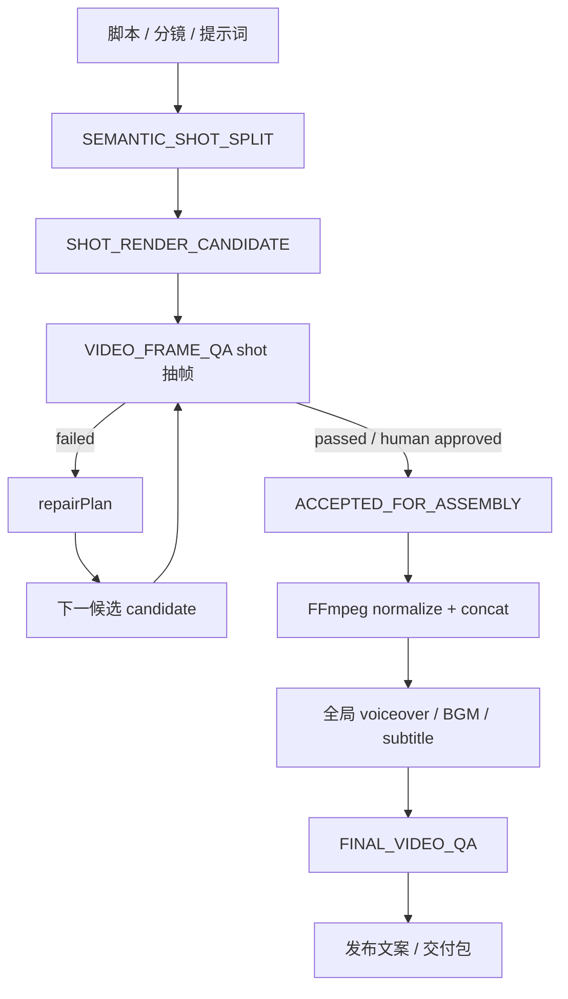

# 视频抽帧 QA Wiki

本文说明 v0.2.0 的 shot 级视频 QA 和 final assembly QA 链路。它的目标不是替代人工审片，而是在交付前把明显的文字遮挡、底部字幕拥挤、画面复杂度、剧本匹配、素材 provenance 和 shot 规格风险提前暴露出来，并把每个 shot candidate 的问题量化成可用于保守返修的机器可读结论。

## 流程位置

视频创作 DAG 中，QA 分为 shot candidate QA 和 final video QA：



`visual_qa` 是系统自动补入的节点。用户不需要在提示词里要求 QA，只要走动态视频创作链路，render 成功后就会进入抽帧检查。

云端和 runner 仍通过 `VIDEO_FRAME_QA` 这个稳定本地命令调度，但实际 QA 能力已经拆成标准 MCP 服务：

```text
local runner VIDEO_FRAME_QA
  -> stdio MCP provider: mcp/video_qa/server.py
  -> MCP tool: video_qa.analyze_video
```

Go executor 只负责路径校验、`local://` 解析和 MCP 调用。抽帧、contact sheet、shot-level QA、`ShotQAReport` 和 `SHOT_REPAIR_PLAN` 都由 Python MCP server 生成。后续 OCR、ASR、PyIQA、VLM judge 等重媒体能力应继续加在 `mcp/video_qa/`，不要回到 Go 本地工具里直接堆实现。

## Shot Split Policy

系统的 shot split policy 是 closed beta 的硬约束：

| 字段 | 值 |
|---|---|
| `minShotDurationSec` | `3` |
| `maxShotDurationSec` | `15` |
| `preferredShotDurationSec` | `6-8` |
| `splitByScriptSemantics` | `true` |
| `splitByVisualChange` | `true` |

一个 shot 应尽量对应一个相对完整画面单元：同一场景、同一主体、同一动作、同一镜头意图、同一或相近景别、同一情绪节奏、同一段旁白/对白含义。切分优先参考剧情节点、场景变化、人物切换、动作目标变化、景别变化、视角/焦段变化、时间跳转、情绪明显变化、信息点切换和画面内容大幅变化。超过 15 秒必须继续拆分；短于 3 秒只在剧情和画面连续且合并后不超过 15 秒时合并。

## 产物

本地工具 `VIDEO_FRAME_QA` 会写入：

| 产物 | 路径 | 用途 |
|---|---|---|
| JSON 报告 | `local://projects/<projectId>/reports/video_frame_qa/video_frame_qa.json` | 结构化分数、问题、抽帧指标 |
| Shot QA 报告 | `local://projects/<projectId>/reports/video_frame_qa/shot_qa_reports.json` | 每个 shot 的 `ShotQAReport`、fatal gate、分项分数和工具级修复计划 |
| Shot 返修计划 | `local://projects/<projectId>/reports/video_frame_qa/shot_repair_plan.json` | 聚合后的 shot 决策和 repair action 映射 |
| Shot 列表 | `local://projects/<projectId>/reports/video_frame_qa/shot_list.json` | 当前项目 shot 单元，含 duration、narration、scene、subject、action、camera 等 |
| Shot 切分报告 | `local://projects/<projectId>/reports/video_frame_qa/shot_split_report.json` | 切分 policy、语义/画面切分原因、forced split/merge 记录 |
| Shot 时长校验 | `local://projects/<projectId>/reports/video_frame_qa/shot_duration_validation.json` | 每个 shot 的 3-15 秒校验结果 |
| Shot candidates | `local://projects/<projectId>/reports/video_frame_qa/shot_candidates.json` | 每个 candidate 的 `attemptIndex`、状态、artifact refs 和独立 QA report |
| Accepted shots | `local://projects/<projectId>/reports/video_frame_qa/accepted_shots.json` | final assembly 可以消费的 accepted candidate 列表 |
| Assembly plan | `local://projects/<projectId>/reports/video_frame_qa/assembly_plan.json` | normalize、concat、global audio/subtitle、final QA/export 计划 |
| Subtitle timeline | `local://projects/<projectId>/reports/video_frame_qa/subtitle_timeline.json` | 使用最终全局时间轴的字幕 cue |
| Audio mix plan | `local://projects/<projectId>/reports/video_frame_qa/audio_mix_plan.json` | 全局 voiceover 对齐、BGM ducking、响度目标 |
| Final QA report | `local://projects/<projectId>/reports/video_frame_qa/final_qa_report.json` | final video 的 QA 结果，失败时阻断 export/publish |
| Provenance summary | `local://projects/<projectId>/reports/video_frame_qa/provenance_summary.json` | raw/repaired/accepted/normalized/concat/final artifact 统计和 source type |
| Contact sheet | `local://projects/<projectId>/reports/video_frame_qa/contact_sheet.jpg` | 人工快速浏览所有采样帧 |
| 单帧图片 | `local://projects/<projectId>/reports/video_frame_qa/frames/frame_*.png` | 定位具体问题帧 |

contact sheet 会根据抽帧数量动态选择 tile，例如 8 张抽帧使用 `4x2`，避免固定 `4x4` 产生大块空黑区域。

## Shot 级量化输出

每个抽帧都会根据 `shotList` 映射回对应 shot。报告中的 `shotSummaries` 会为每个 shot 输出：

| 字段 | 说明 |
|---|---|
| `frameCount` | 当前 shot 被采样到的帧数 |
| `sampledTimesSec` | 当前 shot 的采样时间点 |
| `metricSummary` | 左上文字区、底部三分之一区域、全帧复杂度的平均值和最大值 |
| `blockingIssueCount` / `warningIssueCount` | 阻断问题和警告数量 |
| `score` | 当前 shot 的 0-100 分质量分 |
| `passed` | 当前 shot 是否通过 |
| `needsRegeneration` | 是否建议返修后重生成该 shot |
| `decision` | 标准化 shot 级决策，例如 `PASS`、`PASS_WITH_FIX`、`RERENDER_HTML`、`RECOMPOSITE`、`REVISE_SHOT_SPEC` |
| `repairAction` | 推荐工具动作，供 agent 决定重渲染 HTML、重合成、修订 shot spec 或人工复看 |
| `fatalGateTriggered` | 是否触发一票否决门禁 |
| `conclusion` | 给审核者看的明确结论 |
| `recommendations` | 可执行修复建议，例如减少左上叠字、压缩底部字幕、降低背景复杂度 |

`shotReports` 是更完整的机器可消费结构，包含：

| 字段 | 说明 |
|---|---|
| `schemaVersion` | 当前为 `1` |
| `mode` | `talking_head`、`cinematic` 或 `hybrid` |
| `overallScore` | 当前 shot 的综合分 |
| `decision` | `PASS`、`PASS_WITH_FIX`、`REGEN_AIGC`、`REGEN_AIGC_WITH_REFERENCE`、`RERENDER_HTML`、`RECOMPOSITE`、`REGENERATE_TTS`、`RERENDER_SUBTITLE`、`REVISE_SHOT_SPEC`、`HUMAN_REVIEW` 等 |
| `scores` | `mediaSpec`、`textLayout`、`imageQuality`、`temporalStability`、`promptAlignment`、`continuity` 等分项分数 |
| `hardMetrics` | 从抽帧和 spec lint 得到的硬指标，例如文字安全区密度、底部区域密度、时长、画面文字长度 |
| `issues` | 带证据和修复建议的问题列表 |
| `repairPlan` | 工具级修复计划，包含 `schemaVersion`、`action`、`reason`、`severity`、`targetShotId`、`sourceCandidateId`、`attemptIndex`、`preserve`、`lockedDimensions`、`repairTargets`、`promptPatch`、`renderStrategyPatch`、`nextToolCall` |
| `artifactRefs` | 当前 shot 相关素材引用，含 fallback / AIGC provenance 时用于反向指导重生成 |
| `timestamps` | QA 采样时间点和报告生成时间 |
| `shotSpecLint` | 生成前规格检查结果，用来发现过长 shot、精确文字、长画面文本和 continuity reference 需求 |
| `scriptAlignment` | 剧本、画面描述、拍摄理由和参考资产覆盖是否完整 |

生成前 `shotSpecLints` 先检查不需要视频文件的风险：

- `durationSec` 不在 3-15 秒范围内：建议 `REVISE_SHOT_SPEC`。
- `screenText` 过长：建议压缩文字并使用 HTML overlay。
- `mustBeExact=true`：强制 `RERENDER_HTML` / HyperFrames overlay，禁止 AIGC 内生关键文字。
- `mustMatchPrevious=true`：要求前一 shot 的 reference image 或 end state。
- `directorReason` / `whyThisShot` 缺失：建议补充拍摄理由，否则影视 shot 不能解释画面意义。
- `referenceAssetIds` 为空：建议回到参考资产阶段补充角色、场景或道具锚点。
- `actionBeats` 不足：建议补充 shot 内动作节奏，避免 AIGC 画面只有静态描述。

## Shot 分层素材计划

视频生成资料阶段会为每个 Shot 输出 `shot_visual_layers_v1` 三层画面计划，避免“画面说明”和“视频素材提示词”重复，也避免所有 HyperFrames 画面变成类似 PPT 的单一风格。AIGC 本次不执行时，设计仍必须保留：

| 字段 | 用途 |
|---|---|
| `visualLayers` | 统一声明三层设计、执行状态、时间窗、安全区、层级和合成策略，作为 QA 按层定位问题的入口。 |
| `ipArollPlan` | 正式 3D IP A-roll 层。负责口型、眼神、表情、动作、角色/声音一致性和主体安全区。 |
| `aigcPlan` | 面向外部图片/视频生成工具的 AIGC 层。只生成背景、角色/道具运动、氛围或局部动态视频；必须给标题、字幕、流程标签和 UI 文案留出文字安全区；必须声明不要生成文字、Logo、水印或可读汉字，避免乱码。 |
| `hyperframesPlan` | 本地 HyperFrames / HyperKeyframes 层。负责精确中文标题、字幕、关键帧、图形强调、UI 卡片和流程标签，像可控演示层一样承载文字信息。 |
| `ffmpegFusionPlan` | 合成层。统一分辨率、fps、像素格式和时长，把 IP A-roll、AIGC 背景/B-roll/局部视频与 HyperFrames 文字/图形层裁剪、叠加、遮盖和融合成完整 Shot。 |

QA 和 repair plan 会按层处理问题：IP 口型、眼神、穿插和角色一致性问题只返修 A-roll；文字乱码、字幕/标题安全区和排版问题优先 `RERENDER_HTML` 或 `RECOMPOSITE`；AIGC 只在背景/B-roll、主体动作、场景、氛围或时序失败时才小幅 patch prompt 或重生。已经通过的层必须锁定，不应因为一个文字问题粗暴重写整个 Shot。

影视模式会额外输出硬指标：

| 指标 | 说明 |
|---|---|
| `scriptTextChars` | 当前 shot 对应剧本文字长度 |
| `visualTextChars` | 当前 shot 画面描述长度 |
| `scriptVisualCompletenessScore` | 剧本和画面信息完整度，0-100 |
| `directorReasoningPresent` | 是否存在拍摄理由 |
| `referenceCoverageCount` | 绑定的角色、场景、道具参考资产数量 |
| `actionBeatCount` | shot 内动作节拍数量 |

## Candidate QA 和 Repair Loop

Shot candidate 不会被覆盖。每次修复或重生都会生成新的 candidate，并记录独立 `attemptIndex` 与 QA report：

```text
PLANNED
  -> GENERATING
  -> CANDIDATE_RENDERED
  -> SHOT_QA_RUNNING
  -> SHOT_QA_PASSED / SHOT_QA_FAILED / HUMAN_REVIEW_REQUIRED
  -> ACCEPTED_FOR_ASSEMBLY
```

失败时进入有限循环：

```text
SHOT_QA_FAILED
  -> CREATE_REPAIR_PLAN
  -> APPLY_REPAIR_PLAN
  -> RENDER_NEXT_CANDIDATE
  -> SHOT_QA_AGAIN
```

默认策略：

| 字段 | 值 |
|---|---|
| `maxRepairAttemptsPerShot` | `3` |
| `maxAigcRegenerationAttemptsPerShot` | `2` |
| `preferLocalRepairBeforeAigcRegen` | `true` |
| `preservePassedDimensions` | `true` |

如果 `prompt_alignment`、`character_identity`、`scene`、`action`、`text_intent`、`duration` 或 `style` 已通过，repair plan 会把这些维度写入 `lockedDimensions`，只修复失败项。字幕、文字安全区和排版问题优先 `RERENDER_HTML` / `RECOMPOSITE`；final subtitle、BGM、voiceover、音量和响度问题延期到 final assembly；轻微画面问题只做小幅 `promptPatch`；严重人物崩坏、主体错误、动作失败或时序跳变才使用 `REGEN_AIGC` / `REGEN_AIGC_WITH_REFERENCE`；reference 缺失、provider 不可用、额度不足或多次失败进入 `HUMAN_REVIEW`。

顶层 `repairPlan` 会把所有 shot 聚合成下一步动作：

- `approve`：所有 shot 通过，可以继续发布。
- `manual_review`：没有阻断问题，但部分 shot 有警告，需要人工复看。
- `regenerate_shots`：存在阻断问题，应先重生成指定 shot。

同时 `repairPlan` 会输出 `decisionByShot`、`repairActionByShot` 和 `repairActionCounts`，供后续 agent 做更细的自动返工，而不是只按整片总分判断。

Closed beta 当前确定性映射：

| 触发 | `decision` | `repairPlan.action` |
|---|---|---|
| 文字安全区、字幕或 UI 叠字 | `RERENDER_HTML` | `RERENDER_HTML` |
| fallback storyboard / preview 不能满足真实 AIGC 素材要求 | `REGEN_AIGC` | `REGEN_AIGC` |
| AIGC shot 缺少参考资产 | `REGEN_AIGC_WITH_REFERENCE` | `REGEN_AIGC_WITH_REFERENCE` |
| provider prompt 泄漏 `ffmpeg`、`AIGC_VIDEO`、`artifact` 等内部术语 | `REVISE_SHOT_SPEC` | `PROMPT_PATCH_REGEN` |
| 画面复杂度、叠层或合成风险 | `RECOMPOSITE` | `RECOMPOSITE`，并带 `toolAction=FFMPEG_RECOMPOSITE` |
| 严重渲染失败或指标不足以自动判断 | `HUMAN_REVIEW` | `HUMAN_REVIEW` |

## Final Assembly QA

Final assembly 只能消费 accepted shot candidate。进入拼接前，每个 accepted shot 必须满足：

- `durationSec` 在 3-15 秒内。
- `acceptedCandidateId` 指向存在的 candidate。
- candidate QA 为 passed，或已人工批准。
- candidate 不是失败 candidate。

Final assembly 的标准步骤是：

```text
ALL_SHOTS_ACCEPTED_GATE
  -> NORMALIZE_ACCEPTED_SHOTS
  -> FFMPEG_CONCAT
  -> GLOBAL_VOICEOVER_ALIGN
  -> GLOBAL_BGM_MIX_AND_DUCKING
  -> GLOBAL_SUBTITLE_RENDER
  -> FINAL_VIDEO_QA
  -> EXPORT / PUBLISH
```

FFmpeg concat 前先统一 resolution、fps、pixel format 和 codec。Voiceover、BGM、ducking、响度、最终字幕和最终转码在全局时间轴统一处理，不在每个 shot 内分别混最终 BGM 或烧录最终字幕。final QA failed 时，系统不能 export/publish。

## Artifact Provenance

诊断和前端都必须能区分 artifact 来源：

| Source type | 说明 |
|---|---|
| `aigc_video` | 真实 AIGC 视频输出 |
| `aigc_image` | 真实 AIGC 图片输出 |
| `hyperframes` | HyperFrames 预览或合成 |
| `ffmpeg_composite` | FFmpeg 合成/拼接/转码产物 |
| `uploaded` | 用户上传素材 |
| `fallback_preview` | 本地 fallback 预览，不是真实 AIGC |
| `fallback_storyboard` | 本地 fallback storyboard，不是真实 AIGC |

artifact manifest 会追踪 raw shot candidate、repaired shot candidate、accepted shot、normalized shot clip、concat video、final audio mix、final subtitle track 和 final video。`fallback_preview` 与 `fallback_storyboard` 不能计入真实 AIGC 成果。

## 检查维度

当前 QA 是确定性本地 MCP 检查，不依赖云端视觉模型：

| 维度 | 目的 | 典型问题 |
|---|---|---|
| 左上文字安全区 | 防止品牌、镜头编号、网页原始文字互相挤压 | logo 和标题叠在一起 |
| 底部三分之一区域 | 防止主标题、字幕、原片字幕重复覆盖 | 口播字幕压住按钮或页面文字 |
| 全帧复杂度 | 发现过度复杂的伪 UI、背景、密集文字 | 短视频用户一眼看不清主体 |

阻断问题会让 `passed=false`，并阻断发布文案节点。警告问题允许继续，但应该人工复看。

## 人工审查建议

QA 审核门中优先看三件事：

1. 首帧是否一眼能看懂项目卖点。
2. 每个 shot 的主标题是否和背景、字幕分离。
3. contact sheet 中是否存在转场期间的文字重影、过暗或过乱画面。

如果发现问题，应该回到脚本、分镜或模板层压缩文字，而不是只调低 QA 阈值。

## 本次验证记录

v0.1.5 已用 release 分支当前代码完整生成一条 18 秒、16:9 的正能量搞笑影视宣传短片：

- project: `vp-b1a3a300`
- run: `agent_run_5ff5fbfe-7a61-4250-a103-17a5077a3882`
- task: `20260704050335-c8c8c8c8`
- output: `final.mp4`
- video: `1920x1080`，`18.000000` 秒
- QA: `passed=true`，`score=100`，`shotCount=4`，`frameCount=5`，`blockingIssueCount=0`，`warningIssueCount=0`
- 每个 shot 的 `scriptVisualCompletenessScore=100`，`directorReasoningPresent=true`，`referenceCoverageCount=4`，`actionBeatCount=3`

这条链路覆盖故事大纲、详细剧本、角色/场景/道具档案、参考图 MCP、AIGC shot MCP、预览、渲染、抽帧 QA 和发布文案审核。

v0.1.3 已用系统完整生成一条 30 秒、16:9 的“视频 Agent”开源上线宣传视频：

- project: `vp-f894df0c`
- run: `agent_run_d3bcf6fb-46d7-46d6-bd0d-7e1821fc61d7`
- task: `20260703200752-f8f8f8f8`
- output: `final.mp4`
- duration: `30.000000` 秒
- QA: `passed=true`，`score=100`，`shotCount=6`，`frameCount=8`，`repairPlan.nextAction=approve`

这条链路覆盖了脚本审核、提示词审核、预览审核、渲染前审核、成片抽帧 QA 审核和发布文案审核。

## 验证命令

```bash
python3 mcp/video_qa/test_server.py
python3 -m py_compile mcp/video_qa/server.py

cd local-backend
RUN_PYTHON_MCP_INTEGRATION=1 go test ./internal/localmcp -run TestClientListsToolsFromVideoQAPythonMCPServer -count=1
RUN_VIDEO_QA_MCP_E2E=1 go test ./internal/localtool -run TestVideoFrameQAExecutorRunsDefaultVideoQAMCPServer -count=1
go test ./internal/localtool ./internal/localagent ./internal/localrunner -count=1
```
