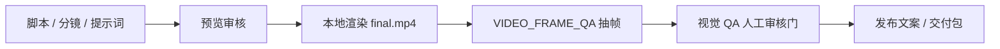

# 视频抽帧 QA Wiki

本文说明 v0.1.3 的成片视觉 QA 链路。它的目标不是替代人工审片，而是在交付前把明显的文字遮挡、底部字幕拥挤和画面复杂度风险提前暴露出来，并把每个 shot 的问题量化成可用于返修的结论。

## 流程位置

视频创作 DAG 中，QA 位于本地渲染之后、发布文案之前：

`visual_qa` 是系统自动补入的节点。用户不需要在提示词里要求 QA，只要走动态视频创作链路，render 成功后就会进入抽帧检查。

## 产物

本地工具 `VIDEO_FRAME_QA` 会写入：

| 产物 | 路径 | 用途 |
|---|---|---|
| JSON 报告 | `local://projects/<projectId>/reports/video_frame_qa/video_frame_qa.json` | 结构化分数、问题、抽帧指标 |
| Contact sheet | `local://projects/<projectId>/reports/video_frame_qa/contact_sheet.jpg` | 人工快速浏览所有采样帧 |
| 单帧图片 | `local://projects/<projectId>/reports/video_frame_qa/frames/frame_*.png` | 定位具体问题帧 |

contact sheet 会根据抽帧数量动态选择 tile，例如 8 张抽帧使用 `4x2`，避免固定 `4x4` 产生大块空黑区域。

## Shot 级量化输出

每个抽帧都会根据 `shotList` 映射回对应 shot。报告中的 `shotSummaries` 会为每个 shot 输出：

| 字段 | 说明 |
|---|---|
| `frameCount` | 当前 shot 被采样到的帧数 |
| `sampledTimesSec` | 当前 shot 的采样时间点 |
| `metricSummary` | 左上文字区、底部三分之一区域、全帧复杂度的平均值和最大值 |
| `blockingIssueCount` / `warningIssueCount` | 阻断问题和警告数量 |
| `score` | 当前 shot 的 0-100 分质量分 |
| `passed` | 当前 shot 是否通过 |
| `needsRegeneration` | 是否建议返修后重生成该 shot |
| `conclusion` | 给审核者看的明确结论 |
| `recommendations` | 可执行修复建议，例如减少左上叠字、压缩底部字幕、降低背景复杂度 |

顶层 `repairPlan` 会把所有 shot 聚合成下一步动作：

- `approve`：所有 shot 通过，可以继续发布。
- `manual_review`：没有阻断问题，但部分 shot 有警告，需要人工复看。
- `regenerate_shots`：存在阻断问题，应先重生成指定 shot。

## 检查维度

当前 QA 是确定性本地检查，不依赖云端视觉模型：

| 维度 | 目的 | 典型问题 |
|---|---|---|
| 左上文字安全区 | 防止品牌、镜头编号、网页原始文字互相挤压 | logo 和标题叠在一起 |
| 底部三分之一区域 | 防止主标题、字幕、原片字幕重复覆盖 | 口播字幕压住按钮或页面文字 |
| 全帧复杂度 | 发现过度复杂的伪 UI、背景、密集文字 | 短视频用户一眼看不清主体 |

阻断问题会让 `passed=false`，并阻断发布文案节点。警告问题允许继续，但应该人工复看。

## 人工审查建议

QA 审核门中优先看三件事：

1. 首帧是否一眼能看懂项目卖点。
2. 每个 shot 的主标题是否和背景、字幕分离。
3. contact sheet 中是否存在转场期间的文字重影、过暗或过乱画面。

如果发现问题，应该回到脚本、分镜或模板层压缩文字，而不是只调低 QA 阈值。

## 本次验证记录

v0.1.3 已用系统完整生成一条 30 秒、16:9 的“视频 Agent”开源上线宣传视频：

- project: `vp-f894df0c`
- run: `agent_run_d3bcf6fb-46d7-46d6-bd0d-7e1821fc61d7`
- task: `20260703200752-f8f8f8f8`
- output: `final.mp4`
- duration: `30.000000` 秒
- QA: `passed=true`，`score=100`，`shotCount=6`，`frameCount=8`，`repairPlan.nextAction=approve`

这条链路覆盖了脚本审核、提示词审核、预览审核、渲染前审核、成片抽帧 QA 审核和发布文案审核。
