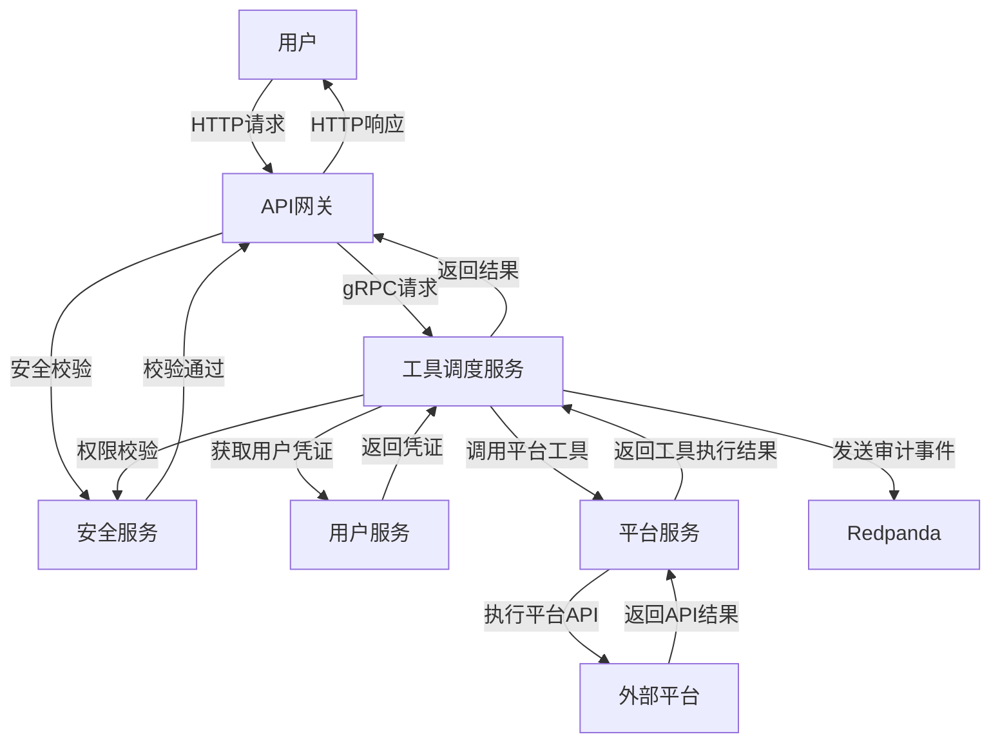
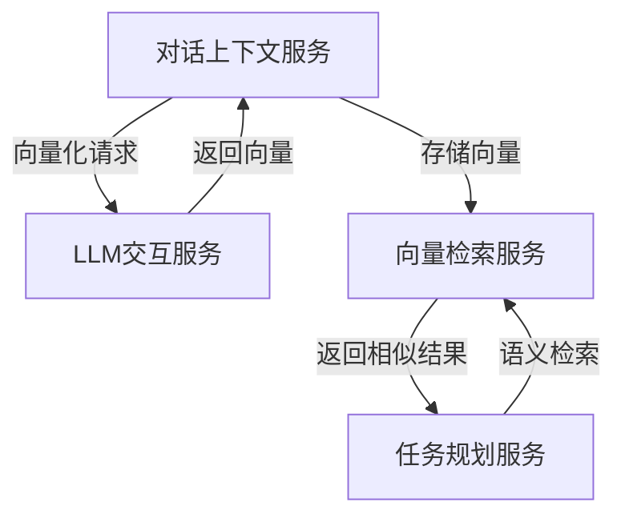

# 系统模块交互流程与协议

## 一、整体交互架构

系统采用分层微服务架构，层与层之间通过gRPC（内部同步调用）+ Redpanda（异步解耦）通信，无跨层强依赖。

## 二、核心调用链路

### 1. 对话交互流程

```mermaid
flowchart TD
    A[用户] -->|HTTP请求| B[API网关]
    B -->|安全校验| C[安全服务]
    C -->|校验通过| B
    B -->|gRPC请求| D[任务规划服务]
    D -->|获取对话历史| E[对话上下文管理服务]
    E -->|返回历史消息| D
    D -->|调用LLM| F[LLM交互服务]
    F -->|返回LLM结果| D
    D -->|需要工具调用| G[工具调度服务]
    G -->|获取工具定义| H[平台服务]
    H -->|返回工具列表| G
    G -->|调用工具| H
    H -->|返回工具执行结果| G
    G -->|返回结果| D
    D -->|更新对话历史| E
    D -->|发送审计事件| I[Redpanda]
    D -->|返回最终结果| B
    B -->|HTTP响应| A
```



### 2. 工具调用流程



### 3. 向量检索流程



## 三、事件驱动闭环

系统通过Redpanda实现事件驱动的异步解耦，主要事件类型包括：

### 1. 审计事件

- **生产者**：工具调度服务、用户服务、平台服务
- **消费者**：审计日志服务
- **Topic**：`audit-log-events`
- **事件结构**：
  ```json
  {
    "event_id": "uuid",
    "event_type": "tool_call",
    "user_id": "user123",
    "operation_type": "search_product",
    "operation_params": {"keyword": "手机"},
    "timestamp": 1620000000000,
    "success": true,
    "error_msg": ""
  }
  ```

### 2. 实时数据事件

- **生产者**：所有模块
- **消费者**：实时数据处理管道
- **Topic**：`realtime-events`
- **事件结构**：
  ```json
  {
    "event_id": "uuid",
    "event_type": "llm_call",
    "service_name": "llm_service",
    "metrics": {
      "latency_ms": 1500,
      "token_count": 1000
    },
    "timestamp": 1620000000000
  }
  ```

### 3. 告警事件

- **生产者**：实时数据处理管道
- **消费者**：监控系统
- **Topic**：`alert-events`
- **事件结构**：
  ```json
  {
    "alert_id": "uuid",
    "alert_type": "high_latency",
    "service_name": "llm_service",
    "threshold": 1000,
    "value": 1500,
    "timestamp": 1620000000000
  }
  ```

## 四、横切能力集成

### 1. 安全管控集成

- **调用方式**：所有跨模块请求必须经过安全服务的校验
- **集成点**：
  - API网关：请求入口处进行身份校验
  - 服务间调用：通过gRPC拦截器自动注入安全校验
  - 敏感操作：在执行前进行二次确认

### 2. 可观测性集成

- **调用方式**：所有模块通过OpenTelemetry SDK自动上报
- **集成点**：
  - 全链路Trace：每个请求生成唯一Trace ID，贯穿全流程
  - 指标监控：每个模块自动上报核心指标
  - 日志采集：统一日志格式，包含Trace ID

### 3. 配置中心集成

- **调用方式**：模块启动时从配置中心拉取配置
- **集成点**：
  - 环境配置：不同环境的配置隔离
  - 动态配置：支持运行时配置更新
  - 配置版本管理：配置变更历史记录

## 五、模块间通信协议

### 1. gRPC协议

- **使用场景**：所有内部同步调用
- **特点**：
  - 高性能：基于HTTP/2，支持双向流
  - 强类型：使用Protobuf定义接口，类型安全
  - 服务发现：通过服务注册中心实现
  - 负载均衡：支持多种负载均衡策略

### 2. Redpanda协议

- **使用场景**：所有异步事件传递
- **特点**：
  - 高吞吐：支持百万级消息/秒
  - 低延迟：毫秒级消息传递
  - 持久化：消息持久化存储
  - 分区容错：支持多副本

### 3. HTTP/REST协议

- **使用场景**：对外接口
- **特点**：
  - 标准协议：广泛支持
  - 简单易用：易于集成
  - 跨语言：支持多种客户端

## 六、数据传输格式

### 1. 结构化数据

- **格式**：Protobuf（内部）、JSON（外部）
- **特点**：
  - 序列化效率高
  - 类型安全
  - 向后兼容

### 2. 向量数据

- **格式**：Float32数组
- **特点**：
  - 高效存储
  - 快速计算相似度

### 3. 事件数据

- **格式**：JSON
- **特点**：
  - 灵活可扩展
  - 易于解析
  - 人类可读

## 七、错误处理机制

### 1. 同步调用错误处理

- **返回方式**：gRPC状态码 + 错误信息
- **错误码定义**：
  - 1000-1999：系统错误
  - 2000-2999：业务错误
  - 3000-3999：权限错误
  - 4000-4999：参数错误

### 2. 异步事件错误处理

- **处理方式**：死信队列 + 重试机制
- **重试策略**：指数退避
- **死信队列**：存储无法处理的事件

## 八、服务发现与负载均衡

### 1. 服务发现

- **实现方式**：基于Consul或Etcd
- **注册方式**：服务启动时自动注册
- **发现方式**：客户端通过服务名查询

### 2. 负载均衡

- **实现方式**：gRPC内置负载均衡
- **策略**：轮询、随机、权重
- **健康检查**：定期检查服务健康状态

## 九、安全通信

### 1. 传输加密

- **实现方式**：TLS 1.3
- **证书管理**：统一证书服务
- **密钥轮换**：定期自动轮换密钥

### 2. 身份认证

- **实现方式**：JWT + 服务间Token
- **Token管理**：统一Token服务
- **过期策略**：短期Token + 刷新机制

### 3. 权限控制

- **实现方式**：基于RBAC的权限模型
- **权限粒度**：服务级、接口级、操作级
- **权限审计**：所有权限操作记录审计日志

## 十、监控与告警

### 1. 监控指标

- **服务指标**：QPS、成功率、延迟、错误率
- **系统指标**：CPU、内存、磁盘、网络
- **业务指标**：工具调用次数、LLM Token消耗、用户活跃度

### 2. 告警策略

- **阈值告警**：基于预设阈值
- **趋势告警**：基于指标趋势
- **异常检测**：基于机器学习的异常检测

### 3. 告警通道

- **通知方式**：邮件、短信、企业微信、Slack
- **告警级别**：Info、Warning、Error、Critical
- **告警聚合**：相似告警自动聚合，减少告警风暴
