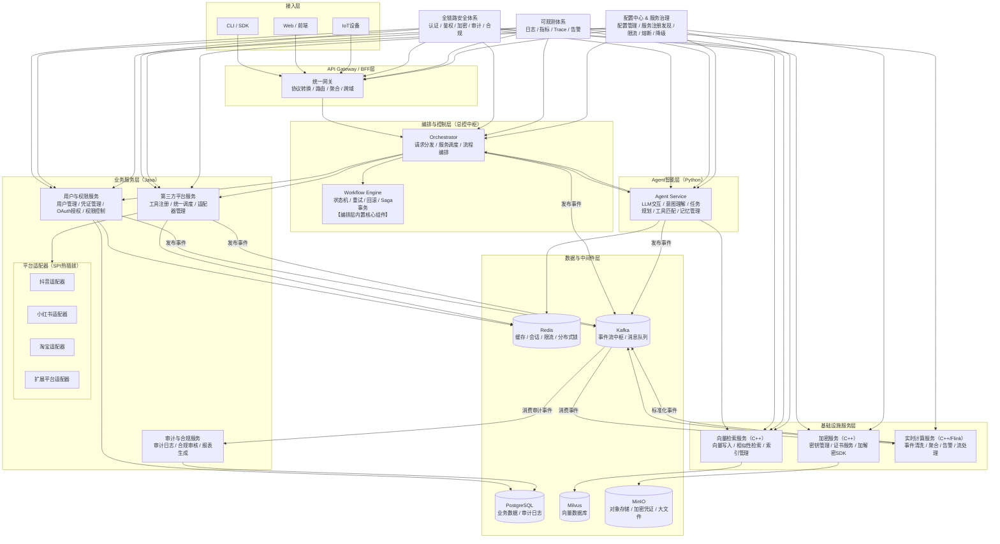

# lingxi-ai-operation-system

本架构完全围绕你的核心需求设计：**以LLM为调度核心，封装抖音/淘宝/小红书等平台API，Python/Java/C++多语言协同，支持多人并行开发、模块解耦、可快速联调、可长期演进**。

***

## 一、架构顶层设计原则（所有设计的核心准则，解耦&协作的前提）

所有模块设计严格遵循以下6条铁律，从根源上避免耦合、解决多人协作冲突、保证联调顺畅：

1. **契约优先**：所有跨模块接口**先定义Protobuf IDL契约，再写业务代码**，契约是模块间唯一的沟通标准，任何人不得私自修改接口，变更必须走评审流程。
2. **单向依赖**：严格分层，上层只能依赖下层，下层绝对不能反向依赖上层；同层模块间只能通过接口调用，禁止直接访问内部实现、禁止直接操作对方的数据库。
3. **职责单一**：每个模块只做一件事，只有一个变更理由。比如「LLM交互模块」只负责和大模型通信，绝对不能混入任务规划逻辑；「淘宝对接模块」只负责淘宝API封装，绝对不能混入小红书的逻辑。
4. **接口隔离**：每个模块只暴露必须的最小接口，隐藏所有内部实现细节。外部模块只能通过gRPC/REST接口调用，不能直接依赖模块的内部代码、不能直连对方的数据库。
5. **可测试可观测**：每个模块必须支持独立单元测试（可mock所有外部依赖），必须接入统一的可观测体系（Trace/Metrics/Logs），出问题可快速定位到模块、甚至代码行。
6. **开闭原则**：对扩展开放，对修改关闭。新增功能（比如新增拼多多平台对接）只能新增模块，不能修改现有核心模块的代码，避免影响已稳定的功能。

***

## 二、整体架构全景与分层边界

整体采用**分层微服务架构**，分为5层核心业务层 + 2个全链路横切模块，层与层之间通过gRPC（内部同步调用）+ Kafka（异步解耦）通信，无跨层强依赖。

***

## 三、各模块详细拆解（含定位、功能、输入输出、上下游依赖）

### 【横切模块】全链路安全管控体系

**模块定位**：整个系统的安全防线，所有跨模块请求必须经过该模块校验，避免每个模块重复开发安全逻辑，从根源上杜绝安全漏洞。
**语言&技术选型**：Java（核心服务）+ C++（底层加密算子）+ 各语言拦截器/SDK
**核心功能**：

1. 统一身份认证：用户Token校验、服务间调用鉴权
2. 分级权限管控：普通操作/敏感操作/高危操作的权限校验
3. 敏感操作二次确认：支付、下单、内容发布等操作的拦截与确认
4. 全链路数据加密：用户凭证、敏感数据的加解密（底层调用C++加密算子库）
5. 恶意指令拦截：违规、违法、恶意请求的实时拦截
6. 接口访问限流：针对用户、服务的流量限流与熔断
   **核心输入输出**：
   \| 核心接口 | 输入 | 输出 |
   \|----------|------|------|
   \| 身份校验接口 | `AuthCheckRequest(user_id, token, service_name, api_name)` | `AuthCheckResponse(pass, error_msg, user_permission)` |
   \| 敏感操作校验接口 | `SensitiveCheckRequest(user_id, operation_type, operation_params)` | `SensitiveCheckResponse(need_confirm, pass, error_msg)` |
   \| 加解密接口 | `CryptoRequest(plaintext/ciphertext, crypto_type)` | `CryptoResponse(result, success, error_msg)` |
   **上下游依赖**：无强业务依赖，被所有上层模块依赖，底层依赖C++加密算子库、Redis（限流）、用户中心服务。

***

### 【横切模块】统一可观测&配置中心

**模块定位**：全系统的「监控大脑」和「配置中枢」，解决多人开发时的问题定位、环境配置统一问题。
**语言&技术选型**：Java（配置中心服务）+ OpenTelemetry（全链路埋点）+ Prometheus + Grafana + Jaeger
**核心功能**：

1. 全链路追踪：所有请求带唯一Trace ID，贯穿从用户输入到结果返回的全流程，可定位每个模块的耗时、异常
2. 指标监控：每个模块的核心指标（请求量、成功率、延迟、错误率）统一采集、可视化告警
3. 统一配置管理：所有环境配置（LLM API Key、平台AK/SK、服务地址）统一管理，分环境下发，避免本地配置混乱
4. 全链路日志采集：所有模块的日志统一格式、统一存储，可通过Trace ID一键查询全链路日志
   **核心输入输出**：

- 配置中心接口：输入`ConfigGetRequest(key, env, service_name)`，输出`ConfigGetResponse(value, success, error_msg)`
- 埋点SDK：各语言集成OpenTelemetry SDK，自动上报Trace/Metrics/Logs，无额外业务代码侵入
  **上下游依赖**：无强业务依赖，被所有模块集成，底层依赖Prometheus、Jaeger、PostgreSQL（配置存储）。

***

### 【L1 接入层】

#### 1. Python CLI客户端

**模块定位**：用户与系统交互的核心入口，Demo阶段的核心交互端，轻量、可快速迭代。
**语言&技术选型**：Python + Typer + gRPC Python SDK + ASR/TTS SDK
**核心功能**：

1. 命令行交互：接收用户文本/语音输入，展示系统返回结果
2. 会话管理：维护用户会话ID，支持多轮对话
3. 敏感操作确认：拦截敏感操作，在终端弹出二次确认
4. 流式输出：支持LLM结果的流式打印、实时语音播报
   **核心输入输出**：

- 终端输入：用户的自然语言文本/语音指令
- 内部输入：Java API网关返回的`ChatResponse`、`ToolCallResponse`
- 内部输出：向Java API网关发送的`ChatRequest(user_id, conversation_id, user_input, stream)`
- 终端输出：格式化的自然语言结果、操作进度、错误提示
  **上下游依赖**：仅依赖Java REST API网关（gRPC接口），不直接调用任何核心业务/智能模块。

#### 2. Java REST API网关

**模块定位**：整个系统的唯一入口，「内外隔离的大门」，对内封装所有gRPC服务，对外暴露统一的REST API，同时做路由、鉴权、限流、协议转换。
**语言&技术选型**：Java + Spring Cloud Gateway + Spring Security + gRPC Java SDK
**核心功能**：

1. 协议转换：对外REST API，对内自动转发为gRPC请求，适配前端/CLI/第三方调用
2. 统一路由：将用户请求转发到对应的核心服务，无需客户端维护多个服务地址
3. 统一鉴权：所有请求先经过安全模块的身份校验，不合法请求直接拦截，不进入内层服务
4. 限流熔断：针对异常流量限流，针对故障服务熔断，避免雪崩
5. 跨域处理：对外前端调用的CORS跨域支持
   **核心输入输出**：
   \| 对外REST接口 | 输入（HTTP请求） | 输出（HTTP响应） | 对内转发 |
   \|--------------|-------------------|-------------------|----------|
   \| `/api/v1/chat` | `ChatRequest(user_id, conversation_id, user_input, stream)` | `ChatResponse(conversation_id, content, is_finish)` | 核心智能层LLM交互服务 |
   \| `/api/v1/tool/call` | `ToolCallRequest(user_id, tool_name, arguments)` | `ToolCallResponse(success, result, error_msg)` | 核心智能层工具调度服务 |
   \| `/api/v1/user/auth` | `UserAuthRequest(username, password)` | `UserAuthResponse(user_id, token, permission)` | 业务服务层用户中心 |
   **上下游依赖**：被接入层客户端依赖，仅向下调用核心智能层、业务服务层的gRPC接口，不实现任何业务逻辑。

***

### 【L2 核心智能层（Agent大脑）】

**整个系统的核心，Python绝对主导**，所有模块仅通过gRPC暴露接口，内部实现完全解耦，多人可并行开发。

#### 1. LLM交互服务

**模块定位**：系统与大模型的唯一交互入口，封装所有LLM调用逻辑，避免每个模块重复对接大模型API。
**语言&技术选型**：Python + LiteLLM + gRPC Python SDK
**核心功能**：

1. 多模型统一适配：封装豆包、GPT、Claude等大模型API，对外提供统一的调用接口，支持模型无缝切换
2. Prompt模板管理：统一管理系统Prompt、角色设定、工具调用Prompt，支持版本管理
3. Token计算与限流：自动计算Token消耗，控制请求频率，避免触发大模型限流
4. 流式响应支持：支持大模型流式输出，对外提供流式gRPC接口
5. 调用日志与重试：自动记录LLM调用日志，失败自动重试，异常兜底处理
   **核心输入输出**：
   \| gRPC接口 | 输入 | 输出 |
   \|----------|------|------|
   \| `ChatCompletion` | `ChatCompletionRequest(model, messages, temperature, stream, functions)` | 流式/非流式 `ChatCompletionResponse(content, tool_call, usage, finish_reason)` |
   \| `Embedding` | `EmbeddingRequest(text_list, model)` | `EmbeddingResponse(embeddings, usage)` |
   **上下游依赖**：被任务规划服务、工具调度服务依赖，仅依赖配置中心、可观测体系，不直接调用任何业务服务。

#### 2. 任务规划与编排服务

**模块定位**：Agent的「大脑中枢」，负责将用户的自然语言需求，拆解为可执行的多步任务，编排执行顺序，处理异常与分支。
**语言&技术选型**：Python + 自定义DAG编排引擎 + gRPC Python SDK
**核心功能**：

1. 用户意图识别：精准理解用户的核心需求、约束条件、执行要求
2. 任务拆解与DAG编排：将复杂需求拆解为多步可执行的子任务，定义任务间的依赖关系、执行顺序（串行/并行）
3. 任务执行调度：按编排好的DAG，依次调度工具调用服务执行子任务
4. 异常处理与重试：子任务执行失败时，自动判断是否重试、是否调整执行方案、是否需要向用户澄清需求
5. 长上下文管理：结合对话上下文管理服务，维护任务执行的全链路上下文
   **核心输入输出**：
   \| gRPC接口 | 输入 | 输出 |
   \|----------|------|------|
   \| `PlanAndExecuteTask` | `TaskPlanRequest(user_id, conversation_id, user_input, max_step)` | `TaskPlanResponse(task_id, status, final_result, error_msg)` |
   \| `GetTaskStatus` | `TaskStatusRequest(task_id)` | `TaskStatusResponse(task_id, current_step, progress, status)` |
   **上下游依赖**：被API网关依赖，向下依赖LLM交互服务、工具调度服务、对话上下文管理服务、向量检索引擎服务。

#### 3. 工具调度与参数校验服务

**模块定位**：Agent的「手脚调度器」，负责工具的发现、参数生成、调用执行、结果解析，是连接智能层与业务服务层的核心桥梁。
**语言&技术选型**：Python + gRPC Python SDK + Pydantic
**核心功能**：

1. 工具注册与发现：从第三方平台对接服务拉取所有可用工具的定义，动态更新工具列表
2. 工具匹配与参数生成：基于用户需求，匹配最优工具，通过LLM生成符合工具要求的入参，校验参数合法性
3. 工具调用执行：通过gRPC调用第三方平台对接服务的工具接口，执行具体操作
4. 工具结果解析：将工具返回的结构化结果，解析为LLM可理解的文本格式
5. 工具调用审计：将所有工具调用事件发送到Kafka，供审计日志服务消费
   **核心输入输出**：
   \| gRPC接口 | 输入 | 输出 |
   \|----------|------|------|
   \| `CallTool` | `ToolCallRequest(user_id, conversation_id, tool_name, arguments)` | `ToolCallResponse(success, result, error_msg, latency_ms)` |
   \| `ListTools` | `ListToolsRequest(platform, keyword)` | `ListToolsResponse(tools: ToolDefinition[])` |
   **上下游依赖**：被任务规划服务依赖，向下依赖第三方平台对接服务、LLM交互服务、安全管控体系。

#### 4. 对话上下文管理服务

**模块定位**：系统的「记忆中枢」，负责维护用户的对话历史、任务执行上下文、用户偏好，支持多轮对话的连贯性。
**语言&技术选型**：Python + gRPC Python SDK + Redis + PostgreSQL
**核心功能**：

1. 对话历史管理：存储、查询用户的多轮对话历史，自动截断超长上下文
2. 会话状态管理：维护用户当前的任务执行状态、会话上下文
3. 用户偏好学习：提取用户的使用习惯、偏好设置，优化后续的任务规划
4. 上下文向量化：将对话历史向量化存储，支持语义检索，提升长对话的理解能力
   **核心输入输出**：
   \| gRPC接口 | 输入 | 输出 |
   \|----------|------|------|
   \| `GetConversationHistory` | `ConversationRequest(user_id, conversation_id, max_round)` | `ConversationResponse(messages: Message[])` |
   \| `AppendConversationMessage` | `AppendMessageRequest(user_id, conversation_id, role, content)` | `AppendMessageResponse(success, error_msg)` |
   \| `GetUserPreference` | `UserPreferenceRequest(user_id)` | `UserPreferenceResponse(preference: dict)` |
   **上下游依赖**：被LLM交互服务、任务规划服务依赖，底层依赖PostgreSQL、Redis、向量检索引擎服务。

***

### 【L3 核心业务服务层】

**系统的「业务骨架」，Java绝对主导**，所有模块严格按职责拆分，平台对接子模块完全解耦，多人可并行开发不同平台的API封装。

#### 1. 用户中心与权限服务

**模块定位**：系统的「用户管理中枢」，负责所有用户相关的业务，是权限管控的核心。
**语言&技术选型**：Java + Spring Boot + Spring Security + MyBatis-Plus
**核心功能**：

1. 用户管理：用户注册、登录、信息修改、账号注销
2. 权限管理：用户角色、权限分级、资源访问控制
3. 凭证管理：用户各平台的授权凭证（淘宝/抖音Token）加密存储、生命周期管理
4. OAuth2授权：对接第三方平台的OAuth2授权流程，获取用户授权凭证
   **核心输入输出**：
   \| gRPC接口 | 输入 | 输出 |
   \|----------|------|------|
   \| `GetUserInfo` | `UserRequest(user_id)` | `UserResponse(user_id, username, permission, status)` |
   \| `GetUserCredential` | `CredentialRequest(user_id, platform)` | `CredentialResponse(encrypted_credential, expire_time)` |
   \| `SaveUserCredential` | `SaveCredentialRequest(user_id, platform, credential)` | `SaveCredentialResponse(success, error_msg)` |
   **上下游依赖**：被API网关、第三方平台对接服务依赖，底层依赖PostgreSQL、C++加密算子库、安全管控体系。

#### 2. 第三方平台对接服务（核心业务模块）

**模块定位**：系统的「手脚执行层」，封装抖音/淘宝/小红书等平台的官方API，对外提供标准化的工具接口，完全贴合你的核心需求。
**设计原则**：**平台间完全解耦**，每个平台独立子模块，实现统一的工具接口规范，新增平台无需修改现有代码，多人可并行开发不同平台。
**语言&技术选型**：Java + Spring Boot + Retrofit + 各平台官方Java SDK
**核心功能（通用）**：

1. 平台API适配：对接各平台官方开放API，处理鉴权、签名、重试、限流、错误处理
2. 工具标准化封装：将平台API封装为符合LLM Function Calling规范的标准化工具
3. 工具注册：将所有工具定义注册到工具注册中心，供工具调度服务发现
4. 接口监控：监控平台API的调用成功率、延迟、错误率，异常告警
   **子模块拆分（完全解耦）**：
   \| 子模块 | 核心封装API范围 | 核心工具列表 |
   \|--------|------------------|--------------|
   \| 抖音平台对接 | 抖音开放平台核心API | 视频搜索、视频详情查询、视频点赞、评论发布、用户信息查询、作品发布 |
   \| 小红书平台对接 | 小红书开放平台核心API | 笔记搜索、笔记详情查询、笔记收藏、评论发布、用户信息查询 |
   \| 淘宝平台对接 | 淘宝开放平台核心API | 商品搜索、商品详情查询、加入购物车、购物车查询、订单创建、物流查询 |
   **每个子模块的核心输入输出（统一规范）**：
   \| gRPC接口 | 输入 | 输出 |
   \|----------|------|------|
   \| `CallTool` | `PlatformToolCallRequest(user_id, tool_name, arguments)` | `ToolCallResponse(success, result, error_msg, latency_ms)` |
   \| `GetToolDefinitions` | `ToolDefinitionRequest()` | `ToolDefinitionResponse(tools: ToolDefinition[])` |
   **上下游依赖**：被工具调度服务依赖，向下依赖用户中心服务、C++加密算子库、安全管控体系，底层对接各平台开放API。

#### 3. 审计日志与合规服务

**模块定位**：系统的「合规中枢」，负责全链路操作的审计留痕，满足合规要求，同时解决多人开发时的问题追溯。
**语言&技术选型**：Java + Spring Boot + Kafka + MyBatis-Plus
**核心功能**：

1. 操作审计：异步消费Kafka中的工具调用、用户操作、敏感操作事件，全链路留痕，不可篡改
2. 合规审核：对用户输入、工具调用结果、发布内容进行合规审核，拦截违规内容
3. 日志查询：提供审计日志的查询接口，支持按用户、操作类型、时间范围追溯
4. 合规报表：定期生成合规报表，满足监管要求
   **核心输入输出**：

- 异步输入：Kafka Topic `audit-log-events` 中的审计事件
- 同步接口：输入`AuditLogQueryRequest(user_id, operation_type, start_time, end_time)`，输出`AuditLogQueryResponse(logs: AuditLog[])`
  **上下游依赖**：无业务依赖，通过Kafka异步接收所有模块的审计事件，底层依赖Kafka、PostgreSQL。

***

### 【L4 高性能基础设施层】

**系统的「性能心脏」，C++绝对主导**，所有模块通过「静态库+JNI/Pybind11绑定」或「gRPC服务」对外提供能力，完全解耦，不依赖上层业务。

#### 1. 向量检索引擎服务

**模块定位**：系统的「语义检索中枢」，提供高性能的向量检索能力，支撑长对话上下文、工具语义匹配、用户偏好检索。
**语言&技术选型**：C++ + Milvus C++ SDK + 自定义索引优化 + gRPC C++ SDK
**核心功能**：

1. 向量写入：支持批量写入向量数据，自动构建索引
2. 高性能向量检索：毫秒级的TopK相似向量检索，支持条件过滤
3. 向量管理：支持向量的更新、删除、版本管理
4. 索引优化：针对业务场景优化索引参数，提升检索准确率和速度
   **核心输入输出**：
   \| gRPC接口 | 输入 | 输出 |
   \|----------|------|------|
   \| `SearchVector` | `VectorSearchRequest(collection_name, vector, top_k, filter)` | `VectorSearchResponse(results: VectorResult[])` |
   \| `InsertVector` | `VectorInsertRequest(collection_name, vectors: VectorData[])` | `VectorInsertResponse(success, count, error_msg)` |
   **上下游依赖**：被对话上下文管理服务、任务规划服务依赖，底层依赖Milvus向量数据库。

#### 2. 加密安全底层算子库

**模块定位**：系统的「加密底层」，提供极致性能的加解密算子，零内存泄露风险，被所有上层模块复用。
**语言&技术选型**：C++ + OpenSSL + JNI绑定（供Java调用） + Pybind11绑定（供Python调用）
**核心功能**：

1. 对称加密：AES-256-GCM加解密，用于用户凭证、敏感数据加密
2. 非对称加密：RSA/ECC加解密、签名验签
3. 哈希算法：SHA-256/SHA-512哈希计算
4. 安全随机数生成：符合密码学安全规范的随机数生成
   **核心输入输出**：

- 交付物：静态链接库`libcrypto_primitives.a`、动态链接库`libcrypto_primitives.so`
- 统一接口：`crypto_encrypt(plaintext, key) → ciphertext`、`crypto_decrypt(ciphertext, key) → plaintext`
- 多语言绑定：Java JNI接口、Python Pybind11接口，输入输出与原生接口完全一致
  **上下游依赖**：无任何业务依赖，被所有需要加解密的模块静态链接/调用。

#### 3. 实时数据处理管道

**模块定位**：系统的「实时数据中枢」，低延迟处理海量的操作日志、用户行为数据，为监控、运营、优化提供数据支撑。
**语言&技术选型**：C++ + librdkafka + 自定义流处理引擎
**核心功能**：

1. 实时数据消费：低延迟消费Kafka中的日志、事件数据
2. 数据清洗与聚合：实时清洗、过滤、聚合数据，生成指标
3. 数据转发：将处理后的数据转发到监控系统、数据仓库
4. 实时告警：检测异常指标，实时触发告警
   **上下游依赖**：无业务依赖，底层依赖Kafka、Prometheus，不与上层业务模块直接交互。

***

### 【L5 统一存储层】

**模块定位**：系统的「数据底座」，所有数据统一存储，严格遵循「只有对应的业务服务才能直连数据库」的原则，禁止跨模块直连数据库，从根源上解耦。

| 存储组件       | 存储内容                    | 唯一可访问的服务                  |
| ---------- | ----------------------- | ------------------------- |
| PostgreSQL | 用户数据、权限数据、审计日志、对话历史元数据  | 用户中心服务、审计日志服务、对话上下文管理服务   |
| Milvus     | 对话历史向量、工具定义向量、用户偏好向量    | 向量检索引擎服务                  |
| Redis      | 会话缓存、限流数据、用户凭证缓存、热点数据缓存 | API网关、用户中心服务、安全管控体系       |
| Kafka      | 审计事件、操作日志、实时数据事件        | 审计日志服务、实时数据处理管道、所有模块的事件发送 |
| MinIO      | 加密的用户凭证文件、大文件、模型文件      | 用户中心服务、加密算子库              |

***

## 四、模块解耦的核心落地方法（多人协作的关键）

### 1. 契约解耦：Protobuf IDL是唯一标准

- **先定契约，再写代码**：所有跨模块接口，先在统一的`proto`仓库中定义Protobuf IDL，经过所有相关模块负责人评审通过后，才能生成代码、开发业务逻辑。
- **接口变更严格管控**：接口变更必须提交PR，说明变更原因、影响范围，经过相关负责人评审，同步更新所有模块的代码，禁止私自修改接口。
- **接口向前兼容**：所有接口变更必须向前兼容，新增字段必须是可选的，禁止删除字段、修改字段类型，避免旧版本服务调用失败。

### 2. 依赖解耦：单向依赖+接口隔离

- **严格单向依赖**：上层只能依赖下层，禁止反向依赖；同层模块间禁止循环依赖，比如任务规划服务依赖工具调度服务，工具调度服务不能反向依赖任务规划服务。
- **接口隔离，隐藏实现**：每个模块只暴露必须的gRPC接口，外部模块只能通过接口调用，不能依赖模块的内部代码、不能直连对方的数据库。比如淘宝对接模块，外部只能调用它的`CallTool`接口，不能直接访问淘宝的SDK、不能直连它的数据库。
- **面向接口编程**：所有模块依赖抽象接口，不依赖具体实现。比如所有平台对接模块都实现统一的`PlatformToolService`接口，工具调度服务只依赖这个接口，不用关心是哪个平台的实现，新增平台无需修改工具调度的代码。

### 3. 数据解耦：数据所有权唯一，禁止跨库访问

- **每个数据表有唯一的所有者**：比如用户表的所有者是用户中心服务，只有用户中心服务能直连用户表进行增删改查，其他模块需要用户数据，必须通过用户中心的gRPC接口调用，绝对不能直连用户表。
- **事件驱动解耦同步依赖**：对于不需要同步返回的操作，通过Kafka事件异步解耦。比如工具调用完成后，工具调度服务只需要向Kafka发送一个审计事件，不需要同步等待审计日志服务处理完成，两个模块完全解耦，即使审计日志服务故障，也不影响核心业务。

### 4. 部署解耦：每个模块独立容器化、独立部署

- 每个模块独立打包为Docker镜像，独立部署、独立扩缩容、独立发布，修改一个模块的代码，只需要重新发布这个模块，不影响其他模块。
- 每个模块有独立的开发、测试、生产环境，配置通过统一配置中心下发，本地开发不需要修改代码，只需要切换环境配置。

***

## 五、代码联调全流程方案（从本地到端到端，可落地）

### 1. 联调前置准备：统一环境与工具

#### （1）统一本地开发环境

- 提供一键启动的`docker-compose.yml`，一键启动所有依赖的中间件（Kafka、Redis、PostgreSQL、Jaeger、Milvus），无需开发者手动搭建环境。
- 统一Protobuf代码生成脚本，一键生成Java/Python/C++的接口代码，避免不同开发者生成的代码不一致。
- 统一环境配置，通过配置中心下发本地开发环境的配置，所有开发者使用统一的测试AK/SK、LLM API Key，避免本地配置混乱。

#### （2）必备联调工具

| 工具             | 用途                                   |
| -------------- | ------------------------------------ |
| grpcurl        | 命令行调用gRPC接口，测试接口是否正常，无需写代码           |
| grpcui         | 可视化的gRPC接口调试工具，类似Postman for gRPC    |
| MockService    | gRPC Mock服务，模拟依赖模块的返回结果，无需等待依赖模块开发完成 |
| Jaeger         | 全链路追踪，查看请求的全链路流程，定位哪个模块出了问题          |
| Docker Compose | 一键启动本地联调环境，模拟生产环境                    |

### 2. 分阶段联调流程（多人并行开发的核心）

#### 阶段1：模块本地单元测试（无依赖，可并行开发）

- 每个模块的开发者，在本地完成单元测试，mock所有外部依赖，验证模块内部的业务逻辑正确。
  - 比如开发淘宝对接模块，mock淘宝开放平台API，验证工具封装逻辑正确，无需依赖用户中心、工具调度服务。
  - 比如开发任务规划服务，mock LLM交互服务、工具调度服务，验证任务拆解逻辑正确，无需依赖其他模块。
- 单元测试覆盖率要求≥80%，单元测试不通过，不能进入下一阶段。

#### 阶段2：双模块集成联调（两两对接，最小范围联调）

- 两个有依赖关系的模块，完成开发后，进行两两联调，验证接口调用正常。
  - 比如工具调度服务和淘宝对接模块，先进行双模块联调，验证工具调用、参数传递、结果返回正常，无需启动整个系统。
  - 比如LLM交互服务和任务规划服务，双模块联调，验证LLM调用、任务拆解逻辑正常。
- 联调通过后，输出联调报告，确认接口对接正常，再进入多模块联调。

#### 阶段3：多模块集成联调（核心链路联调）

- 按核心业务链路，启动相关的所有模块，验证链路通断。
  - 核心链路1：用户输入 → CLI客户端 → API网关 → LLM交互服务 → 任务规划服务 → 工具调度服务 → 淘宝对接模块 → 结果返回，全链路联调。
  - 核心链路2：用户输入 → 任务规划 → 多工具组合调用 → 结果返回，全链路联调。
- 通过全链路Trace ID，定位每个模块的耗时、异常，解决联调中的问题。

#### 阶段4：端到端全量联调（全系统联调）

- 启动所有模块，模拟生产环境，进行全场景、全功能的端到端联调，验证所有功能正常。
- 模拟异常场景（比如平台API故障、LLM限流、网络超时），验证系统的容错能力、异常处理逻辑正常。

### 3. 联调问题定位方法

- **全链路Trace优先**：出问题先查Jaeger的全链路Trace，通过Trace ID查看请求经过的每个模块，快速定位是哪个模块返回错误、超时。
- **日志定位**：通过Trace ID，在统一日志系统中查询每个模块的详细日志，定位具体的代码错误。
- **接口测试**：用grpcurl/grpcui直接调用对应模块的gRPC接口，传入联调中的参数，验证模块本身是否正常，排除接口对接问题。

***

## 六、多人协作开发的规范与流程（避免冲突、保证效率）

### 1. 组织架构与模块负责人制度

- **每个模块有唯一的负责人**：负责人对模块的需求、开发、测试、联调、线上问题全生命周期负责，是模块的唯一接口人。
  - 示例：张三负责核心智能层（Python），李四负责淘宝/抖音平台对接（Java），王五负责C++基础设施层，赵六负责API网关与安全体系。
- **接口变更必须经过负责人评审**：任何跨模块的接口变更，必须经过对应模块的负责人评审，才能合并代码。
- **每日站会**：15分钟短会，每个负责人同步开发进度、遇到的阻塞问题，协调跨模块协作。

### 2. 代码管理与分支规范（Git Flow）

采用标准化的Git Flow分支管理，避免代码冲突，保证代码质量：

| 分支名               | 用途                     | 合并规则                                      |
| ----------------- | ---------------------- | ----------------------------------------- |
| `main`            | 生产环境分支，只能通过PR合并，禁止直接提交 | 只能从`release`分支合并                          |
| `release`         | 发布分支，用于测试、预发布          | 只能从`develop`分支合并，测试通过后合并到`main`和`develop` |
| `develop`         | 开发分支，所有开发完成的功能合并到这里    | 只能通过PR合并，禁止直接提交                           |
| `feature/模块名-功能名` | 功能开发分支，每个开发者在自己的分支上开发  | 从`develop`分支拉取，开发完成后提PR合并到`develop`       |
| `hotfix/问题编号`     | 线上bug修复分支              | 从`main`分支拉取，修复完成后合并到`main`和`develop`      |

### 3. 代码提交与评审规范

- **提交规范**：代码提交必须遵循`type(模块名): 描述`的格式，比如`feat(taobao): 新增商品搜索工具`、`fix(llm): 修复流式输出异常`，清晰说明提交内容。
- **代码评审（CR）制度**：所有PR必须经过至少1个模块负责人的评审，才能合并到`develop`分支，评审不通过必须修改后重新提交。
  - CR核心检查点：代码是否符合规范、是否符合接口契约、是否有安全漏洞、是否影响其他模块、单元测试是否覆盖。
- **禁止强制合并**：任何PR必须通过CI自动化测试、代码评审，才能合并，禁止绕过流程强制合并。

### 4. CI/CD自动化流水线

通过CI/CD流水线，自动化完成代码检查、测试、构建、部署，避免人为操作失误，提升协作效率：

1. **提交触发**：开发者提交代码到`feature`分支，自动触发CI流水线。
2. **自动化检查**：流水线自动执行代码格式检查、语法检查、安全漏洞扫描。
3. **自动化测试**：自动运行单元测试、接口契约测试，测试不通过，流水线失败，不能合并。
4. **代码合并**：PR通过评审、CI流水线通过后，合并到`develop`分支。
5. **自动构建部署**：合并到`develop`分支后，自动构建Docker镜像，部署到测试环境，供集成联调使用。
6. **发布流程**：合并到`release`分支后，自动构建镜像，部署到预发布环境，测试通过后部署到生产环境。

### 5. 文档规范

- **接口文档**：Protobuf IDL必须有详细的注释，说明每个接口、字段的含义、约束，自动生成接口文档，所有开发者可随时查看。
- **模块设计文档**：每个模块必须有设计文档，说明模块的定位、核心功能、接口定义、依赖关系、异常处理逻辑，负责人维护更新。
- **开发手册**：统一的开发规范、环境搭建手册、联调手册，新加入的开发者可快速上手。

***

## 七、快速落地执行步骤

1. **第一步（1周）：确定契约与分工**
   - 完成所有核心模块的Protobuf IDL定义，评审通过，作为唯一契约。
   - 确定模块负责人、开发分工，搭建代码仓库、CI/CD流水线、统一开发环境。
2. **第二步（2周）：基础模块开发**
   - 完成API网关、用户中心服务、配置中心、可观测体系的开发，为上层模块提供基础支撑。
   - 完成C++加密算子库的开发，提供多语言绑定。
3. **第三步（3周）：核心模块并行开发**
   - 核心智能层（Python）、第三方平台对接服务（Java）、C++基础设施层并行开发，每个模块完成单元测试。
4. **第四步（2周）：分阶段联调**
   - 先完成双模块集成联调，再完成核心链路联调，最后完成端到端全量联调。
5. **第五步（1周）：测试与上线**
   - 完成全量功能测试、性能测试、安全测试，发布Demo版本。